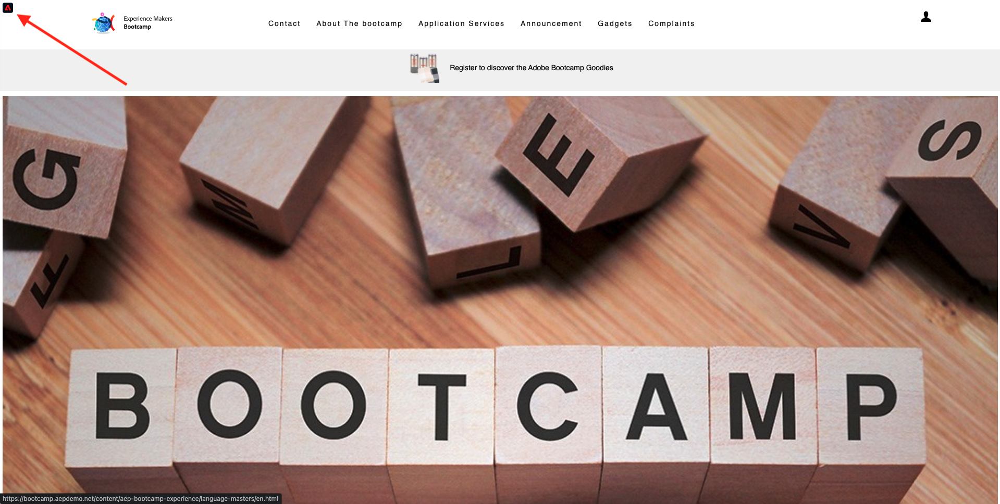

# 1.1 Do desconhecido ao conhecido em nosso site

## Contextto

一個Adobe Experience Platform的紙幣。 A platformaé o cérebro da comunicação, o **體驗記錄系統**.

Plataformaé um am biente em que palavra cliente engloba mais do que clientes conhecidos. Um visitante desconhecido no site tambémé um cliente do ponto de vista da Platforma e, todo to do o comportamento de um visitante desconhecido também e enviadoà platforma. Graças a essa a abordagem, quando esse visitante最終會影響到torna um cliente conhecido, uma marca também pode visualizar o que aconteceu antes daquele monto。 Isso ajuda a partir de uma perspectiva de otimização de atribuição e experincia.

## 克呂克索 — 達喬納達 — 杜克里恩特

阿塞斯 [https://bootcamp.aepdemo.net](https://bootcamp.aepdemo.net). 小組 **允許全部**.

Plickue noícone do logotipo daAdobeno canto supererquerdo da tela para abrir o Visualizador de perfil.

Verifique o painel do Visualizador de perfil e no Perfil do cliente em tempo real com o **Experience CloudID** 我要確認一下primário para es cliente que aindaé desconhecido。

Você também pode ver todos os Eventos de Experiência coletados com base no comportamento do cliente。 別急，別急。

Acesse a opção de menu **應用程式服務** e集團無產品 **Real-Time CDP**.

我會做產品。 埃文托德埃佩雷恩西亞 — 多蒂波 **產品檢視** agora foi enviado para a Adobe Experience Platform usando a implementationção do Web SDK que voê no Módulo 1. Abra o painel Visualizador de perfie e verifique seus **體驗事件**.

Acesse a opção de menu **應用程式服務** e集團無產品 **Adobe Journey Optimizer**. Mais um Evento de experincia foi enviado para a Adobe Experience Platform。

佩菲爾的視覺化手術。 Agora você verá 2 Eventos de experiência do tipo **產品檢視**. Embora o comportamento seja anônimo, cada plicus e rastreado e armazenado na Adobe Experience Platform。 Depois que o cliente anônimo se tornar conhecido, poderemos mesclar todo o comportamento anônimo automamente ao perfil conhecido.

Agora vamos analisar seu perfil de cliente e usar seu comportamento para personalizar sua experience do cliente無站點。

埃塔帕： [1.2將seu próprio perfil de cliente em tempo real視覺化 — UI](./ex2.md)

[烏薩里奧1號](./uc1.md)

[托多斯山](../../overview.md)
