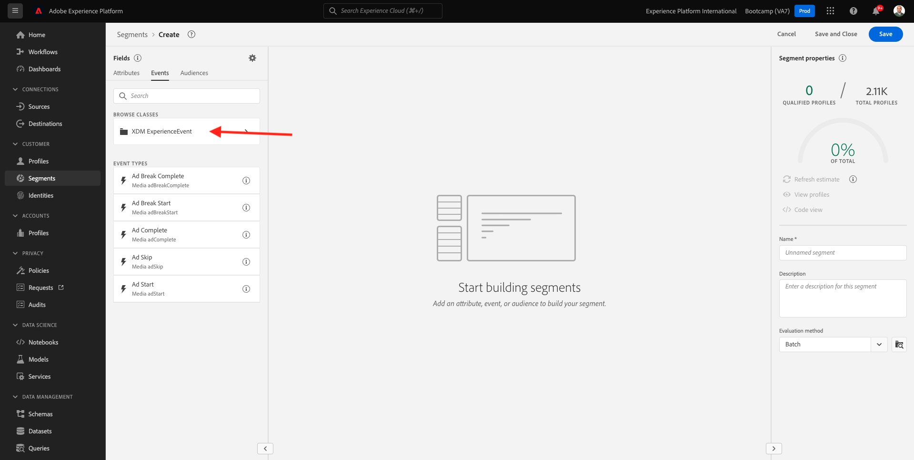
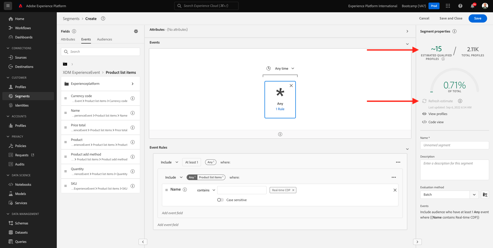
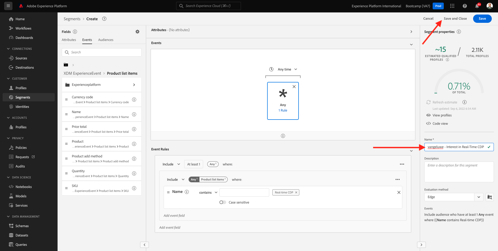

# 1.3 Crie um區段 — UI

Neste exercício， voce irá criar um segmento usando o o Constructor de Segmentos da Adobe Experience Platform.

## 歷史協會

Acesse [Adobe Experience Platform](https://experience.adobe.com/platform). Depois de fazer登入，voce irá存取página incial da Adobe Experience Platform。

Antes de continuar， voce precisa seclecionar um **沙箱**. 不要做沙箱，只要選擇一個 ``Bootcamp``. É possível fazer isso clicando no texto **[!UICONTROL 生產產品]** na linha azul na parte superior da tela. Depois de selecionar o sandbox apriado， voce verá a tela mudando e agora voce está em seu [!UICONTROL 沙箱] dedicado。

無功能表對應查詢、存取 **區段**. Nesta página， voce tem uma visão geral de todos os segmentos existes. Clique no botao + Criar segmento para comecar a criar um novo segmento。

Quando estiver no novo constructor de segmentos， voce irá perceber imente a opcao de menu **屬性** 做參考 **XDM個別設定檔**.

XDM是一種語言，可以說是經驗的一部分，XDM教學課程是構建分段的基礎。 Todos os dados ingeridos na platforma devem ser mapeados em relacao XDM e， portanto， todos os dados se tornam parte do mesmo modelo de dados， independentemente da origem desses dados. Isso oferece uma grande vantagem ao criar segmentos， pois a partir dessa interface do usuário do constructor de segmento， é posível combinar dados de qualquer origem no mesmo fluxo de trabalho. Os區段指令無建構者設定區段設定器設定程式環境共用Adobe Target、Adobe Campaign和Adobe Audience Manager解決方案。

Agora voce precisa criar um segmento de todos os clientes que visualizaram o produto **Real-Time CDP**.

Para construir este segmento， voce precisa adicionar um Evento de experiencia. Voce pode contract todos os Eventos de experiencia clicando no ícone **事件** na barra de menu **欄位**.

Em seguida， voce verá o nó **XDM ExperienceEvents** 不要太優秀。 小團體 **XDM ExperienceEvent**.

Acesse **產品清單專案**.

選擇器 **名稱** 重新排列物件 **名稱** 做選單à esquerda na tela do constructor de segmentos na secao **事件**. Em seguida， o seguinte será exibido：

O parameter de comparação device ser **等於** e， no campo de entrada， insira **Real-time CDP**.

Sempre que adicionar um elemento ao constructor de segmentos， voce pode clicar no botao **重新整理預估值** para obter uma nova estimativa da população em seu segmento.

Para **評估方法**，選取 **Edge**.

小費，我們來看看吧。

Como modelo de nomenclatura，使用：

- `seuSobrenome - Interest in Real-Time CDP`

Em seguida， clique no botao **儲存並關閉** para salvar seu segmento.

Agora voce irá retornar à página de visão geral do segmento， onde verá uma visualização de amostra dos perfis de clientes que se qualificam para o seu segmento.

Agora voce pode continuar no próximo exercício e usar seu segmento com o Adobe Target.

冰淇淋甜菜： [1.4 Acao：envie seu segmento para o Adobe Target](./ex4.md)

[Retornar para Fluxo de Usuário 1](./uc1.md)

[Retornar para Todos os Módulos](../../overview.md)
