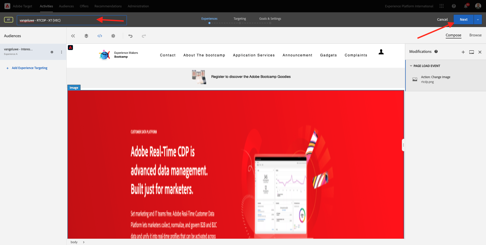

# 1.4 Acao：envie seu segmento para o Adobe Target

存取[Adobe Experience Platform](https://experience.adobe.com/platform)。 Depois de fazer登入，voce irá acsesar a página inicial da Adobe Experience Platform。

Antes de continuar， voce precisa selectionar um **沙箱**。 不要做沙箱，你可以選擇一個é Bootcamp。 É posssível fazer isso clicando no texto **[!UICONTROL Production Prod]** na linha azul na parte superior da tela。 Depois de selecionar o sandbox apropriado， voce verá a tela mudando e agora voce está em seu [!UICONTROL 沙箱]專用沙箱。

## 1.4.1 Active seu區段目標Adobe Target

O Adobe Target está disponível como um destino do CDP em tempo real. Para設定sua integracao com o Adobe Target，存取&#x200B;**目的地** e **目錄**。

叢集&#x200B;**Personalization**&#x200B;沒有功能表&#x200B;**類別**。 **Adobe Target**。 點按&#x200B;**啟動區段**。

選擇目標``Bootcamp Target``群組&#x200B;**下一步**。

Na lista de segmentos disponíveis， selectione o segmento que voce criou em [1.3 Crie um segmento](./ex3.md)， com o nome `yourLastName - Interest in Real-Time CDP`。 Em seguida，點選em **下一個**。

Na próxima página， clique em **下一步**。

叢集&#x200B;**完成**。

在Adobe Target的區段。

>[!IMPORTANT]
>
>Imediatamente após criar seu destino do Adobe Target no Real-Time CDP， pode levar até uma hora para que o destino seja ativado. 我們非常重視後端的設計。 Depois que o tempo de espera incial de 1 hora e a configuracao do backend form concluídos， os segmentos de borda recém-adicionados que sao enviados ao destino do Adobe Target estarao disponíveis para segmentacao em tempo real.

## 1.4.2在Adobe Target上設定sua atividade

Agora que seu segmento Real-Time CDP está configurado para ser enviado ao Adobe Target， é posssível configurar sua atividade de Segmentacao por experiencia no Adobe Target。 Neste excício， voce irá configurar uma atividade baseada no Visual Experience Composer.

存取página inicial da Adobe Experience Cloud acessando [https://experiencecloud.adobe.com/](https://experiencecloud.adobe.com/)。 點按&#x200B;**Target** para abrir。

Na página inicial do **Adobe Target**， voce verá todas as atividades existenes.
點按em **+建立活動** para criar uma nova atividade。

選取一個&#x200B;**體驗鎖定目標**。

選取&#x200B;**Visual** e定義&#x200B;**活動URL**&#x200B;共用`https://bootcamp.aepdemo.net/content/aep-bootcamp-experience/language-masters/en/exercises/particpantXX.html`、mas、antes disso、substitua XX por um número entre 01 e 60。

>[!IMPORTANT]
>
>Cada participante da capacitação deve usar uma página da Web separada para evitar a colisao de várias experiencias do Adobe Target。 É possível escolher uma página da Web e包含URL存取： [https://bootcamp.aepdemo.net/content/aep-bootcamp-experience/language-masters/en/exercises.html](https://bootcamp.aepdemo.net/content/aep-bootcamp-experience/language-masters/en/exercises.html)。
>
>Todas as páginas compartilham a mesma URL base e terminam com o numero do participante.
>
>Por範例、 o參與者1使用URL `https://bootcamp.aepdemo.net/content/aep-bootcamp-experience/language-masters/en/exercises/particpant01.html`、o參與者30使用URL `https://bootcamp.aepdemo.net/content/aep-bootcamp-experience/language-masters/en/exercises/particpant30.html`。

在Bootcamp **選擇工作區**。

點按&#x200B;**下一個**。

沒有視覺化體驗撰寫器。 Pode levar de 20 a 30 segundos até que o site esteja completamente carregado.

Atualmente， o público padrao sao **所有訪客**。 叢集nos **3點** ao lado de **所有訪客**&#x200B;叢集&#x200B;**變更對象**。

Agora voce está vendo a lista de públicos disponíveis， e o segmento da Adobe Experience Platform que voce criou anteriormente e eviou ao Adobe Target agora faz parte dessa lista. 在Adobe Experience Platform中選取前方的voice。 點按&#x200B;**指派對象**。

Seu segmento da Adobe Experience Platform agora faz parte dessa Atividade de segmentacao por experiencia.

Antes de alterar a imagem principal， voce deve clicar em **全部允許**&#x200B;沒有橫幅de cookie。

para isso， vá para **瀏覽**

Em seguida， cluque em **全部允許**。

Em seguida， retorne para **撰寫**。

Agora vamos mudar a imagem principal na página inicial do site. Clicque na imagem principal padrao no site， clicque em **取代內容**&#x200B;選取一個&#x200B;**影像**。

Pesquise o arquivo de imagem **rtcdp.png**。 選取群組&#x200B;**儲存**。

Voce verá a nova experiencia com a nova imagem para o seu Público seleconado

這個小集團沒有上級的榮耀。

段落名稱，使用：

- `seuSobrenome - RTCDP - XT (VEC)`

點按&#x200B;**下一個**。

點按&#x200B;**下一個**。

Na página **目標與設定**，存取&#x200B;**目標量度**。

定義中繼主體組合&#x200B;**參與** - **網站逗留時間**。 按一下&#x200B;**儲存並關閉**。

Agora voce está na página **活動概覽**。 Voce ainda precisa activar sua Atividade.

叢集無Campo **非使用中** e選取器&#x200B;**啟動**。

我們確認了video de que sua atividade agora está ativa。

Agora sua atividade está ativa e pode ser testada網站沒有啟動訓練營。

Se agora voce voltar ao seu site de demonstracao e visitar a página do produto para **Real-Time CDP**， voce se qualificará instaneamente para o segmento que criou e verá a atividade do Adobe Target exibida na página inicial em tempo real.

>[!IMPORTANT]
>
>Cada participante da capacitação deve usar uma página da Web separada para evitar a colisao de várias experiencias do Adobe Target。 É possível escolher uma página da Web e包含URL acessando ao連結： [https://bootcamp.aepdemo.net/content/aep-bootcamp-experience/language-masters/en/exercises.html](https://bootcamp.aepdemo.net/content/aep-bootcamp-experience/language-masters/en/exercises.html)。
>
>Todas as páginas compartilham a mesma URL base e terminam com o numero do participante.
>
>Por範例、 o參與者1 deve使用`https://bootcamp.aepdemo.net/content/aep-bootcamp-experience/language-masters/en/exercises/particpant01.html`、o參與者30 deve使用URL `https://bootcamp.aepdemo.net/content/aep-bootcamp-experience/language-masters/en/exercises/particpant30.html`。

Próxima etapa： [1.5 Acao： envie seu segmento para o Facebook](./ex5.md)

[Retornar para Fluxo de Usuário 1](./uc1.md)

[Retornar para Todos os Módulos](../../overview.md)
