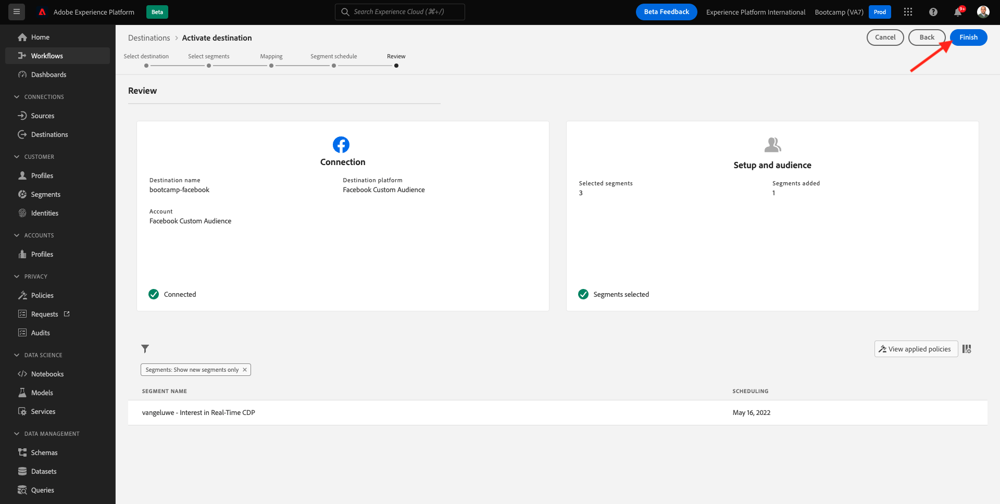

# 1.5採取行動：將區段傳送至Facebook

前往 [Adobe Experience Platform](https://experience.adobe.com/platform). 登入後，您會登陸Adobe Experience Platform首頁。

繼續之前，您需要選取 **沙箱**. 要選取的沙箱已命名 ``Bootcamp``. 您可以按一下文字 **[!UICONTROL 生產產品]** 在螢幕上方的藍線。 選取適當的 [!UICONTROL 沙箱]，您會看到畫面變更，現在您已進入專屬 [!UICONTROL 沙箱].

在左側功能表中，前往 **目的地**，然後前往 **目錄**. 然後您會看到 **目的地目錄**. 在 **目的地**，按一下 **啟用區段** 在 **Facebook自訂對象** 卡片。

選取目的地 **bootcamp-facebook** 按一下 **下一個**.

在可用區段清單中，選取您在上一個練習中建立的區段。 按&#x200B;**「下一步」**。

在 **對應** 頁面，確定 **套用轉換** 核取方塊已啟用。 按&#x200B;**「下一步」**。

在 **區段排程** 頁面，選擇 **對象的來源** 並將其設定為 **直接從客戶**. 按&#x200B;**「下一步」**。

最後，在 **檢閱** 頁面，按一下 **完成**.

您的區段現在已連結至Facebook自訂對象。 每次客戶符合此區段的資格時，都會傳送訊號至Facebook伺服器端，將該客戶納入Facebook端的自訂對象中。

在Facebook中，您會在「自訂對象」下方找到來自Adobe Experience Platform的區段：

您現在可以看到自訂對象出現在Facebook中：

[返回用戶流1](./uc1.md)

[返回所有模組](../../overview.md)
