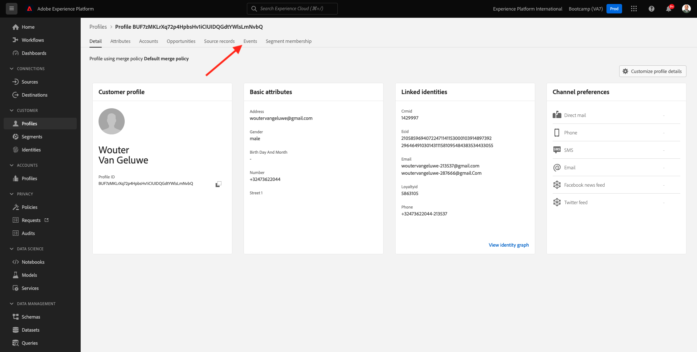

# 2.6個人化呼叫中心

Conforme discutido várias vezes durante o bootcamp, personalizar a experiencia do cliente e algo deve acontecer de maneira omnichannel. Um呼叫中心geralmente e bastante desconectado do restante da jornada do cliente e isso pode, com frequencia, levar a experincias frustrantes do cliente, mas não precisa ser assim。 Vamos mostrar um semplo de como o call center pode ser facilmente conectado a Adobe Experience Platform,em tempo real。

## 克呂克索 — 達喬納達 — 杜克里恩特

沒有前練習，usando o aplicativo móvel, você comprou m produt clicando no botão **購買**.

那麼，你說的是，我們的身份，或者說，我的身份，或者說，我的身份？ 諾曼特，呼叫中心。

佩拉呼叫中心 **忠誠度ID**. Você pode encontrar seu ID de fidelidade no Visualizador de Perfil do站點。

Nesse caso, o **忠誠度ID** é **5863105**. Como parte de nossa implementationção personalizada do recurso de call center no ambiente de de dexedção, você deve adicionar um prefixo seu **忠誠度ID**. O prefixoé **11373**, portanto, o ID de fidelidade a ser usado neste exemploé **11373 5863105**.

再見。 使用seu telefone e ligue para o número **+1(323)745-1670**.

塞拉·索利塔多，塞吉多·德 **#**. Digite seu ID de fidelidade.

沃凱烏維拉 **你好，女人**. Esse nomeé retirado do Perfil do Cliente em tempo re a Adobe Experience Platform。 Você tem 3 escolhas。 普雷西奧內·努梅羅 **1**, **訂單狀態**.

Depois de ouvir o status do seu pedido, você terá a opção de pressionar **1** para voltarao菜單首字母o pressionar 2 普雷西奧內 **2**.

Em seguida, será solicitado que você avalie sua experiencia de call center, selectionando um número entre 1 e 5, sendo 1 baixo e 5 alto。 真是太好了。

呼叫中心，塞拉。

阿塞斯 [Adobe Experience Platform](https://experience.adobe.com/platform). 登入Depois de fazer，是Página inical da Adobe Experience Platform。

連續、前輪 **沙箱**. 不要用沙箱做選擇 ``Bootcamp``. É postível fazer isso clicando no texto **[!UICONTROL 生產產品]** 娜琳娜·阿祖爾娜·帕特·蘇佩拉。 Depois de selecionar o [!UICONTROL 沙箱] 波普里亞多，você verá a tela mudando e agora você em seu [!UICONTROL 沙箱] 愛心。

沒有菜單，阿塞斯 **設定檔** e **瀏覽**.

選取 **身分命名空間** **電子郵件** e insira o endereço de e-mail do seu perfil de cliente. 小組 **檢視**. 派人對付她。

Você verá seu perfil de cliente novamente. 阿塞斯 **事件**.

Em eventos, você verá 2 eventos com eventType de **callCenter**. O primeiro eventoé y o resultado da sua resposta á pergunta **評分您的電話滿意度** （阿瓦利·塞烏·查馬達）。

Role um pouco para baixo e você verá o evento que foi registration do quando você selecionou a opção de verificar o **訂單狀態**.

阿塞斯 **區段成員資格**. Agora você verá que 2 segmentos se qualificam em seu perfil, em tempo real, com base nas interções que você teve por meio do call center. Essas associações de segmento podem e devem ser usadas para impactar qual comunicação e personalização acontece em qualquer outro canal。

Você termou est exticio。

[烏薩里奧河畔雷托納爾2](./uc2.md)

[托多斯山](../../overview.md)
