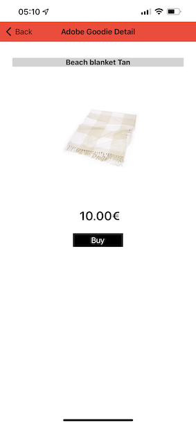
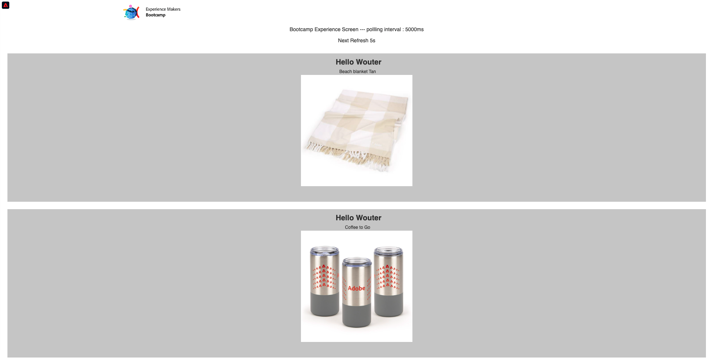

# 3.1使用applicativo móvel e acione um beacon

## 安裝應用程式Mov

應用程式安裝安裝，必需 **Rastreamento** 沒有seu dispositivo iOS。 段落，存取 **設定** > **Privacidade e securanca** > **Rastreamento** 驗證opcao **允許應用程式需求或需求**.

存取App Store da Apple e pesquise `aepmobile-bootcamp`. 小團體 **安裝** ou **下載**.

應用程式追蹤系統安裝，小團體 **Abrir**.

小團體 **確定**.

小團體 **許可權**.

按一下 **我同意**.

小團體 **美國應用程式許可權**.

小團體 **許可權**.

Agora voce está no applicativo， na página inicial， pronto(a) para verificar toda a jornada do cliente.

## Fluxo da jornada do cliente

需要登入的首要條件。 小團體 **登入**.

位於前方的越野小越野小越野中，因此不存在任何網站。 Agora é necessário reutilizar o endereco de email da contact quue voce crious no applicativo para fazer or login.

Digite o endereco de email que voce沒有網站que em **登入**.

Voce receberá uma confirmacao de que está conectado e receberá uma notificação push.

Retorne para a página inicial do applicativo e os recursos adicionais irao aparecer.

Primeiro， accesse **產品**. 小團體em qualquer產品，巢狀範例： **咖啡待用**.

Voce verá a página do produto **咖啡待用** 無應用程式。

Agora voce irá simular um evento de entrada de sinalização (beacon) em uma loja offline. O objetivo da simulacao é personalizar a experiencia do cliente nas telas da loja. Para visualizar a experiencia na loja， foi criada uma página que mostrará de forma dinamica as information relevantes para o cliente ao entrar na loja.

Antes de continuar， abra esta página da Web em seu computador： [https://bootcamp.aepdemo.net/content/aep-bootcamp-experience/language-masters/en/screen.html](https://bootcamp.aepdemo.net/content/aep-bootcamp-experience/language-masters/en/screen.html)

Em seguida，一種長吻蝮：

Em seguida， retorne para a página inicial. 小集團無任何內涵 **beacon**.

Após essa etapa， o seguinte será exibido. Primeiro，選取 **Bootcamp畫面信標** e clique no botao de **entrada**. Isso permitirá que voce simule uma entrada de sinalização com beacon.

Agora confira a tela da loja. Voce verá o último produto visualizado aparecer nesa tela em 5 segundos.

Em seguida， retorne para **產品**. 小團體em qualquer產品，巢狀範例： **沙灘毯棕褐色**.

Em seguida， retorne para a página inicial. 小集團無任何內涵 **beacon**.

Em seguida，選擇 **Bootcamp畫面信標** e clique no botao de **Entrada** novamente。 Isso permitirá que voce simule uma entrada de sinalização （信標）。

Agora，確認a tela da loja novamente。 Voce verá o último produto visualizado aparecer nesa tela em 5 segundos.

Agora、vamos verificar também或seu Visualizador de Perfil無網站。 Voce verá muitos eventos que foram adicionados， para mostrar que alquer interacao com um cliente é coletada e armazenada na Adobe Experience Platform.

Nos próximos exercícios， voce irá configurar e testar sua própria jornada de entrada do beacon.

冰淇淋甜菜： [3.2 Crie seu evento](./ex2.md)

[Retornar para Fluxo de Usuário 3](./uc3.md)

[Retornar para Todos os Módulos](../../overview.md)
