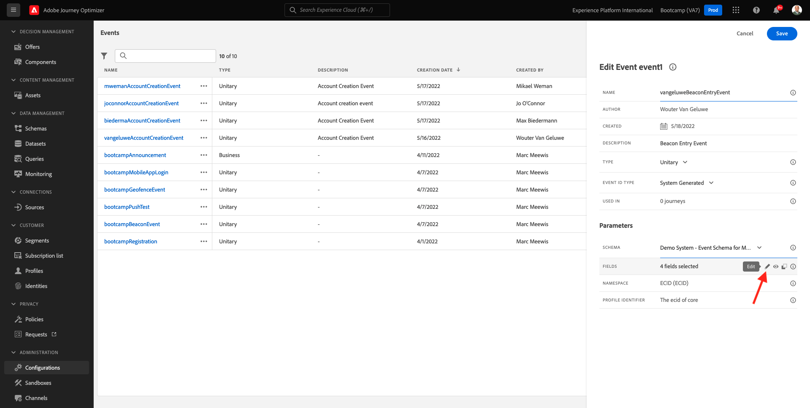
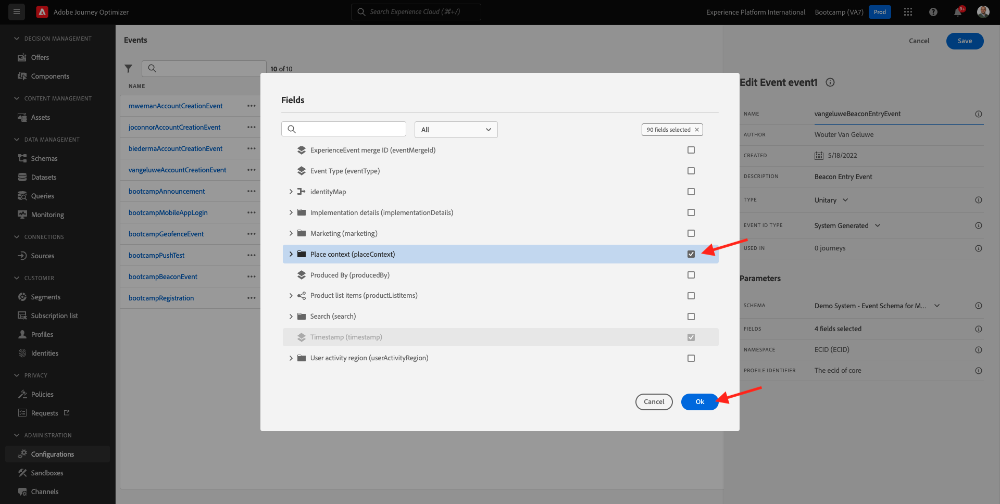

# 3.2 Crie seu evento

登錄Adobe Journey Optimizer帳戶a [Adobe Experience Cloud]. 小組 **Journey Optimizer**.

Você será redirecionado para a **首頁** 不，Journey Optimizer。 Primeiro, Verifique se você usando o sandbox correto. 不要沙箱，就要用 `Bootcamp`. Para alternar de um sandbox para outro, plicaem **生產** 選擇沙箱或沙箱。 不要做沙箱 **布坎普**. Você estará na visualização da **首頁** 做seu沙箱 `Bootcamp`.

沒有菜單，角色是 **配置**. Em seguida，小團體 **管理** 埃文托斯。

Você verá uma visão geral de todos os eventos disponíveis. 小組 **建立事件** 這是一個罪名。

烏馬諾瓦·雅內拉·德·埃文托·瓦齊亞·阿帕雷克。

Em primeiro lugar, dê um noma o seu evento como, por exampleo: `yourLastNameBeaconEntryEvent` e adicione uma描述como como, por exemple: `Beacon Entry Event`.

Em seguida, certifique-se de que **類型** 我就是，科莫 **單一** e，第seleção de **事件ID類型**, selectone **系統生成**.

一個塞萊桑的方案。 我的計畫是準備做練習。 使用結構 `Demo System - Event Schema for Mobile App (Global v1.1) v.1`.

Depois de selecionar o Schema, você verá vários campos sendo selecionados na seção **欄位**. 阿戈拉·沃克·德韋·帕薩 **欄位** Trêsícones彈出窗口serão exibidos。 伊科內集團 **編輯**.

Você verá uma janela pop de **欄位**，通過você deve selectionar alguns dos campos que precisamos para personalizar a jornada。 Escolheremos outs outros atributos de perfil posterofermente, ulidando os dados já existes na Adobe Experience Platform

Baixo até ver o bjeto `Place context` 是塞萊桑的。 Com isso, todo o contexto da localização do cliente será disponibilizado para a jornada. 小組 **確定** 薩爾瓦·蘇亞斯·阿爾特拉松伊斯。

是的，有個彈簧。 小組 **儲存** 馬伊斯·烏馬·韋斯·薩爾瓦·蘇亞斯·阿爾特拉松伊斯。

我要說，我要說，我要說。

Plicus no seu evento novamentte para abrir a tela **編輯事件** 馬伊斯·烏馬·韋斯。 滑鼠的呼吸 **欄位** 第3版。 伊科內集團 **檢視**.

Agora você verá um exeplo，需要裝載。
Seu event to tem um eventID de orquestraçãoúnico, que você pode encontror rolando para baixo nessa cargaútil até visualiza `_experience.campaign.orchestration.eventID`.

O eventIDé o que deve ser enviado à Adobe Experience Platform para acionar a jorna dus próximos extreccios. Lembre-se deste eventID, você pode precisar deposerormente。
`"eventID": "e76c0bf0c77c3517e5b6f4c457a0754ebaf5f1f6b9357d74e0d8e13ae517c3d5"`

小組 **確定** e, em seguida，小團em **坎塞爾**.

Você termou est exticio。

埃塔帕： [3.3 Crie sua jornada e notificação push](./ex3.md)

[烏薩里奧3](./uc3.md)

[托多斯山](../../overview.md)
