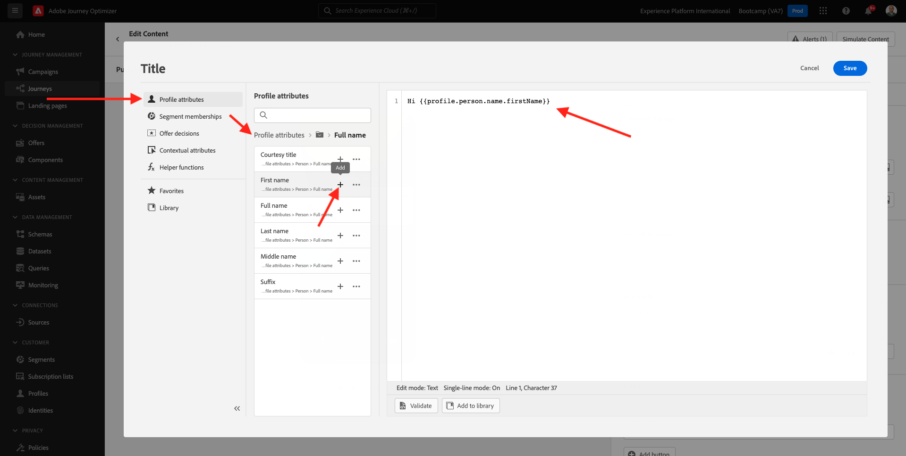
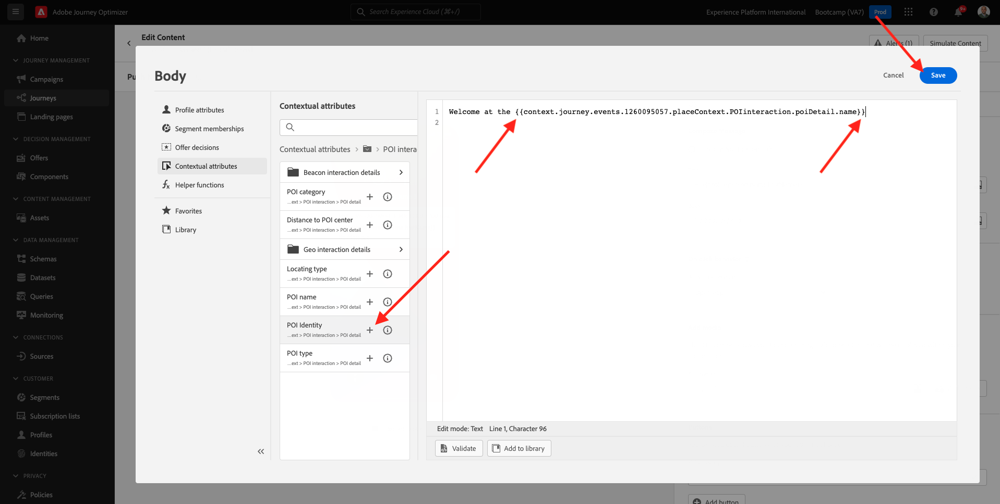
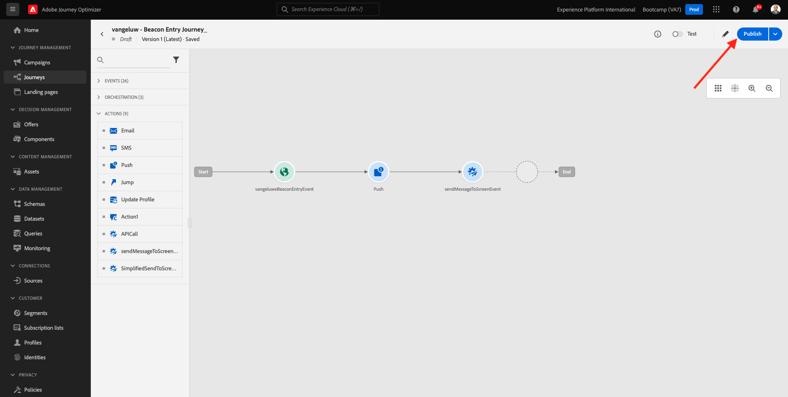
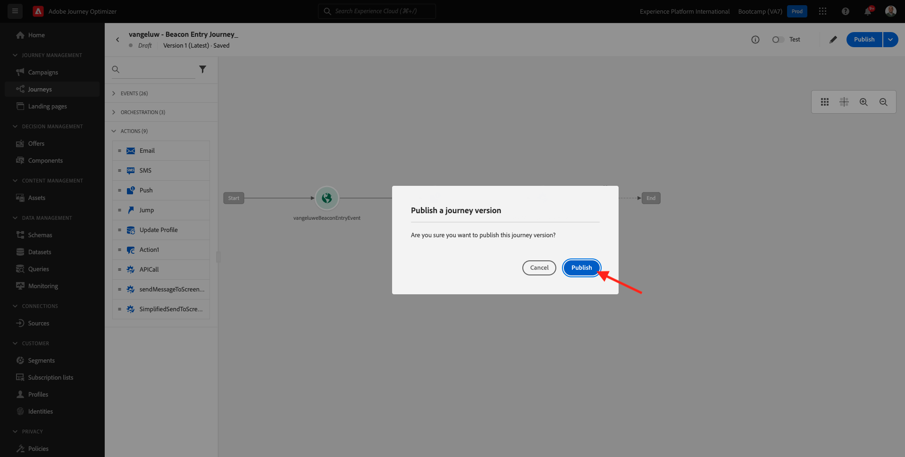

# 3.3 Crie sua jornada e notificação push

Neste exercício， voce irá configurar a jornada e a mensagem que ses acionada quando alguém inserir uma sinalização （信標） usando o o aplicativo móvel.

Faca登入無Adobe Journey Optimizer存取權a [Adobe Experience Cloud](https://experience.adobe.com). 小團體 **Journey Optimizer**.

Voce será redirecionado para a visualização da **首頁** 無Journey Optimizer。 Primeiro，驗證是否成功了。 不要做沙箱que deve susado é `Bootcamp`. Para alternar de um sandbox para outtro， clique em **Prod** 選擇沙箱沙箱。 Neste範例， o nome do sandbox é **Bootcamp**. 視覺化雅緻 **首頁**  執行seu sandbox `Bootcamp`.

## 3.3.1珍珠母

沒有選單，小團 **歷程**. Em seguida，小團體 **建立歷程** para criar uma nova jornada.

敬請期待，敬請期待。

前方沒有練習，重新開始 **事件**. 事件旁白 `yourLastNameBeaconEntryEvent` e替代 `yourLastName` 佩洛·塞烏·索布雷諾姆。 Este foi o resultado da criação do Evento：

Agora voce deve considerate este evento como o o início desta Jornada. Voce pode fazer isso indo para o lado esquerdo da tela e procurando pelo seu evento na lista de eventos.

選擇事件，排定所有事件。 海島若爾納達島上塞梅蘭特島上的塞梅蘭特。 小團體 **確定** para salvar suas alteracoes.

Como segunda etapa da jornada， voce deve adicionar uma acao **推播**. Vá para o lado esquerdo da tela para **動作**，選取a acao **推播** e arraste solte a acao no segundo nó da sua jornada.

沒有拉多的direito da tela、agora voce deve criar sua notificação push。

定義 **類別** como **行銷** 選擇推送表面que permite environmie notifications push。 Nesse caso，超級推送 **mmeeewis-app-mobile-bootcamp**.

## 3.3.2基本概念

小團體 **編輯內容**.

Em seguida，一種長吻蝮：

Vamos definir o conteúdo da notificação推送。

無無營帳的小型企業 **標題**.

科梅斯，艾瑞亞 **奧拉**. 沒有個人化的小團體。

Agora voce precisa trader o token de personalização para o campo **名字** 我這才叫阿瑪澤納多 `profile.person.name.firstName`. 無功能表à esquerda，選擇 **設定檔屬性**，角色para baixo/navegue para encontract o elemento **個人** 小團體na seta para avancar um nível até chegar ao campo `profile.person.name.firstName`. 小團體no ícone **+** 歡迎您來到campo à tela。 小團體 **儲存**.

恩濤，請迴音。 小集團無個人化組織 **內文**.

艾斯克雷瓦，艾瑞亞 `Bem-vindo(a)`.

Em seguida，小團體  **內容屬性** e **Journey Orchestration**.

小團體 **事件**.

小團體不做任何事，做任何事： **yourLastNameBeaconEntryEvent**.

小團體 **地標內容**.

小團體 **POI互動**.

小團體 **POI詳細資料**.

小團體否 **+** 圖示否 **POI名稱**.
Em seguida， o seguinte será exibido. 小團體 **儲存**.

小香腸。 Clique na seta no canto superior esquerdo para retornar à sua jornada.

小團體 **確定**.

## 3.3.2 Envire uma mensagem para uma tela

Como terceira etapa da jornada， voce deve adicionar uma acao  **sendMessageToScreen**. Vá para o lado esquerdo da tela para **動作**，選取a acao **sendMessageToScreen** 我們很榮幸地來到這裡。 真好，敬請期待。

**sendMessageToScreen** uma acao personalizada que irá publicar uma mensagem否 **端點** 烏薩多pela exibicao na loja。 A acao **sendMessageToScreen** 西班牙語。 Voce pode visualizar essas variáveis rolando para baixo até ver **動作引數**.

Agora voce預先定義os valores para cada parametero de acao。 Siga esta tabela para entender quais valores sao necessários e onde.

| 參數 | 值 |
|:-------------:| :---------------:|
| 傳遞 | `'image'` |
| ECID | `@{yourLastNameBeaconEntryEvent._experienceplatform.identification.core.ecid}` |
| 名字 | `#{ExperiencePlatform.ProfileFieldGroup.profile.person.name.firstName}` |
| EVENTSUBJECT | `#{ExperiencePlatform.ProductListItems.experienceevent.first(currentDataPackField.eventType == "commerce.productViews").productListItems.first().name}` |
| EVENTSUBJECTURL | `#{ExperiencePlatform.ProductListItems.experienceevent.first(currentDataPackField.eventType == "commerce.productViews").productListItems.first()._experienceplatform.core.imageURL}` |
| 沙箱 | `'bootcamp'` |
| CONTAINERID | `''` |
| ACTIVITYID | `''` |
| PLACEMENTID | `''` |

{style="table-layout:auto"}

Para definir esses valores， clique no ícone **編輯**.

Em seguida，選擇 **進階模式**.

Em seguida， cole o valor com base na tabela acima. 小團體 **確定**.

Repita esse processo para adicionar valores para cada campo.

>[!IMPORTANT]
>
>Para o campo ECID， há uma referencia ao evento`yourLastNameBeaconEntryEvent`. Lembre-se de substituir  `yourLastName` 佩洛·塞烏·索布雷諾姆。

最後的結果是semelhante ao seguinte：

角色para cima e clique em **確定**.

您仍需要為歷程提供名稱。 若要這麼做，請按一下 **屬性** 圖示加以檢視。

Voce pode inserir o nome da jornada aqui. 使用 `yourLastName - Beacon Entry Journey`. 小團體 **確定** para salvar suas alteracoes.

Agora voce pode publicar sua jornada clicando em **發佈**.

小團體 **發佈** novamente。

西班牙公共事業部關於澳門的資訊。

Sua jornada agora está ativa e pode ser acionada。

Voce terminou este expercisio。

冰淇淋甜菜： [3.4測驗sua jornada](./ex4.md)

[Retornar para Fluxo de Usuário 3](./uc3.md)

[Retornar para Todos os Módulos](../../overview.md)
