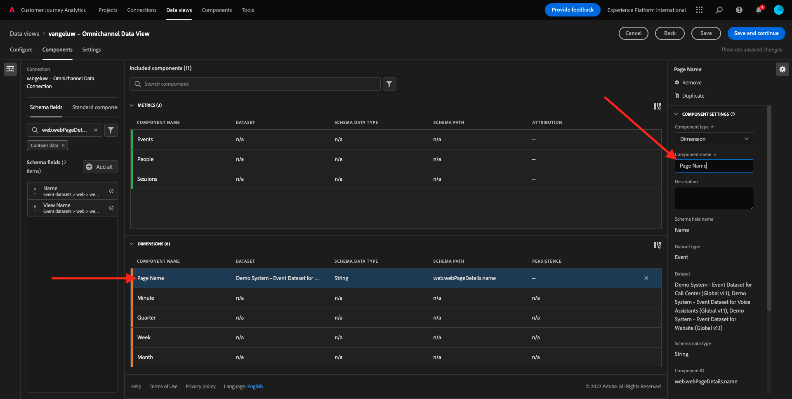
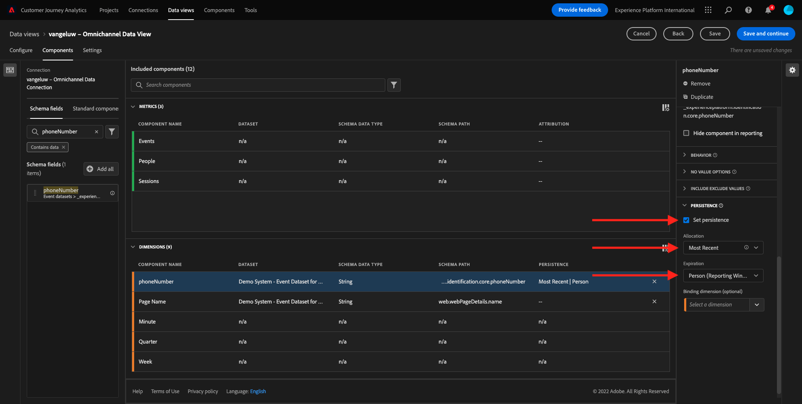
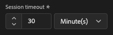

# 4.3 Crie uma Visualização de Dados

## 物件

- Entenda a UI de Visualização de Dados
- Compreenda as configuracoes básicas de definicao de visita
- Compreenda a attribuicao e a Persistencia em uma Visualização de

## 4.3.1達多斯的視覺化圖表

Agora， com sua conexão conclouída， é possível progredir para influenciar a visualização. Uma diferenca entre o Adobe Analytics e o CJA é que o CJA precia de uma visualização de dados para limpar e preparar os dados antes da visualizaçao。

Uma Visualização de Dados é semelhante ao conceito de Virtual Report Suites no Adobe Analytics， onde voce establete as definicoes de visita com reconnececimento de contexto， filtragem e também como os componentes sao chamados.

塞拉內塞薩里奧、沒有米尼莫、烏馬維蘇阿里薩索 — 達多斯波爾 — 科內克桑。 沒有entanto， para alguns casos de uso， é ótimo ter múltiplas Visualizacoes de Dados para mesma conexao， com o objetvo de fornecer insights differenties para equipes distintas. 我們非常希望能夠適應這種環境。 Alguns範例：

- Métricas de UX apenas para a equipe de UX設計
- 使用os mesmos nomes para KPIs e métricas para oGoogle Analyticse para oCustomer Journey Analytics，para que a equipe de análise digital fale apenas 1 idioma。
- Visualização de Dados filtrada para mostrar， por explo， dados para apenas um mercado， ou uma marca， ou apenas para Dispositivos móveis.

Na tela de **連線** marque a caixa de seleção da conexao que voce acabou de criar. 小團體  **建立資料檢視**.

Voce será redirecionado para o fluxo de trabalho **建立資料檢視** 工作流程。

## 4.3.2達多斯視覺化定義

Agora voce pode configurar as definicoes básicas para sua Visualização de dados.

A **連線** 前方沒有練習。 蘇亞康內克桑色查馬 `yourLastName – Omnichannel Data Connection`.

Em seguida， de um nome à sua Visualização de Dados seguindo este modelo de nomenclatura： `yourLastName – Omnichannel Data View`.

Insira o mesmo valor para descrição： `yourLastName – Omnichannel Data View`.

| 名稱 | 說明 |
| ----------------- |-------------| 
| `yourLastName – Omnichannel Data View` | `yourLastName – Omnichannel Data View` |

Para **時區**，選擇鬍鬚紅葡萄酒 **貝利姆、埃斯托科爾莫、羅馬、貝爾納、布魯克塞拉斯、維埃納、阿姆斯特達GMT+01:00**. Este é um cenário realmente interessante， pois algumas empresas operam em diferences países e geografias. Alocar o fuso horário certo para cada país evitará erros típicos de dados， como， por explo， acreditar que a maioria das pessoas compra camisetas à 4h no Peru.

Voce também pode modificar a nomenclatura das métricas principais (Pessoa， Sessao e Evento)。 Isso nao é obrigatório， mas alguns clientes gostam de usar Pessoas， Visitas e Acessos em vez de Pessoa， Sessao e Eventos (convencao de nomenclatura padrao do Customer Journey Analytics)。

Agora voce deve as seguintes configuracoes definidas：

小團體 **儲存並繼續**.

## 4.3.3 Componentes da Visualização de Dados

Neste exercício， voce irá configurar os components necessários para analisar os dados e visualizá-los usando o o Analysis Workspace。 內斯塔·伊烏，主人：

- Lado esquerdo： Components disponíveis dos datasets selectionados
- Meio： Componentes adicionados à Visualização de Dados
- Lado目錄：設定元件

>[!IMPORTANT]
>
>Se voce nao encontract uma metrica ou dimensao específica， verifique se o campo `Contains data` foi removido de sua visualização de dados. 康泰利奧莊園除外。
>
>

Agora voce precisa arrastar e soltar os components necessários para análise nos **新增的元件**. Para isso， voce deve selectionar os components no menu à esquerda e arrastá-los e soltá-los na tela no meio.

Vamos comecar com o primeiro元件： **名稱(web.webPageDetails.name)**. 請回答元件e arraste-o e solte-o na tela。

Esse componente é o nome da página， comoo voce pode derivar da leitura do campo do schema `(web.webPageDetails.name)`.

無entanto，usar **名稱** Como o nome nao é a melhor convencao de nomenclatura para um usuário corporativo compreender rapidamente essa dimensao.

Vamos mudar o nome para **頁面名稱**. 集團無任何組成要素 **元件設定**.

作為持續性設定sao **持續性設定**. Os conceitos de eVars e prop nao exist no CJA， mas as configuracoes de Persistencia possibilitam um comportamento semelhante.

Se voce nao alterate essas configuracoes， o CJA irá interpretar a dimensao como um **Prop** （尼維爾·德·奧科倫西亞）。 Além disso， podomos alterate a Persistencia para tornar a dimensao uma **eVar** （永久保佑）。

Svoce nao estiver familiarizado com eVars e Prop， [莉亞·梅斯·索布雷·伊索·納杜克曼塔考](https://experienceleague.adobe.com/docs/analytics/landing/an-key-concepts.html)..

Vamos deixar o Nome da Página como Prop. Dessa forma， voce nao precisa alterate nenhuma **持續性設定**.

| 要搜尋的元件名稱 | 新名稱 | 持續性設定 |
| ----------------- |-------------| --------------------| 
| 名稱(web.webPageDetails.name) | 頁面名稱 |          |

Em seguida， escolha a dimensao **phonenumber** 單獨。 O novo nome deve ser **電話號碼**.

Por fim， vamos alterar as Configuracoes de persistencia， pois o Número do Celular deve persisting no nível do usuário.

Para alterate a Persistencia， role para baixo no menu à direita e abra a aba **持續性**：

將caixa de seleção para modificar標示為configuracoes de persistencia。 選擇器 **最近** e o escopo **人員（「報表」視窗）**，pois nos preocumamos apenas com o último número de celular da pessoa。 若有客戶nao preencher o celular em visitas futuras， voce ainda verá esse valor preenchido。

| 要搜尋的元件名稱 | 新名稱 | 持續性設定 |
| ----------------- |-------------| --------------------| 
| phonenumber | 電話號碼 | 最近，人員（報告視窗） |

O próximo componente é `web.webPageDetails.pageViews.value`.

沒有選單à esquerda， pesquise `web.webPageDetails.pageViews.value`. Arraste e solte essa métrica na tela。

替代名稱段落 **頁面檢視** 在 **元件設定**.

| 要搜尋的元件名稱 | 新名稱 | 歸因設定 |
| ----------------- |-------------| --------------------| 
| web.webPageDetails.pageViews.value | 頁面檢視 |         |

para as configuracoes de atribuicao、deixaremos em branco.

Observação：作為configuracoes de persistencia nas métricas também podem ser alteradas no Analysis Workspace。 Em alguns casos， voce pode optar por configurá-las aqui para evitar que os usuários de negócios tenham que pensar qual é melhor modelo de persistencia.

Em seguida， voce terá que configurar várias Dimensoes e Métricas， conforme indicado na tabela abaixo.

### 尺寸

| 要搜尋的元件名稱 | 新名稱 | 持續性設定 |
| ----------------- |-------------| --------------------| 
| brandName | 品牌名稱 | 最近，工作階段 |
| callfeeling | 通話感覺 |          |
| 呼叫ID | 通話互動型別 |          |
| callTopic | 呼叫主題 | 最近，工作階段 |
| ecid | ECID | 最近，人員（報告視窗） |
| 電子郵件 | 電子郵件ID | 最近，人員（報告視窗） |
| 付款型別 | 付款型別 |          |
| 產品新增方法 | 產品新增方法 | 最近，工作階段 |
| 活動類型 | 活動類型 |         |
| 名稱(productListItems.name) | 產品名稱 |         |
| SKU | SKU （工作階段） | 最近，工作階段 |
| 交易 ID | 交易 ID |         |
| URL (web.webPageDetails.URL) | URL |         |
| 使用者代理 | 使用者代理 | 最近，工作階段 |

### 美trica

| 要搜尋的元件名稱 | 新名稱 | 歸因設定 |
| ----------------- |-------------| --------------------| 
| 數量 | 數量 |          |
| commerce.order.priceTotal | 收入 |         |

Sua configuracao deve ser semelhante ao seguinte：

Nao se esqueca de Salvar sua Visualização de Dados. 恩陶小集團 **儲存**.

## 4.3.4梅特里卡斯電腦

Embora tenhamos organizado todos os componentes na Visualização de dados， voce ainda deve adaptar alguns dels para que os usuários de negócios estejam prontos para iniciar suas análises.

Se voce se lembra， nao trouxemos specificamente Métricas como Adicionar ao Carrinho， Visualização do producto ou Compras para a a Visualização de dados. 沒有內坦托，特莫斯·烏馬·維度聖查馬達： **事件型別**. Entao， vamos derivar esses tipos de interacao criando 3 métricas calculadas.

Vamos comecar com a primeira Métrica： **產品檢視**.

沒有lado esquerdo，pesquise **事件型別** 選取維度。 Em seguida， arraste-o e solte-o na tela **包含的元件**.

新都市圈圈圈子 **事件型別**.

Agora altere o name e a descrição do componente para os seguintes valores：

| 元件名稱 | 元件說明 |
| ----------------- |-------------| 
| 產品檢視 | 產品檢視 |

Agora vamos contar apenas eventos de **產品檢視**. Para fazer isso，角色para baixo em **元件設定** 瓦洛雷斯德峰 **包含排除值**. Certifique-se de habilitar a opcao **設定包含/排除值**.

Como queremos contar apenas **產品檢視**，尤其是 **commerce.productViews** 沒有克里特利奧斯。

真是個不錯的市集！

Em seguida， repita o mesmo processo para os eventos **加入購物車** e **購買**.

### 加入購物車

Primeiro， arraste e solte a mesma dimensao **事件型別**.

Voce verá um alerta popup de um Campo Duplicado， pois estamos usando a mesma variável. 小團體 **仍要新增**：

Agora， siga o mesmo processo que fizemos para a métrica Visualizacoes de produto：
- Primeiro替代品是德式的。
- Por fim， adicione **commerce.productListAdds** como critério para contar apenas Add To Cart

| 名稱 | 說明 | 標準 |
| ----------------- |-------------| -------------|
| 加入購物車 | 加入購物車 | commerce.productListAdds |

### 購買

Primeiro， arraste e solte a mesma dimensao **事件型別** como fizemos para as duas métricas anteriores.

Voce verá um alerta popup de um Campo Duplicado， pois estamos usando a mesma variável. 小團體 **仍要新增**：

Agora， siga o mesmo processo que fizemos para as métricas產品檢視e加入購物車：
- Primeiro替代品是德式的。
- Por fim， adicione **commerce.purchases** Compras的como critérios para conbilizar apenas

| 名稱 | 說明 | 標準 |
| ----------------- |-------------| -------------|
| 購買 | 購買 | commerce.purchases |

Sua configuração final deve ser semelhante ao seguinte. 小團體 **儲存並繼續**.

## 4.3.5 Componentes da Configuração de Dados

Voce deve ser redirecionado para esta tela：

Nesta aba， voce pode modificar algumas configurations important para alterate a forma como os dados sao processados. Vamos漫畫定義o **工作階段逾時** 30分鐘完成 Gracas ao registro de data e hora de cada evento de experiencia， voce pode estender o conceito de uma sessao em todos os canais. 您是客服中心的客服人員嗎？ Usando Tempos Limite de Sessao personalizados， voce tem muita flexibilidade para decisir o que é uma sessao e como essa sessao irá mesclar os dados.

Nesta aba voce pode modificar outtras coisas como filtrar os dados usando um segmento/filtro. Voce nao precisará fazer isso nest exercício.

Quando終端，小集團 **儲存並完成**.

>[!NOTE]
>
>Voce pode voltar a esta Visualização de dados posteriormente e alterar as configuracoes e os components a qualquerer momento。 作為聖莫斯特拉多斯歷史教區的alteracoes afetarao a forma como os dados historicos sao mostrados。

Agora voce pode continuar com a parte de visualização e análise！

冰淇淋甜菜： [4.4 Preparacao de dados emCustomer Journey Analytics](./ex4.md)

[Retornar para Fluxo de Usuário 4](./uc4.md)

[Retornar para Todos os Módulos](./../../overview.md)
