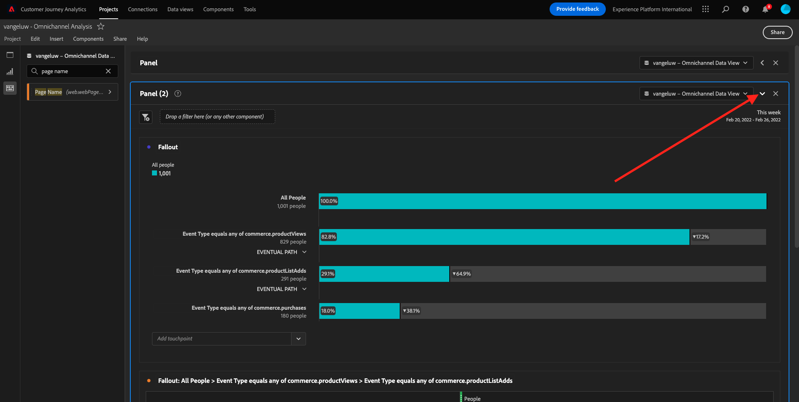

# 4.5使用Customer Journey Analytics的視覺效果

## 目標

- 了解Analysis Workspace UI
- 了解讓Analysis Workspace如此不同的功能。
- 了解如何使用Analysis Workspace在CJA中分析

## 內容

在本練習中，您將在CJA中使用Analysis Workspace來分析產品檢視、產品漏斗、流失率等。

讓我們使用您在 [4.4Analysis Workspace中的資料準備](./ex4.md)，請前往 [https://analytics.adobe.com](https://analytics.adobe.com).

開啟專案 `yourLastName - Omnichannel Analysis`.

開啟專案並檢視資料時 `yourLastName - Omnichannel Analysis` 選取「 」，即可開始建立第一個視覺效果。

## 我們每天有多少個產品檢視

首先，我們需要選取正確的日期來分析資料。 前往畫布右側的日曆下拉式清單。 按一下，然後選取適用的日期範圍。

>[!IMPORTANT]
>
>請選擇日期範圍，如 **本週** 或 **本月**. 2022年9月19日已擷取最新可用資料。

在左側功能表（元件區域）中，尋找計算量度 **產品檢視**. 選取它，然後將它拖放至自由表格右上方的畫布。

自動維度 **日** 將新增，以建立您的第一個表格。 現在，你可以看到你的問題被即時回答。

接下來，以滑鼠右鍵按一下量度摘要。

按一下 **視覺化** 然後選取 **折線圖** 視覺效果。

您會按日查看您的產品檢視。

您可以按一下 **設定** 在視覺效果中。

按一下旁邊的點 **折線圖** to **管理資料來源**.

下一步，按一下 **鎖定選擇** 選取 **所選項目** 來鎖定此視覺效果，以便一律顯示產品檢視時間軸。

## 檢視的5大產品

5大產品檢視次數為何？

請記得不時儲存專案。

| 作業系統 | 短切 |
| ----------------- |-------------| 
| Windows | Control + S |
| Mac | Command + S |

讓我們開始找到檢視的前5項產品。 在左側功能表中，尋找 **產品名稱** -Dimension。

現在拖放 **產品名稱** 替換 **日** 維度：

結果就是

接下來，嘗試依品牌名稱劃分其中一個產品。 搜尋 **brandName** 並將其拖曳至第一個產品名稱下。

接下來，使用使用者代理進行劃分。 搜尋 **使用者代理** 並將其拖曳至品牌名稱下。

然後您會看到：

最後，您可以新增更多視覺效果。 在左側的視覺效果下方，搜尋 `Donut`. Take `Donut`，將其拖放至畫布下方 **折線圖** 視覺效果。

接下來，在表格中選取前5個 **使用者代理**  的資料列 **Google Pixel XL 32GB黑色智慧手機** > **Citi Signal**. 選取5列時，請保留 **CTRL** 按鈕（在Windows上）或 **命令** 按鈕(在Mac上)。

您會看到環圈圖已變更：

您甚至可以調整設計，使兩者皆為 **折線圖** 圖表和 **環形圖** 圖表小一點，以便彼此相鄰：

按一下旁邊的點 **環形圖** to **管理資料來源**.
下一步，按一下 **鎖定選擇** 來鎖定此視覺效果，以便一律顯示產品檢視時間軸。

請前往下列位置，進一步了解使用Analysis Workspace的視覺效果：

- [https://experienceleague.adobe.com/docs/analytics/analyze/analysis-workspace/visualizations/freeform-analysis-visualizations.html](https://experienceleague.adobe.com/docs/analytics/analyze/analysis-workspace/visualizations/freeform-analysis-visualizations.html)
- [https://experienceleague.adobe.com/docs/analytics/analyze/analysis-workspace/visualizations/t-sync-visualization.html](https://experienceleague.adobe.com/docs/analytics/analyze/analysis-workspace/visualizations/t-sync-visualization.html)

## 產品互動漏斗，從檢視到購買

有很多方法可以解決這個問題。 其中一項是使用「產品互動類型」，並在自由表格中使用它。 另一種方式是使用 **流失視覺效果**. 讓我們將最後一個項目用於同時視覺化和分析。

按一下這裡，關閉目前的面板：

現在按一下 **+新增空白麵板**.

按一下視覺效果 **流失**.

選取與上次練習相同的日期範圍。

你會看到這個。

尋找維度 **事件類型** 在左側的元件下：

按一下箭頭以開啟維度：

您會看到所有可用的事件類型。

選取項目 **commerce.productViews** 然後拖放到 **新增接觸點** 欄位 **流失視覺效果**.

使用 **commerce.productListAdds** 和 **commerce.purchases** 然後把它們放到 **新增接觸點** 欄位 **流失視覺效果**. 您的視覺效果現在看起來會像這樣：

你可以做很多事。 一些範例：逐個裝置比較每個步驟，或依忠誠度比較。 不過，如果我們想分析有趣的項目，例如客戶在新增項目至購物車後為何不購買，可以在CJA中使用最佳工具：按一下右鍵。

以滑鼠右鍵按一下接觸點 **commerce.productListAdds**. 然後按一下 **在此接觸點劃分流失**.

系統會建立新的自由表格，以分析使用者未購買時的行為。

變更 **事件類型** by **頁面名稱**，以查看他們正在執行的頁面，而非購買確認頁面。

## 在到達「取消服務」頁之前，人們在網站上做什麼？

同樣地，執行此分析有許多方法。 讓我們使用流分析開始發現部分。

按一下這裡以關閉目前面板：

現在按一下 **+新增空白麵板**.

按一下視覺效果 **流量**.

然後您會看到：

選取與上次練習相同的日期範圍。

尋找維度 **頁面名稱** 在左側的元件下：

按一下箭頭以開啟維度：

您會找到所有已檢視的頁面。 查找頁面名稱： **取消服務**.
拖放 **取消服務** 進入中間欄位的「流量視覺效果」：

然後您會看到：

現在來分析造訪 **取消服務** 網站上的頁面也叫呼叫中心，結果是什麼。

在維度下，返回並尋找 **呼叫互動類型**.
拖放 **呼叫互動類型** 取代 **流量視覺效果**.

您現在會在造訪 **取消服務** 頁面。

接下來，在維度下方搜尋 **呼叫感覺**.  拖放它，以取代 **流量視覺效果**.

然後您會看到：

如您所見，我們已使用流量視覺效果執行全通路分析。 多虧了這一點，我們發現，一些考慮取消服務的客戶在呼叫呼叫呼叫中心後，似乎有積極的感覺。 我們有沒有通過升職改變他們的想法？

## 具有正式呼叫中心聯繫人的客戶如何根據主要KPI執行？

先將資料分段，只讓使用者使用 **正面** 呼叫。 在CJA中，區段稱為「篩選」。 前往元件區域內的篩選器（位於左側），然後按一下 **+**.

在篩選器產生器內，為篩選器命名

| 名稱 | 說明 |
| ----------------- |-------------| 
| 呼叫感覺 — 積極 | 呼叫感覺 — 積極 |

在元件下（在篩選器產生器內），尋找 **呼叫感覺** 並將其拖放至「篩選器產生器定義」中。

現在請選取 **正面** 作為篩選器的值。

將範圍更改為 **人員** 層級。

要完成，只需按一下 **儲存**.

你會回來的。 如果尚未完成，請關閉上一個面板。

現在按一下 **+新增空白麵板**.

選取與上次練習相同的日期範圍。

按一下 **自由表格**.

現在，請拖放您剛建立的篩選器。

新增某些量度的時間。 開始於 **產品檢視**. 拖放至自由表格。 您也可以刪除 **事件** 量度。

使用 **人員**,  **新增至購物車** 和 **購買**. 你最後會得到這樣的桌子。

由於第一次流量分析，我想到了一個新問題。 因此，我們決定建立這個表格，並根據區段檢查一些KPI，以回答這個問題。 如您所見，深入分析的時間比使用SQL或使用其他BI解決方案快得多。

## Customer Journey Analytics和Analysis Workspace重述

正如您在本實驗中所了解的，Analysis Workspace會匯整所有管道的資料，以分析整個客戶歷程。 此外，請記住，您可以將資料匯入歷程中未匯整的相同工作區。
將中斷連線的資料帶入您的分析中，為歷程提供內容，這真的很實用。 有些範例包括NPS資料、調查、Facebook廣告事件或離線互動（未識別）。

下一步： [4.6從見解到行動](./ex6.md)

[返回用戶流4](./uc4.md)

[返回所有模組](./../../overview.md)
