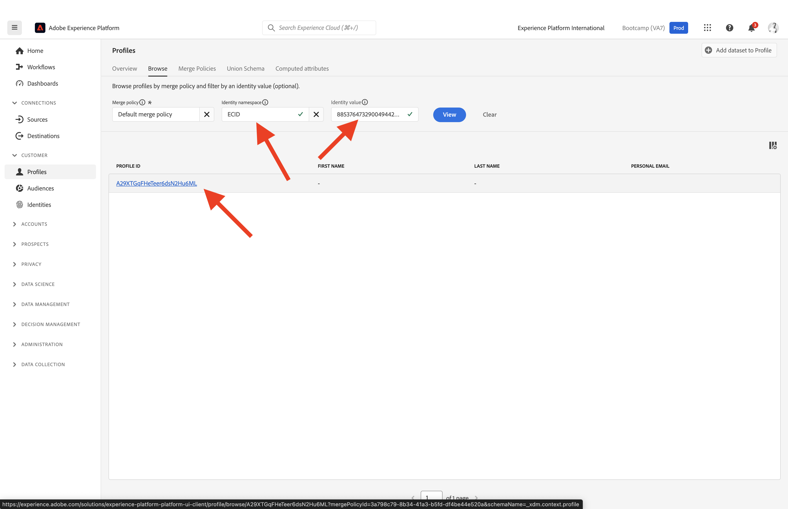

# 1.2視覺化您自己的即時客戶設定檔 — UI

在本練習中，您將登入Adobe Experience Platform並在UI中檢視您自己的即時客戶個人檔案。

## Story

在即時客戶個人檔案中，所有個人檔案資料都會與事件資料一起顯示，以及顯示現有的受眾會籍。 顯示的資料可來自任何地方，包括Adobe應用程式和外部解決方案。 這是Adobe Experience Platform中最強大的檢視畫面，真正的體驗記錄系統。

## 1.2.1在Adobe Experience Platform中使用客戶設定檔檢視

前往 [Adobe Experience Platform](https://experience.adobe.com/platform). 登入後，您會登入Adobe Experience Platform的首頁。

在繼續之前，您需要選取 **沙箱**. 要選取的沙箱已命名 ``Bootcamp``. 您可以按一下文字來執行此操作 **[!UICONTROL 生產環境]** 在熒幕上方的藍線中。 選取適當的 [!UICONTROL 沙箱]，您將會看到畫面變更，現在您已進入專屬狀態 [!UICONTROL 沙箱].

在左側功能表中，前往 **設定檔** 和 **瀏覽**.

您可以在網站上的「設定檔檢視器」面板上找到身分總覽。 每個身分都會連結至名稱空間。

有了Adobe Experience Platform，所有ID都同等重要。 之前，ECID是Adobe內容中最重要的訪客ID，其他所有ID都是以階層式關係連結至ECID。 使用Adobe Experience Platform後，情況已完全不同，每個ID都可視為主要識別碼。

通常，主要識別碼取決於內容。 如果您詢問客服中心， **最重要的識別碼為何？** 他們可能會回答， **電話號碼！** 但如果您詢問您的CRM團隊，他們將會回答， **電子郵件地址！**  Adobe Experience Platform瞭解這種複雜性，並為您管理它。 每個應用程式(不論是Adobe應用程式或非Adobe應用程式)都會參照其視為主要的ID與Adobe Experience Platform交談。 而且它就是這麼運作的。

針對欄位 **身分名稱空間**，選取 **ECID** 欄位的and **身分值** 輸入您可以在bootcamp網站的「設定檔檢視器」面板上找到的ECID。 按一下 **檢視**. 然後，您將在清單中看到您的設定檔。 按一下 **設定檔ID** 以開啟您的設定檔。

您現在看到幾項重要內容的概觀 **設定檔屬性** ，屬於您的客戶設定檔。

前往 **活動**，您可以在此處檢視連結至設定檔之每個體驗事件的專案。

最後，前往功能表選項 **對象會籍**. 您現在會看到符合此設定檔資格的所有對象。

現在，讓我們建立新的對象，好讓您為匿名或認識的客戶個人化客戶體驗。

下一步： [1.3建立對象 — UI](./ex3.md)

[返回使用者流程1](./uc1.md)

[返回所有模組](../../overview.md)
