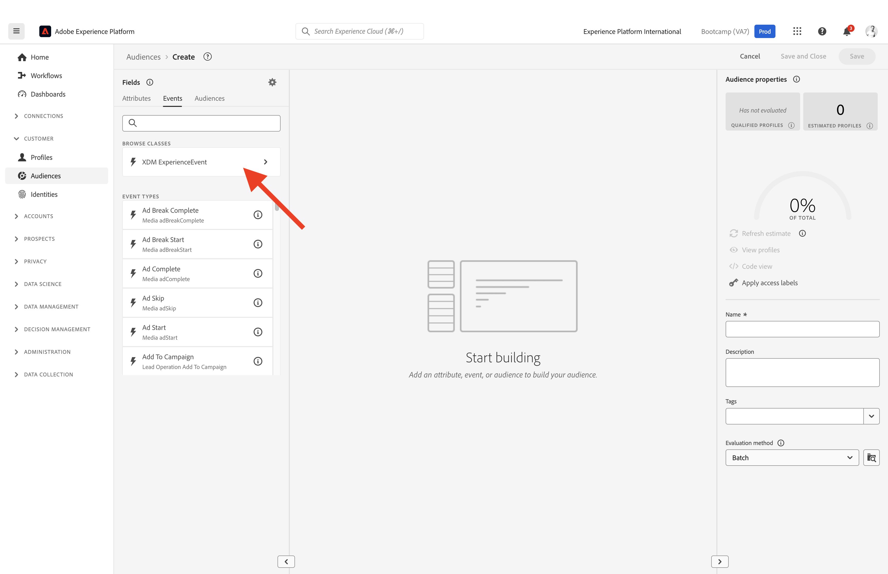

# 1.3建立區段 — UI

在本練習中，您將使用Adobe Experience Platform的區段產生器來建立區段。

## Story

前往 [Adobe Experience Platform](https://experience.adobe.com/platform). 登入後，您會登入Adobe Experience Platform的首頁。

在繼續之前，您需要選取 **沙箱**. 要選取的沙箱已命名 ``Bootcamp``. 您可以按一下文字來執行此操作 **[!UICONTROL 生產產品]** 在熒幕上方的藍線中。 選取適當的 [!UICONTROL 沙箱]，您會看到畫面變更，現在您已進入專屬團隊 [!UICONTROL 沙箱].

在左側的功能表中，前往 **區段**. 在此頁面中，您可以看到所有現有區段的概觀。 按一下 **+建立區段** 按鈕以開始建立新區段。

進入新的區段產生器後，您會立即注意到 **屬性** 功能表選項和 **XDM個別設定檔** 參考資料。

由於XDM是提供體驗業務的語言，XDM也是區段產生器的基礎。 Platform中擷取的所有資料都應對應至XDM，因此無論資料來自何處，所有資料都會成為相同資料模型的一部分。 這為您在建立區段提供了一項絕佳優勢，因為從這個區段產生器UI，您可以在相同工作流程中合併來自任何來源的資料。 內建於Segment Builder的區段可傳送至Adobe Target、Adobe Campaign和Adobe Audience Manager等解決方案以進行啟用。

您現在需要建立已檢視過產品之所有客戶的區段 **Real-Time CDP**.

若要建置此區段，您需要新增體驗事件。 您可以按一下 **事件** 圖示於 **欄位** 功能表列。

接下來，您將看到頂層、 **XDM ExperienceEvents** 節點。 按一下 **XDM ExperienceEvent**.

前往 **產品清單專案**.

選取 **名稱** 並拖放 **名稱** 物件，從左側選單移至區段產生器畫布中的 **事件** 區段。 然後您會看到以下內容：

比較引數應為 **等於** 並在輸入欄位中輸入 **Real-time CDP**.

每次將元素新增至區段產生器時，您都可以按一下 **重新整理預估值** 按鈕來取得區段中的母體新預估值。

作為 **評估方法**，選取 **Edge**.

最後，為區段命名並儲存。

作為命名慣例，請使用：

- `yourLastName - Interest in Real-Time CDP`

然後，按一下 **儲存並關閉** 按鈕以儲存區段。

您現在將返回區段概觀頁面，在那裡您將看到符合您區段資格的客戶設定檔範例預覽。

您現在可以繼續進行下一個練習，並將您的區段用於Adobe Target。

下一步： [1.4採取行動：將您的區段傳送至Adobe Target](./ex4.md)

[返回使用者流程1](./uc1.md)

[返回所有模組](../../overview.md)
