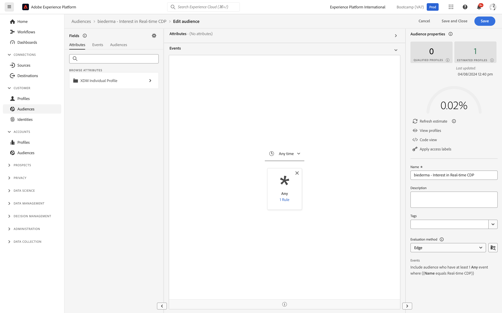

# 1.3建立區段 — UI

在本練習中，您會使用Adobe Experience Platform的區段產生器來建立區段。

## Story

前往 [Adobe Experience Platform](https://experience.adobe.com/platform). 登入後，您會登陸Adobe Experience Platform首頁。

繼續之前，您需要選取 **沙箱**. 要選取的沙箱已命名 ``Bootcamp``. 您可以按一下文字 **[!UICONTROL 生產產品]** 在螢幕上方的藍線。 選取適當的 [!UICONTROL 沙箱]，您會看到畫面變更，現在您已進入專屬 [!UICONTROL 沙箱].

在左側的功能表中，前往 **區段**. 在此頁面上，您可以檢視所有現有區段的概觀。 按一下 **+建立區段** 按鈕以開始建立新區段。

進入新的區段產生器後，您會立即注意到 **屬性** 功能表選項和 **XDM個別設定檔** 參考。

由於XDM是支援體驗業務的語言，因此XDM也是區段產生器的基礎。 Platform中擷取的所有資料都應對應至XDM，因此，無論資料來自何處，所有資料都會成為相同資料模型的一部分。 這可讓您在建立區段時獲得重大優勢，因為透過這個區段產生器UI，您可以將來自任何來源的資料合併至相同的工作流程。 在「區段產生器」中建立的區段可傳送至Adobe Target、Adobe Campaign和Adobe Audience Manager等解決方案進行啟用。

您現在需要建立已檢視產品之所有客戶的區段 **Real-Time CDP**.

若要建置此區段，您必須新增體驗事件。 您可以按一下 **事件** 圖示 **欄位** 的上界。

接下來，你會看到最高層， **XDM ExperienceEvents** 節點。 按一下 **XDM ExperienceEvent**.

前往 **產品清單項目**.

選擇 **名稱** 拖放 **名稱** 物件，從左側功能表移至區段產生器畫布中 **事件** 區段。 然後您會看到：

比較參數應為 **等於** 在輸入欄位中，輸入 **Real-time CDP**.

每次新增元素至區段產生器時，您都可以按一下 **刷新估計值** 按鈕，以取得區段中人口的新估計。

As **評估方法**，選取 **Edge**.

最後，將區段命名並儲存。

作為命名慣例，請使用：

- `yourLastName - Interest in Real-Time CDP`

然後，按一下 **儲存並關閉** 按鈕來儲存區段。

您現在會回到區段概觀頁面，這裡會顯示符合區段資格的客戶設定檔範例預覽。

您現在可以繼續下一個練習，並搭配Adobe Target使用區段。

下一步： [1.4採取行動：將區段傳送至Adobe Target](./ex4.md)

[返回用戶流1](./uc1.md)

[返回所有模組](../../overview.md)
