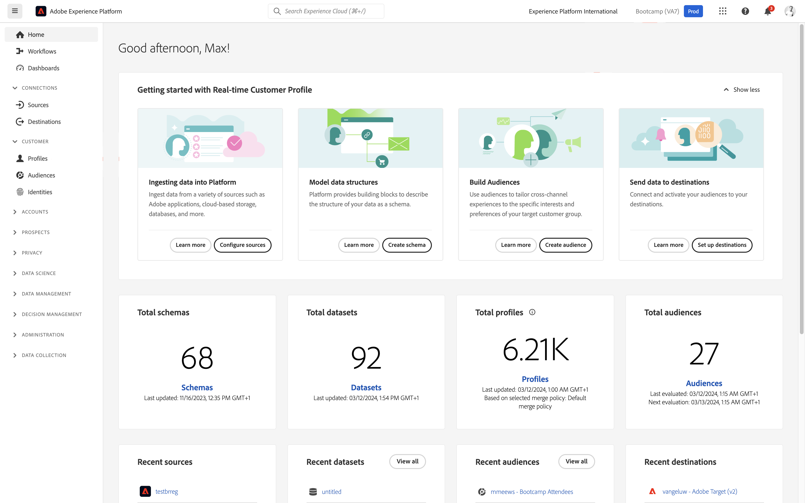

# 1.5採取動作：將對象傳送至Facebook

移至[Adobe Experience Platform](https://experience.adobe.com/platform)。 登入後，您會登入Adobe Experience Platform的首頁。

繼續之前，您必須選取&#x200B;**沙箱**。 要選取的沙箱名為``Bootcamp``。 您可以按一下熒幕上方藍線中的文字&#x200B;**[!UICONTROL Production Prod]**&#x200B;來執行此操作。 選取適當的[!UICONTROL 沙箱]後，您將會看到畫面變更，現在您已在專屬的[!UICONTROL 沙箱]中。

在左側功能表中，前往&#x200B;**目的地**，然後前往&#x200B;**目錄**。 然後您會看到&#x200B;**目的地目錄**。 在&#x200B;**目的地**&#x200B;中，按一下&#x200B;**Facebook自訂對象**&#x200B;卡片上的&#x200B;**啟用對象**。

選取目的地&#x200B;**bootcamp-facebook**，然後按一下&#x200B;**下一步**。

在可用受眾清單中，選取您在上一個練習中建立的受眾。 按一下&#x200B;**下一步**。

在&#x200B;**對應**&#x200B;頁面上，確定已啟用&#x200B;**套用轉換**&#x200B;核取方塊。 按一下&#x200B;**下一步**。

在&#x200B;**對象排程**&#x200B;頁面上，選取對象的&#x200B;**來源**，並將其設定為&#x200B;**直接來自客戶**。 按一下&#x200B;**下一步**。

最後，在&#x200B;**檢閱**&#x200B;頁面上按一下&#x200B;**完成**。

您的對象現在已連結至Facebook自訂對象。 每當客戶符合此對象的資格時，就會傳送訊號至Facebook伺服器端，將該客戶納入Facebook端的自訂對象中。

在Facebook中，您可以在Adobe Experience Platform的自訂對象下方找到您的對象：

您現在可以看到自訂對象出現在Facebook中：

[返回使用者流程1](./uc1.md)

[返回所有模組](../../overview.md)
