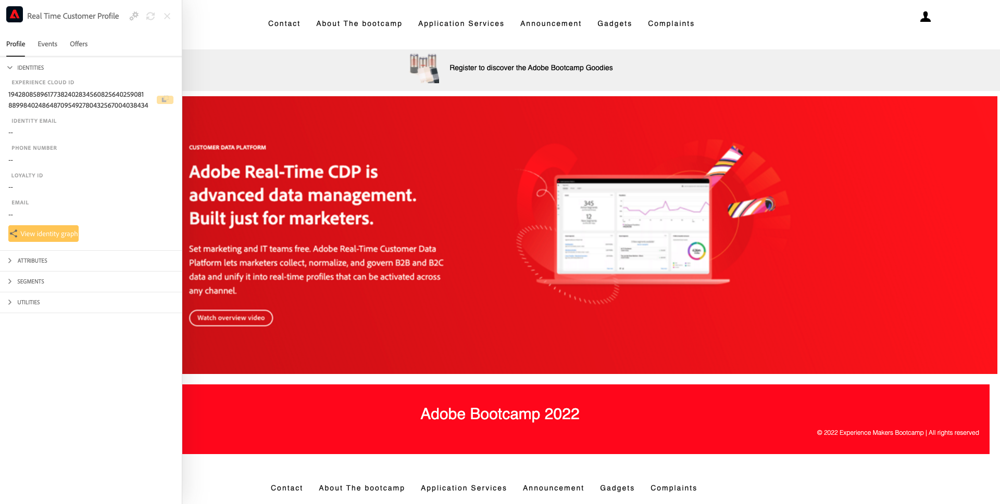

# 2.1造訪網站並建立您的帳戶

## 內容

從未知到已知的歷程是這些天品牌中最重要的主題之一，就像客戶從贏取到保留的歷程。

Adobe Experience Platform在此歷程中擔當著重要角色。 Platform是通訊的大腦，亦即&#x200B;**記錄體驗系統**。

Platform是一種環境，其中客戶一詞的含義比已知客戶更為廣泛。 在網站上的未知訪客也是Platform視角下的客戶，因此，作為未知訪客的所有行為也會傳送到Platform。 由於這種方法，當此訪客最終成為已知客戶時，品牌也可以將當下所發生的事情視覺化。 從歸因和體驗最佳化的角度來看，這很有幫助。

## 客戶歷程流程

移至[https://bootcamp.aepdemo.net](https://bootcamp.aepdemo.net)。 按一下&#x200B;**全部允許**。 根據您在上一個使用者流程中的瀏覽行為，您將在網站的首頁上看到個人化發生。

按一下畫面左上角的Adobe標誌圖示，開啟設定檔檢視器。 請檢視「設定檔檢視器」面板，以及將&#x200B;**Experience CloudID**&#x200B;作為目前未知客戶主要識別碼的即時客戶設定檔。

您也可以檢視根據客戶行為收集的所有體驗事件。

按一下熒幕右上角的&#x200B;**設定檔**&#x200B;圖示。

按一下&#x200B;**建立帳戶**。

填寫表單的所有欄位。 使用電子郵件地址和電話號碼的實值，因為它將用於稍後傳送電子郵件和簡訊的練習。

向下捲動並按一下&#x200B;**註冊**。

您將會看到此訊息。

您也會收到此電子郵件：

幾分鐘後，您也會收到此電子郵件：

讓我們看看此入門歷程後續的設定方式。

下一步： [2.2建立您的活動](./ex2.md)

[返回使用者流程2](./uc2.md)

[返回所有模組](../../overview.md)
