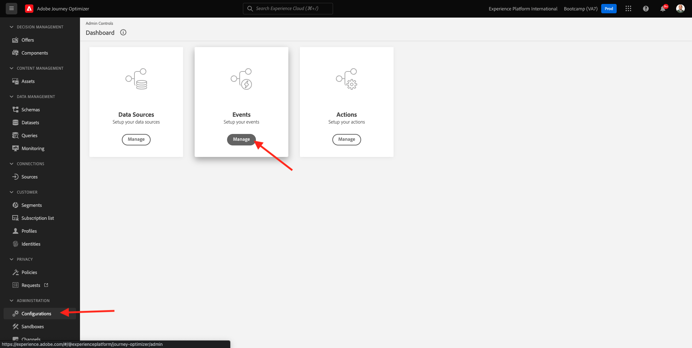

# 2.2建立您的活動

前往[Adobe Experience Cloud](https://experience.adobe.com)登入Adobe Journey Optimizer。 按一下&#x200B;**Journey Optimizer**。

您將被重新導向到Journey Optimizer中的&#x200B;**首頁**&#x200B;檢視。 首先，確定您使用正確的沙箱。 要使用的沙箱稱為`Bootcamp`。 若要從一個沙箱變更為另一個沙箱，請按一下&#x200B;**Prod**&#x200B;並從清單中選取該沙箱。 在此範例中，沙箱名為&#x200B;**Bootcamp**。 然後您就會進入沙箱`Bootcamp`的&#x200B;**首頁**&#x200B;檢視。

在左側功能表中，向下捲動並按一下&#x200B;**組態**。 接著，按一下&#x200B;**事件**&#x200B;下的&#x200B;**管理**&#x200B;按鈕。

接著，您會看到所有可用事件的概觀。 按一下&#x200B;**建立事件**&#x200B;開始建立您自己的事件。

隨後即會出現新的空白事件視窗。

首先，請為事件命名如下： `yourLastNameAccountCreationEvent`並新增說明，如`Account Creation Event`。

接下來，確定&#x200B;**型別**&#x200B;設定為&#x200B;**單一**，並且針對&#x200B;**事件識別碼型別**&#x200B;選取專案，選取&#x200B;**系統產生**。

接下來是「結構描述」選項。 已針對此練習準備結構描述。 請使用結構描述`Demo System - Event Schema for Website (Global v1.1) v.1`。

選取結構描述後，您會在&#x200B;**欄位**&#x200B;區段中看到許多選取的欄位。 您現在應該暫留在&#x200B;**欄位**&#x200B;區段上，將會看到3個圖示快顯視窗。 按一下&#x200B;**編輯**&#x200B;圖示。

您會看到&#x200B;**欄位**&#x200B;視窗快顯視窗，您必須在其中選取我們個人化電子郵件所需的部分欄位。  稍後我們將使用Adobe Experience Platform中已提供的資料，選擇其他設定檔屬性。

在物件`_experienceplatform.demoEnvironment`中，請確定選取欄位&#x200B;**brandLogo**&#x200B;和&#x200B;**brandName**。

在物件`_experienceplatform.identification.core`中，請確定選取欄位&#x200B;**電子郵件**。

按一下&#x200B;**確定**&#x200B;以儲存變更。

您應該會看到此訊息。 再按一次「儲存&#x200B;**&#x200B;**」以儲存變更。

您的事件現在已設定並儲存。

再次按一下您的事件以再次開啟&#x200B;**編輯事件**&#x200B;畫面。 再次將游標暫留在&#x200B;**欄位**&#x200B;上可再次看到3個圖示。 按一下&#x200B;**檢視裝載**&#x200B;圖示。

您現在將看到預期裝載的範例。
您的事件具有獨特的協調流程eventID，您可以在該承載中向下捲動直到看到`_experience.campaign.orchestration.eventID`為止。

事件ID是必須傳送至Adobe Experience Platform的專案，才能觸發您將在下一個練習中建立的歷程。 記住此eventID，因為您稍後可能會需要它。
`"eventID": "19cab7852cdef99d25b6d5f1b6503da39d1f486b1d585743f97ed2d1e6b6c74f"`

按一下&#x200B;**確定**，然後按一下&#x200B;**取消**。

您現在已經完成此練習。

下一步： [2.3建立您的電子郵件訊息](./ex3.md)

[返回使用者流程2](./uc2.md)

[返回所有模組](../../overview.md)
