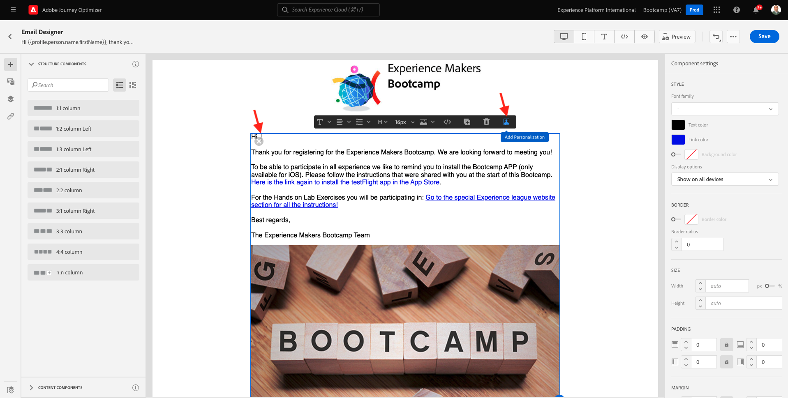
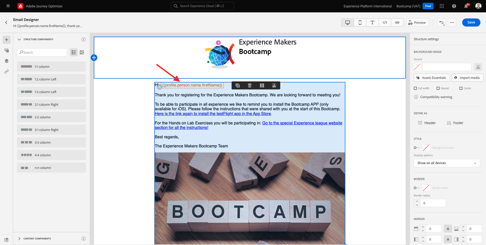

# 2.3建立您的歷程和電子郵件訊息

在本練習中，您將設定當有人在示範網站上建立帳戶時，需要觸發的歷程。

登入Adobe Journey Optimizer的方法為前往 [Adobe Experience Cloud](https://experience.adobe.com). 按一下 **Journey Optimizer**.

系統會將您重新導向至 **首頁**  在Journey Optimizer中檢視。 首先，請確定您使用正確的沙箱。 要使用的沙箱稱為 `Bootcamp`. 若要從一個沙箱變更為另一個沙箱，請按一下 **Prod** 並從清單中選取沙箱。 在此範例中，沙箱命名為 **Bootcamp**. 然後，您將會在 **首頁** 您的沙箱檢視 `Bootcamp`.

## 2.3.1建立您的歷程

在左側功能表中，按一下 **歷程**. 接下來，按一下 **建立歷程** 以建立新歷程。

然後您會看到空白的歷程畫面。

在上一個練習中，您建立了一個 **事件**. 您將其命名如下 `yourLastNameAccountCreationEvent` 和已取代 `yourLastName` 加上您的姓氏。 這是建立事件的結果：

您現在需要將此事件當作此歷程的開端。 您可以移至畫面左側，在事件清單中搜尋您的事件，藉此執行此操作。

選取您的事件，將其拖放至「歷程」畫布上。 您的歷程現在看起來像這樣：

作為歷程的第二步，您需要新增一個簡短的 **等待** 步驟。 前往熒幕左側，前往 **協調流程** 區段以找到此專案。 您將使用設定檔屬性，而且需要確定這些屬性已填入即時客戶設定檔中。

您的歷程現在看起來像這樣。 在熒幕右側，您需要設定等待時間。 設定為1分鐘。 這會在事件觸發後，提供充足的時間讓設定檔屬性可用。

按一下 **確定** 以儲存變更。

作為歷程的第三個步驟，您需要新增 **電子郵件** 動作。 前往熒幕左側，前往 **動作**，選取 **電子郵件** 動作，然後將其拖放至歷程的第二個節點上。 您現在可以看到這個。

設定 **類別** 至 **行銷** 並選取可讓您傳送電子郵件的電子郵件介面。 在此情況下，要選取的電子郵件表面為 **電子郵件**. 確認核取方塊 **電子郵件的點按次數** 和 **電子郵件開啟次數** 兩者皆已啟用。

下一步是建立您的訊息。 若要這麼做，請按一下 **編輯內容**.

## 2.3.2建立您的訊息

若要建立您的訊息，請按一下 **編輯內容**.

您現在可以看到這個。

按一下 **主旨列** 文字欄位。

在文字區域中開始寫入 **嗨**

主旨列尚未完成。 接下來，您需要為欄位引進個人化權杖 **名字** ，儲存在 `profile.person.name.firstName`. 在左側功能表中，向下捲動以尋找 **個人** 元素，並按一下箭頭可深入瞭解。

現在尋找 **全名** 元素，並按一下箭頭可深入瞭解。

最後，尋找 **名字** 欄位並按一下 **+** 在該檔案旁邊簽署。 然後，您會看到個人化權杖出現在文字欄位中。

接下來，新增文字 **，感謝您註冊！**。按一下&#x200B;**儲存**。

然後您就會回到這裡。 按一下 **電子郵件設計工具** 以建立電子郵件的內容。

在下一個畫面中，系統會使用3種不同的方法來提示您提供電子郵件內容：

- **從頭開始設計**：從空白畫布開始，使用WYSIWYG編輯器拖放結構和內容元件，以視覺化方式建立電子郵件內容。
- **自行撰寫程式碼**：使用HTML編碼來建立您自己的電子郵件範本
- **匯入HTML**：匯入現有的HTML範本，以便您進行編輯。

按一下 **匯入HTML**. 或者，您也可以按一下 **已儲存的範本** 並選取範本 **Bootcamp — 電子郵件範本**.

如果您已選取 **匯入HTML**，您現在可以拖放檔案 **mailtemplatebootcamp.html**，您可下載 [此處](../../assets/html/mailtemplatebootcamp.html.zip). 按一下「匯入」。

然後您會看到此預設電子郵件範本：

讓我們個人化電子郵件。 按一下文字旁的 **嗨** 然後按一下 **新增個人化** 圖示。

接下來，您需要將 **名字** 個人化代號(儲存在 `profile.person.name.firstName`. 在功能表中，尋找 **個人** 元素，向下展開至 **全名** 元素，然後按一下 **+** 圖示以將「名字」欄位新增至運算式編輯器。

按一下&#x200B;**儲存**。

您現在會注意到個人化欄位已新增至文字的方式。

按一下 **儲存** 以儲存您的訊息。

按一下「 」，返回訊息控制面板 **箭頭** 左上角主旨行文字旁邊。

您現在已經完成建立註冊電子郵件。 按一下左上角的箭頭，返回您的歷程。

按一下 **確定**.

## 2.3.3發佈您的歷程

您仍需要為歷程提供名稱。 若要這麼做，請按一下 **屬性** 圖示加以檢視。

然後，您可以在此處輸入歷程的名稱。 請使用 `yourLastName - Account Creation Journey`. 按一下 **確定** 以儲存變更。

您現在可以按一下「 」，發佈您的歷程 **發佈**.

按一下 **發佈** 再來一次。

接著，您會看到綠色確認列，指出您的歷程已發佈。

您現在已經完成此練習。

下一步： [2.4測試您的歷程](./ex4.md)

[返回使用者流程2](./uc2.md)

[返回所有模組](../../overview.md)