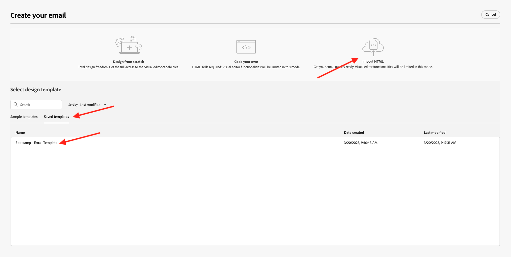

# 2.3建立您的歷程和電子郵件訊息

在本練習中，您將設定當使用者在示範網站上建立帳戶時需要觸發的歷程。

前往登入Adobe Journey Optimizer [Adobe Experience Cloud](https://experience.adobe.com). 按一下 **Journey Optimizer**.

系統會將您重新導向至 **首頁**  檢視。 首先，請確定您使用的沙箱正確無誤。 系統會呼叫要使用的沙箱 `Bootcamp`. 若要從一個沙箱變更為另一個沙箱，請按一下 **生產** 並從清單中選取沙箱。 在此範例中，沙箱的名稱為 **布坎普**. 那你就在 **首頁** 沙箱檢視 `Bootcamp`.

## 2.3.1建立您的歷程

在左側功能表中，按一下 **歷程**. 下一步，按一下 **建立歷程** 來建立新歷程。

然後您會看到空白的歷程畫面。

在上一個練習中，您建立了 **事件**. 你給它起了這個名字 `yourLastNameAccountCreationEvent` 和 `yourLastName` 姓氏。 這是建立事件的結果：

您現在需要將此活動視為此歷程的開始。 您可以前往畫面左側，並在事件清單中搜尋您的事件，以執行此操作。

選取您的事件，將其拖放至歷程畫布。 您的歷程現在看起來像這樣：

作為歷程的第二步，您需要新增簡短 **等待** 步驟。 前往畫面左側的 **協調** 區段來尋找此項目。 您將使用設定檔屬性，且需要確定這些屬性已填入「即時客戶設定檔」中。

你的旅程現在看起來像這樣。 在畫面右側，您需要設定等待時間。 設為1分鐘。 這將提供充足的時間讓設定檔屬性在事件引發後可用。

按一下 **確定** 來儲存變更。

作為歷程的第三個步驟，您需要新增 **電子郵件** 動作。 前往畫面左側，前往 **動作**，請選取 **電子郵件** 動作，然後將其拖放至歷程中的第二個節點。 你現在看到這個。

設定 **類別** to **行銷** 並選取電子郵件介面，讓您傳送電子郵件。 在此情況下，要選取的電子郵件表面是 **電子郵件**. 確保的複選框 **電子郵件的點按次數** 和 **電子郵件開啟** 都會啟用。

下一步是建立訊息。 若要這麼做，請按一下 **編輯內容**.

## 2.3.2建立訊息

若要建立訊息，請按一下 **編輯內容**.

你現在看到這個。

按一下 **主旨行** 文字欄位。

在文本區域開始寫 **你好**

尚未完成主題行。 接下來，您需要為欄位帶入個人化代號 **名字** 儲存於 `profile.person.name.firstName`. 在左側功能表中，向下捲動以尋找 **人員** 元素，然後按一下箭頭以深入了解層級。

現在找到 **全名** 元素，然後按一下箭頭以深入了解層級。

最後，找到 **名字** 欄位，然後按一下 **+** 簽到旁邊。 然後，您會看到個人化代號出現在文字欄位中。

接下來，新增文字 **，感謝您註冊！**。按一下「**儲存**」。

你會回來的。 按一下 **電子郵件設計工具** 來建立電子郵件內容。

在下一個畫面中，系統會以3種不同方法提示您提供電子郵件的內容：

- **從頭設計**:從空白畫布開始，使用WYSIWYG編輯器來拖放結構和內容元件，以視覺化方式建立電子郵件的內容。
- **自行編碼**:使用HTML對您自己的電子郵件範本進行編碼，以建立您的電子郵件範本
- **匯入HTML**:匯入您將能編輯的現有HTML範本。

按一下 **匯入HTML**.

拖放檔案 **mailtemplatebootcamp.html**，您可以下載 [此處](../../assets/html/mailtemplatebootcamp.html.zip). 按一下「匯入」。

然後您會看到此預設電子郵件範本：

讓我們將電子郵件個人化。 按一下文字旁的 **你好** 然後按一下 **新增個人化** 表徵圖。

接下來，你要把 **名字** 儲存於 `profile.person.name.firstName`. 在功能表中，尋找 **人員** 元素，向下切入 **完整名稱** 元素，然後按一下 **+** 圖示將「名字」欄位新增至運算式編輯器。

按一下「**儲存**」。

您現在會注意到個人化欄位已新增至文字的方式。

按一下 **儲存** 來儲存訊息。

按一下 **箭頭** 在左上角的主旨行文字旁邊。

您現在已完成建立註冊電子郵件。 按一下左上角的箭頭，返回您的歷程。

按一下 **確定**.

## 2.3.3發佈您的歷程

您仍需為歷程命名。 您可以按一下 **屬性** 圖示。

然後，您可以在此處輸入歷程的名稱。 請使用 `yourLastName - Account Creation Journey`. 按一下 **確定** 來儲存變更。

您現在可以按一下 **發佈**.

按一下 **發佈** 。

接著，您會看到綠色的確認列，指出您的歷程現已發佈。

你已經完成了這個練習。

下一步： [2.4測試您的歷程](./ex4.md)

[返回用戶流2](./uc2.md)

[返回所有模組](../../overview.md)