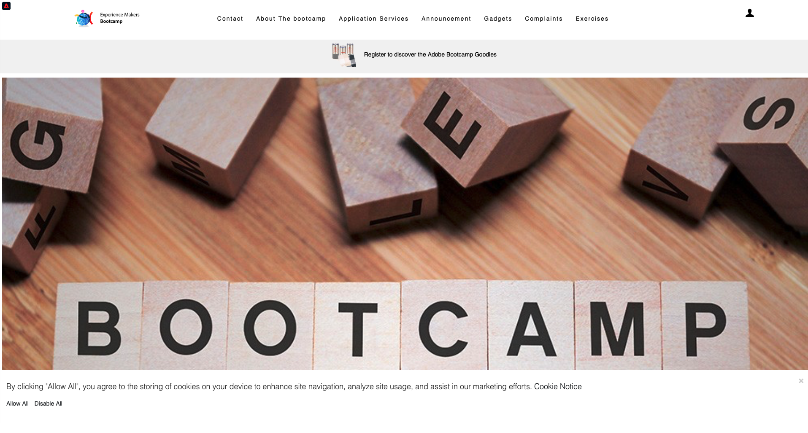

# 2.4測試您的歷程

## 客戶歷程流程

開啟新的、乾淨且無痕的瀏覽器視窗，並移至[https://bootcamp.aepdemo.net](https://bootcamp.aepdemo.net)。 按一下&#x200B;**全部允許**。 根據您在上一個使用者流程中的瀏覽行為，您將在網站的首頁上看到個人化發生。

按一下熒幕右上角的&#x200B;**設定檔**&#x200B;圖示。

按一下&#x200B;**建立帳戶**。

填寫表單的所有欄位。 使用電子郵件地址和電話號碼的實值，因為它將用於稍後傳送電子郵件和簡訊的練習。

向下捲動。 您現在需要輸入您在練習2.2中建立的自訂事件的eventID。您可以在這裡找到它：

事件ID需要傳送至Adobe Experience Platform，才能觸發您建立的歷程。 這是此範例中的eventID： `19cab7852cdef99d25b6d5f1b6503da39d1f486b1d585743f97ed2d1e6b6c74f`

在&#x200B;**您的帳戶建立事件識別碼**&#x200B;欄位中填寫eventID，然後按一下&#x200B;**註冊**。

您將會看到此訊息。

您也會收到這封電子郵件，這是您在本練習中自行建立的電子郵件。

您現在已經完成此練習。

下一步： [2.5安裝及使用行動應用程式](./ex5.md)

[返回使用者流程2](./uc2.md)

[返回所有模組](../../overview.md)
