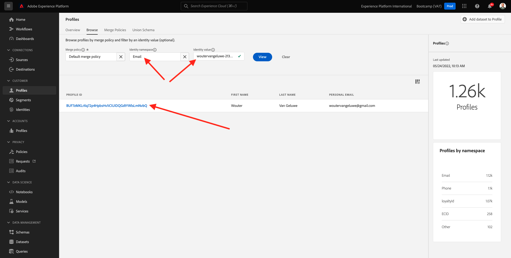

# 2.6客服中心的個人化

正如在Bootcamp期間已多次討論的，個人化客戶體驗應以全通路的方式進行。 客服中心通常與客戶歷程的其餘部分相去甚遠，這通常會導致令人沮喪的客戶體驗，但不需要。 讓我們舉個例子，告訴您客服中心如何即時輕鬆連線至Adobe Experience Platform。

## 客戶歷程流量

在先前的練習中，您使用行動應用程式，按一下 **購買** 按鈕。

假設您對訂單狀態有疑問，您會怎麼做？ 通常您會呼叫呼叫中心。

在呼叫客服中心之前，您需要了解 **忠誠度ID**. 您可以在網站的設定檔檢視器中找到您的忠誠度ID。

在此情況下， **忠誠度ID** is **5863105**. 在示範環境中，作為客服中心功能的自訂實作，您需要在 **忠誠度ID**. 前置詞是 **11373**，因此此範例中使用的忠誠度ID為 **11373 5863105**.

現在來。 用你的電話打電話 **+1(323)745-1670**.

系統會要求您輸入忠誠度ID，之後 **#**. 輸入您的忠誠度ID。

你就會聽到 **你好，名字**. 名字取自Adobe Experience Platform的「即時客戶個人檔案」。 那你有3個選擇。 新聞號碼 **1**, **訂單狀態**.

聽完訂單狀態後，您將可以選擇按 **1** 要返回主菜單或其他，請按2。 Press **2**.

接著，系統會要求您透過選取介於1和5之間、1為低且5為高的數字，對客服中心的使用體驗進行評分。 做出選擇。

您對客服中心的呼叫現在將結束。

前往 [Adobe Experience Platform](https://experience.adobe.com/platform). 登入後，您會登陸Adobe Experience Platform首頁。

繼續之前，您需要選取 **沙箱**. 要選取的沙箱已命名 ``Bootcamp``. 您可以按一下文字 **[!UICONTROL 生產產品]** 在螢幕上方的藍線。 選取適當的 [!UICONTROL 沙箱]，您會看到畫面變更，現在您已進入專屬 [!UICONTROL 沙箱].

在左側功能表中，前往 **設定檔** 和 **瀏覽**.

選取 **身分命名空間** **電子郵件** 並輸入客戶設定檔的電子郵件地址。 按一下 **檢視**. 按一下以開啟您的設定檔。

您會再次看到您的客戶設定檔。 前往 **事件**.

在events底下，您會看到2個事件，其中eventType為 **callCenter**. 第一個事件是您回答問題的結果 **評分您的電話滿意度**.

向下捲動一點，您就會看到選取要檢查 **訂單狀態**.

前往 **區段成員資格**. 您現在會根據您透過客服中心的互動，即時看到2個區段符合您的設定檔資格。 然後，這些區段成員資格可以也應該用於影響任何其他管道間的通訊和個人化情形。

你已經完成了這個練習。

[返回用戶流2](./uc2.md)

[返回所有模組](../../overview.md)
