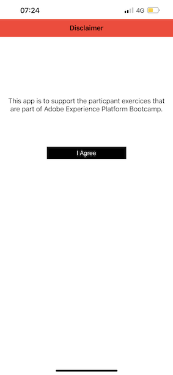

# 3.1使用行動應用程式並觸發信標專案

## 安裝行動應用程式

安裝應用程式之前，您必須在iOS裝置上啟用&#x200B;**追蹤**。 若要這麼做，請移至&#x200B;**設定** > **隱私權與安全性** > **追蹤**，並確認選項&#x200B;**允許應用程式要求追蹤**。

前往Apple App Store搜尋`aepmobile-bootcamp`。 按一下&#x200B;**安裝**&#x200B;或&#x200B;**下載**。

安裝應用程式後，請按一下[開啟]。**&#x200B;**

按一下&#x200B;**「確定」**。

按一下&#x200B;**允許**。

按一下&#x200B;**我同意**。

使用應用程式&#x200B;**時按一下**&#x200B;允許。

按一下&#x200B;**允許**。

您現在位於應用程式的首頁，準備進行客戶歷程。

## 客戶歷程流程

首先，您必須登入。 按一下&#x200B;**登入**。

在先前練習中建立您的帳戶後，您會在網站上看到此內容。 現在，您需要重複使用在應用程式中建立的帳戶電子郵件地址來登入。

在這裡輸入您在網站上使用的電子郵件地址，然後按一下&#x200B;**登入**。

之後，您將會收到您已登入的確認訊息，而且您將會收到推播通知。

返回應用程式中的首頁，您會看到顯示的其他功能。

首先，移至&#x200B;**產品**。 按一下任何產品，在此範例中為&#x200B;**咖啡到**。

您會在應用程式中看到&#x200B;**咖啡到**&#x200B;產品頁面。

您現在將會在離線存放區位置模擬信標專案事件。 模擬此情形的目標是在店內熒幕上個人化客戶體驗。 為了將店內體驗視覺化，已建立可動態顯示與剛進入商店之客戶相關的資訊的頁面。

繼續之前，請在您的電腦上開啟此網頁： [https://bootcamp.aepdemo.net/content/aep-bootcamp-experience/language-masters/en/screen.html](https://bootcamp.aepdemo.net/content/aep-bootcamp-experience/language-masters/en/screen.html)

然後您會看到以下內容：

接著，返回首頁。 按一下&#x200B;**信標**&#x200B;圖示。

您將會看到此訊息。 首先，選取&#x200B;**Bootcamp熒幕信標**，然後按一下&#x200B;**專案**&#x200B;按鈕。 這可讓您模擬信標專案。

現在，請檢視店內畫面。 您會在5秒內看到最後檢視的產品。

接著，返回&#x200B;**產品**。 按一下任何產品，在此範例中為&#x200B;**沙灘毯式Tan**。

接著，返回首頁。 按一下&#x200B;**信標**&#x200B;圖示。

您將會看到此訊息。 首先，選取&#x200B;**Bootcamp熒幕信標**，然後再次按一下&#x200B;**專案**&#x200B;按鈕。 這可讓您模擬信標專案。

現在，請再次檢視店內畫面。 您會在5秒內看到最後檢視的產品。

現在也來瀏覽您網站上的設定檔檢視器。 您會看到許多新增的事件，其中只是為了顯示系統已收集和儲存任何與客戶的互動Adobe Experience Platform。

在下個練習中，您將設定並測試自己的Beacon進入歷程。

下一步： [3.2建立您的活動](./ex2.md)

[返回使用者流程3](./uc3.md)

[返回所有模組](../../overview.md)
