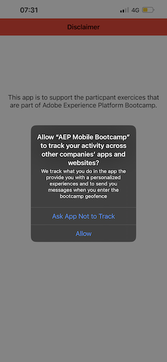

# 3.1使用行動應用程式並觸發信標項目

## 安裝行動應用程式

安裝應用程式之前，您必須啟用 **追蹤** 在iOS裝置上。 若要這麼做，請前往 **設定** > **隱私權與安全性** > **追蹤** 並確保 **允許應用程式要求追蹤**.

前往Apple App Store並搜尋 `aepmobile-bootcamp`. 按一下 **安裝** 或 **下載**.

安裝應用程式後，按一下 **開啟**.

按一下&#x200B;**「確定」**。

按一下 **允許**.

按一下 **我同意**.

按一下 **使用應用程式時允許**.

按一下 **允許**.

您現在已可在應用程式、首頁上完成客戶歷程的準備。

## 客戶歷程流程

首先，您需要登入。 按一下「**登入**」。

在先前的練習中建立帳戶後，您在網站上看到了這個。 您現在需要重複使用在應用程式中建立之帳戶的電子郵件地址才能登入。

在此處輸入您在網站上使用的電子郵件地址，然後按一下 **登入**.

然後您會收到登入的確認資訊，並收到推播通知。

返回應用程式中的首頁，您會看到其他功能出現。

首先，請前往 **產品**. 在此範例中，按一下任何產品 **咖啡**.

您會看到 **咖啡** 產品頁面。

您現在會在離線商店位置模擬信標項目事件。 模擬此動作的目標是在店內畫面上個人化客戶體驗。 為了視覺化店內體驗，已建立一個頁面，以動態顯示與剛進入商店之客戶相關的資訊。

繼續操作之前，請在您的電腦上開啟此網頁： [https://bootcamp.aepdemo.net/content/aep-bootcamp-experience/language-masters/en/screen.html](https://bootcamp.aepdemo.net/content/aep-bootcamp-experience/language-masters/en/screen.html)

然後您會看到：

接下來，返回首頁。 按一下 **信標** 表徵圖。

你會看到這個。 首先，選取 **Bootcamp螢幕信標** 然後按一下 **登入** 按鈕。 這可讓您模擬信標項目。

現在，查看店內螢幕。 在5秒內，您會看到您最後檢視的產品出現在該處。

然後，返回 **產品**. 在此範例中，按一下任何產品 **灘毯灘**.

接下來，返回首頁。 按一下 **信標** 表徵圖。

你會看到這個。 首先，選取 **Bootcamp螢幕信標** 然後按一下 **登入** 按鈕。 這可讓您模擬信標項目。

現在，再看看店內螢幕。 在5秒內，您會看到您最後檢視的產品出現在該處。

現在，我們也可以在網站上查看您的設定檔檢視器。 您會看到許多新增到此處的事件，只是為了顯示已收集並儲存與客戶的任何互動。Adobe Experience Platform

在下個練習中，您將設定並測試您自己的信標項目歷程。

下一步： [3.2建立事件](./ex2.md)

[返回用戶流3](./uc3.md)

[返回所有模組](../../overview.md)
