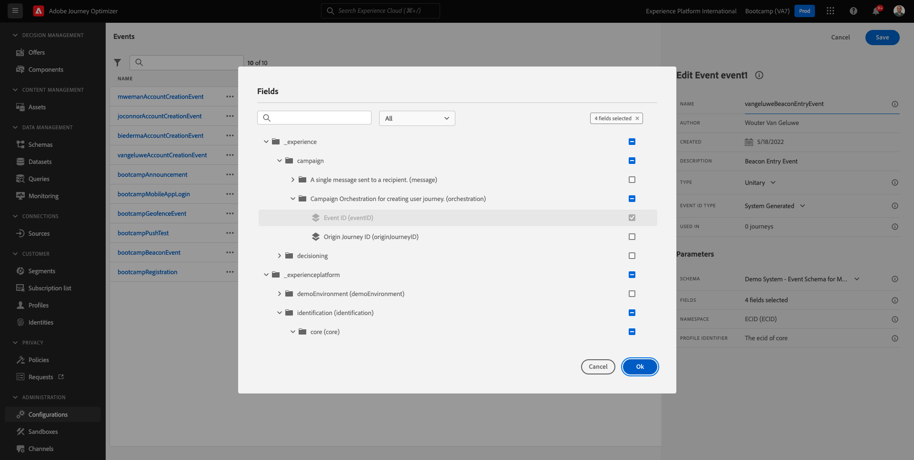

# 3.2建立您的活動

登入Adobe Journey Optimizer的方法為前往 [Adobe Experience Cloud](https://experience.adobe.com). 按一下 **Journey Optimizer**.

系統會將您重新導向至 **首頁**  在Journey Optimizer中檢視。 首先，請確定您使用正確的沙箱。 要使用的沙箱稱為 `Bootcamp`. 若要從一個沙箱變更為另一個沙箱，請按一下 **Prod** 並從清單中選取沙箱。 在此範例中，沙箱命名為 **Bootcamp2**. 然後，您將會在 **首頁** 您的沙箱檢視 `Bootcamp`.

在左側功能表中，向下捲動並按一下 **設定**. 接下來，按一下 **管理** 按鈕於 **事件**.

然後您會看到所有可用事件的概觀。 按一下 **建立事件** 以開始建立您自己的事件。

隨後將會出現新的空白事件視窗。

首先，請為事件命名，如下所示： `yourLastNameBeaconEntryEvent` 並新增如下的說明 `Beacon Entry Event`.

接下來，確認 **型別** 設為 **單一**&#x200B;的，和 **事件ID型別** 選取，選取 **系統已產生**.

接下來是「結構描述」選項。 已為此練習準備結構描述。 請使用結構描述 `Demo System - Event Schema for Mobile App (Global v1.1) v.1`.

選取「結構描述」後，您會看到在 **欄位** 區段。 您現在應該暫留在 **欄位** 區段，您會看到3個圖示快顯視窗。 按一下 **編輯** 圖示。

您將會看到 **欄位** 視窗快顯視窗，您必須在其中選取我們需要個人化歷程的某些欄位。  稍後我們將使用Adobe Experience Platform中已有的資料，選擇其他設定檔屬性。

向下捲動直到您看到物件為止 `Place context` 並勾選核取方塊。 透過此專案，客戶位置的所有內容都可供歷程使用。 按一下 **確定** 以儲存變更。

然後您應該會看到此內容。 按一下 **儲存** 再儲存一次變更。

您的事件現在已設定並儲存。

再次按一下您的活動以開啟 **編輯事件** 重新熒幕。 暫留在 **欄位** 再次檢視這3個圖示。 按一下 **檢視** 圖示。

您現在會看到預期裝載的範例。
您的事件具有獨特的協調流程eventID，您可以向下捲動該裝載直至看到 `_experience.campaign.orchestration.eventID`.

事件ID需要傳送至Adobe Experience Platform，才能觸發您將在下一個練習中建立的歷程。 記住此eventID，因為您稍後可能會需要它。
`"eventID": "e76c0bf0c77c3517e5b6f4c457a0754ebaf5f1f6b9357d74e0d8e13ae517c3d5"`

按一下 **確定**，然後按一下 **取消**.

您現在已經完成此練習。

下一步： [3.3建立您的歷程和推播通知](./ex3.md)

[返回使用者流程3](./uc3.md)

[返回所有模組](../../overview.md)
