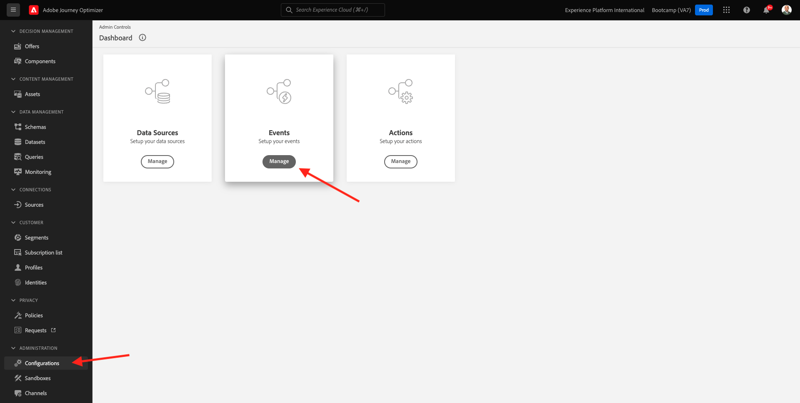
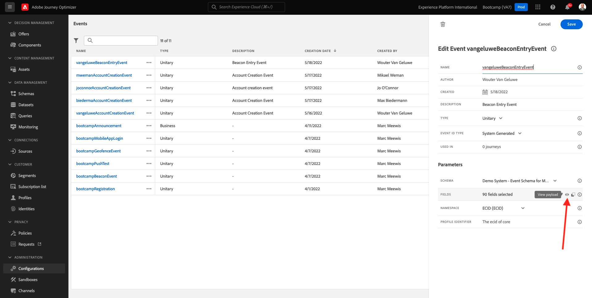

# 3.2建立事件

前往登入Adobe Journey Optimizer [Adobe Experience Cloud](https://experience.adobe.com). 按一下 **Journey Optimizer**.

系統會將您重新導向至 **首頁**  檢視。 首先，請確定您使用的沙箱正確無誤。 系統會呼叫要使用的沙箱 `Bootcamp`. 若要從一個沙箱變更為另一個沙箱，請按一下 **生產** 並從清單中選取沙箱。 在此範例中，沙箱的名稱為 **Bootcamp2**. 那你就在 **首頁** 沙箱檢視 `Bootcamp`.

在左側功能表中，向下捲動並按一下 **配置**. 下一步，按一下 **管理** 按鈕 **事件**.

之後，您將會看到所有可用事件的概觀。 按一下 **建立事件** 以開始建立您自己的事件。

接著會出現新的空事件視窗。

首先，為您的事件命名如下： `yourLastNameBeaconEntryEvent` 並添加這樣的說明 `Beacon Entry Event`.

接下來，請確定 **類型** 設為 **單一**，和 **事件ID類型** 選擇，選擇 **系統生成**.

接下來是「結構」選項。 為本練習準備了方案。 請使用架構 `Demo System - Event Schema for Mobile App (Global v1.1) v.1`.

選取結構後，您會在 **欄位** 區段。 您現在應將滑鼠暫留在 **欄位** 區段中顯示3個圖示快顯視窗。 按一下 **編輯** 表徵圖。

你會看到 **欄位** 視窗快顯視窗中，您需要在其中選取我們個人化歷程所需的一些欄位。  我們稍後會使用Adobe Experience Platform中已有的資料，選擇其他設定檔屬性。

向下捲動，直到看到該對象 `Place context` 並勾選核取方塊。 借此，客戶位置的所有內容都將可供歷程使用。 按一下 **確定** 來儲存變更。

你應該看看這個。 按一下 **儲存** 以儲存變更。

您的事件現在已設定並儲存。

再按一下您的事件以開啟 **編輯事件** 畫面。 暫留在 **欄位** 再看3個圖示。 按一下 **檢視** 表徵圖。

您現在會看到預期有效負載的範例。
您的事件有唯一的協調eventID，您可以在該裝載中向下捲動以找到它，直到您看到 `_experience.campaign.orchestration.eventID`.

事件ID是需要傳送至Adobe Experience Platform的項目，以觸發您將在下一個練習中建立的歷程。 記住此eventID，因為您稍後可能需要它。
`"eventID": "e76c0bf0c77c3517e5b6f4c457a0754ebaf5f1f6b9357d74e0d8e13ae517c3d5"`

按一下 **確定**，然後按一下 **取消**.

你已經完成了這個練習。

下一步： [3.3建立您的歷程和推播通知](./ex3.md)

[返回用戶流3](./uc3.md)

[返回所有模組](../../overview.md)
