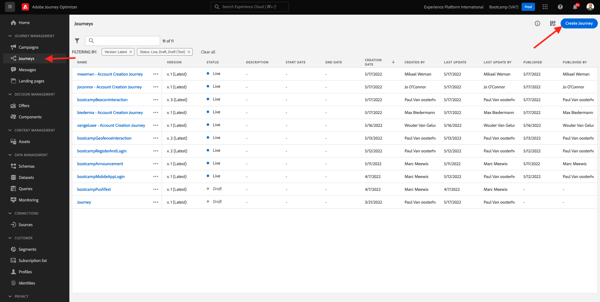
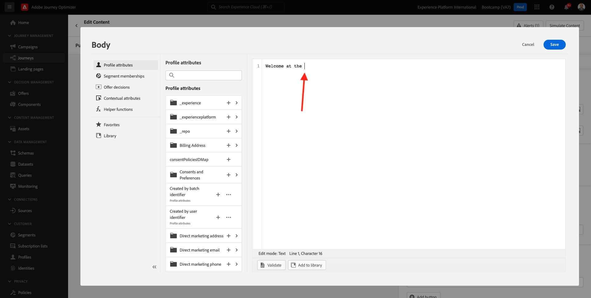
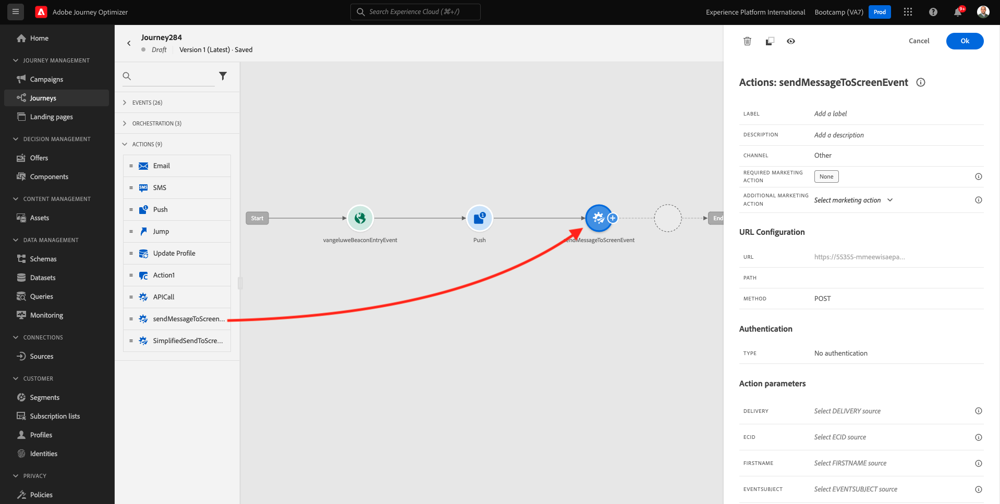

# 3.3建立您的歷程及推播通知

在本練習中，您將設定當有人使用行動應用程式進入信標時，需要觸發的歷程和訊息。

登入Adobe Journey Optimizer，方法是前往 [Adobe Experience Cloud](https://experience.adobe.com). 按一下 **Journey Optimizer**.

系統會將您重新導向至 **首頁**  在Journey Optimizer中檢視。 首先，確定您使用正確的沙箱。 呼叫要使用的沙箱 `Bootcamp`. 若要從一個沙箱變更為另一個，請按一下 **Prod** 並從清單中選取沙箱。 在此範例中，沙箱命名為 **Bootcamp**. 然後您將會在 **首頁** 您的沙箱檢視 `Bootcamp`.

## 3.3.1建立您的歷程

在左側功能表中，按一下 **歷程**. 接下來，按一下 **建立歷程** 以建立新的歷程。

接著，您會看到空白的歷程畫面。

在上一個練習中，您建立了一個 **事件**. 您將其命名如下 `yourLastNameBeaconEntryEvent` 和已取代 `yourLastName` 您的姓氏。 這是建立事件的結果：

您現在需要將此事件當作此歷程的開端。 您可以移至畫面左側，在事件清單中搜尋您的事件，以執行此操作。

選取您的事件，將其拖放到歷程畫布上。 您的歷程現在看起來像這樣。 按一下 **確定** 以儲存變更。

作為歷程的第二步，您需要新增 **推播** 動作。 移至熒幕左側： **動作**，選取 **推播** 動作，然後將其拖放至歷程的第二個節點。

在熒幕右側，您現在需要建立推播通知。

設定 **類別** 至 **行銷** 並選取可讓您傳送推播通知的推播表面。 在此情況下，要選取的推播表面為 **mmeewis-app-mobile-bootcamp**.

## 3.3.2建立您的訊息

按一下 **編輯內容**.

然後您會看到以下內容：

讓我們定義推播通知的內容。

按一下 **標題** 文字欄位。

在文字區域中開始寫入 **您好**. 按一下個人化圖示。

您現在需要為欄位匯入個人化權杖 **名字** ，儲存在 `profile.person.name.firstName`. 在左側功能表中，選取 **設定檔屬性**，向下捲動/導覽以尋找 **個人** 元素，並按一下箭頭可更深入瞭解，直到到達欄位為止 `profile.person.name.firstName`. 按一下 **+** 圖示將欄位新增至畫布。 按一下&#x200B;**儲存**。

然後您就會回到這裡。 按一下欄位旁的個人化圖示 **內文**.

在文字區域中，寫入 `Welcome at the `.

接下來，按一下 **內容屬性** 然後 **Journey Orchestration**.

按一下 **活動**.

按一下事件的名稱，名稱應如下所示： **yourLastNameBeaconEntryEvent**.

按一下 **地標內容**.

按一下 **POI互動**.

按一下 **POI詳細資料**.

按一下 **+** 圖示開啟 **POI名稱**.
您將會看到此訊息。 按一下**儲存**。

您的訊息現已準備就緒。 按一下左上角的箭頭，返回您的歷程。

按一下 **確定**.

## 3.3.2傳送訊息至畫面

作為歷程的第三個步驟，您需要新增 **sendMessageToScreen** 動作。 移至熒幕左側： **動作**，選取 **sendMessageToScreen** 動作，然後將其拖放至歷程中的第三個節點。 您將會看到此訊息。

此 **sendMessageToScreen** action是自訂動作，會將訊息發佈至店內顯示所使用的端點。 此 **sendMessageToScreen** 動作需要定義許多變數。 您可以向下捲動直到顯示，以檢視這些變數 **動作引數**.

您現在需要設定每個動作引數的值。 請參考此表格以瞭解需要在哪些位置有哪些值。

| 參數 | value |
|:-------------:| :---------------:|
| 傳遞 | `'image'` |
| ECID | `@{yourLastNameBeaconEntryEvent._experienceplatform.identification.core.ecid}` |
| 名字 | `#{ExperiencePlatform.ProfileFieldGroup.profile.person.name.firstName}` |
| EVENTSUBJECT | `#{ExperiencePlatform.ProductListItems.experienceevent.first(currentDataPackField.eventType == "commerce.productViews").productListItems.first().name}` |
| EVENTSUBJECTURL | `#{ExperiencePlatform.ProductListItems.experienceevent.first(currentDataPackField.eventType == "commerce.productViews").productListItems.first()._experienceplatform.core.imageURL}` |
| 沙箱 | `'bootcamp'` |
| CONTAINERID | `''` |
| ACTIVITYID | `''` |
| PLACEMENTID | `''` |

{style="table-layout:auto"}

若要設定這些值，請按一下 **編輯** 圖示。

接下來，選取 **進階模式**.

接著，根據上表貼上值。 按一下 **確定**.

重複此程式，為每個欄位新增值。

>[!IMPORTANT]
>
>對於ECID欄位，有事件的參考 `yourLastNameBeaconEntryEvent`. 請確定取代 `yourLastName` 依您的姓氏。

最終結果應如下所示：

向上捲動並按一下 **確定**.

您仍需要提供歷程名稱。 若要這麼做，請按一下 **鉛筆** 圖示加以調整。

然後，您可以在此處輸入歷程的名稱。 請使用 `yourLastName - Beacon Entry Journey`. 按一下 **確定** 以儲存變更。

您現在可以按一下 **發佈**.

按一下 **發佈** 再來一次。

接著，您會看到綠色確認列，指出您的歷程已發佈。

您的歷程現在處於上線狀態，且可以觸發。

您現在已經完成此練習。

下一步： [3.4測試您的歷程](./ex4.md)

[返回使用者流程3](./uc3.md)

[返回所有模組](../../overview.md)
