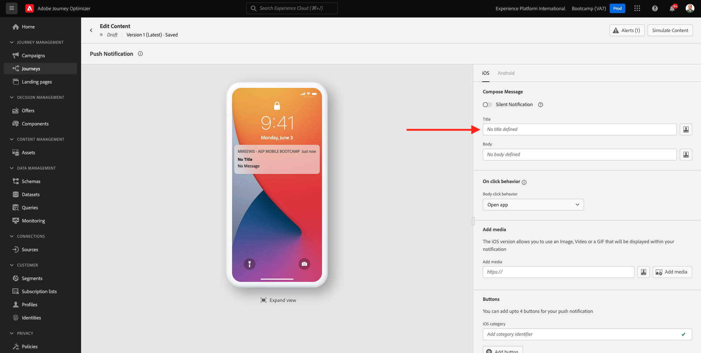

# 3.3建立您的歷程及推播通知

在本練習中，您將設定當有人使用行動應用程式進入信標時，需要觸發的歷程和訊息。

前往[Adobe Experience Cloud](https://experience.adobe.com)登入Adobe Journey Optimizer。 按一下&#x200B;**Journey Optimizer**。

您將被重新導向到Journey Optimizer中的&#x200B;**首頁**&#x200B;檢視。 首先，確定您使用正確的沙箱。 要使用的沙箱稱為`Bootcamp`。 若要從一個沙箱變更為另一個沙箱，請按一下&#x200B;**Prod**&#x200B;並從清單中選取該沙箱。 在此範例中，沙箱名為&#x200B;**Bootcamp**。 然後您就會進入沙箱`Bootcamp`的&#x200B;**首頁**&#x200B;檢視。

## 3.3.1建立您的歷程

在左側功能表中，按一下&#x200B;**歷程**。 接著，按一下&#x200B;**建立歷程**&#x200B;以建立新歷程。

接著，您會看到空白的歷程畫面。

在上一個練習中，您已建立新的&#x200B;**事件**。 您將其命名為`yourLastNameBeaconEntryEvent`，並將`yourLastName`取代為您的姓氏。 這是建立事件的結果：

您現在需要將此事件當作此歷程的開端。 您可以移至畫面左側，在事件清單中搜尋您的事件，以執行此操作。

選取您的事件，將其拖放到歷程畫布上。 您的歷程現在看起來像這樣。 按一下&#x200B;**確定**&#x200B;以儲存變更。

作為歷程的第二步，您需要新增&#x200B;**推播**&#x200B;動作。 移至畫面左側的&#x200B;**動作**，選取&#x200B;**推播**&#x200B;動作，然後將其拖放到歷程的第二個節點。

在熒幕右側，您現在需要建立推播通知。

將&#x200B;**類別**&#x200B;設定為&#x200B;**行銷**，並選取可讓您傳送推播通知的推播表面。 在此情況下，要選取的推播表面為&#x200B;**mmeewis-app-mobile-bootcamp**。

## 3.3.2建立您的訊息

按一下&#x200B;**編輯內容**。

然後您會看到以下內容：

讓我們定義推播通知的內容。

按一下&#x200B;**標題**&#x200B;文字欄位。

在文字區域中開始寫入&#x200B;**嗨**。 按一下個人化圖示。

您現在需要為&#x200B;**名字**&#x200B;欄位（儲存在`profile.person.name.firstName`下）引進個人化權杖。 在左側功能表中，選取&#x200B;**設定檔屬性**，向下捲動/導覽以尋找&#x200B;**人員**&#x200B;元素，然後按一下箭頭以深入瞭解，直到您到達欄位`profile.person.name.firstName`。 按一下&#x200B;**+**&#x200B;圖示以將欄位新增至畫布。 按一下&#x200B;**儲存**。

然後您就會回到這裡。 按一下欄位&#x200B;**內文**&#x200B;旁的個人化圖示。

在文字區域中，寫入`Welcome at the `。

接著，按一下&#x200B;**內容屬性**，然後按一下&#x200B;**Journey Orchestration**。

按一下&#x200B;**事件**。

按一下事件的名稱，名稱應如下所示： **yourLastNameBeaconEntryEvent**。

按一下&#x200B;**置入內容**。

按一下&#x200B;**POI互動**。

按一下&#x200B;**POI詳細資料**。

按一下&#x200B;**POI名稱**&#x200B;上的&#x200B;**+**&#x200B;圖示。
您將會看到此訊息。 按一下&#x200B;**儲存**。

您的訊息現已準備就緒。 按一下左上角的箭頭，返回您的歷程。

按一下&#x200B;**確定**。

## 3.3.2傳送訊息至畫面

作為歷程的第三個步驟，您需要新增&#x200B;**sendMessageToScreen**&#x200B;動作。 移至熒幕左邊的&#x200B;**動作**，選取&#x200B;**sendMessageToScreen**&#x200B;動作，然後將其拖放到歷程中的第三個節點。 您將會看到此訊息。

**sendMessageToScreen**&#x200B;動作是自訂動作，會將訊息發佈至店內顯示所使用的端點。 **sendMessageToScreen**&#x200B;動作需要定義許多變數。 您可以向下捲動直到看到&#x200B;**動作引數**&#x200B;為止，以檢視這些變數。

您現在需要設定每個動作引數的值。 請參考此表格以瞭解需要在哪些位置有哪些值。

| 參數 | 值 |
|:-------------:| :---------------:|
| 傳遞 | `'image'` |
| ECID | `@{yourLastNameBeaconEntryEvent._experienceplatform.identification.core.ecid}` |
| 名字 | `#{ExperiencePlatform.ProfileFieldGroup.profile.person.name.firstName}` |
| EVENTSUBJECT | `#{ExperiencePlatform.ProductListItems.experienceevent.first(currentDataPackField.eventType == "commerce.productViews").productListItems.first().name}` |
| EVENTSUBJECTURL | `#{ExperiencePlatform.ProductListItems.experienceevent.first(currentDataPackField.eventType == "commerce.productViews").productListItems.first()._experienceplatform.core.imageURL}` |
| 沙箱 | `'bootcamp'` |
| CONTAINERID | `''` |
| ACTIVITYID | `''` |
| PLACEMENTID | `''` |

{style="table-layout:auto"}

若要設定這些值，請按一下&#x200B;**編輯**&#x200B;圖示。

接著，選取&#x200B;**進階模式**。

接著，根據上表貼上值。 按一下&#x200B;**確定**。

重複此程式，為每個欄位新增值。

>[!IMPORTANT]
>
>對於欄位ECID，有事件`yourLastNameBeaconEntryEvent`的參考。 請確定以您的姓氏取代`yourLastName`。

最終結果應如下所示：

向上捲動並按一下&#x200B;**確定**。

您仍需要提供歷程名稱。 若要這麼做，請按一下熒幕左上方的&#x200B;**鉛筆**&#x200B;圖示。

然後，您可以在此處輸入歷程的名稱。 請使用`yourLastName - Beacon Entry Journey`。 按一下&#x200B;**確定**&#x200B;以儲存變更。

您現在可以按一下&#x200B;**Publish**&#x200B;發佈您的歷程。

再按一下&#x200B;**Publish**。

接著，您會看到綠色確認列，指出您的歷程已發佈。

您的歷程現在處於上線狀態，且可以觸發。

您現在已經完成此練習。

下一步： [3.4測試您的歷程](./ex4.md)

[返回使用者流程3](./uc3.md)

[返回所有模組](../../overview.md)
