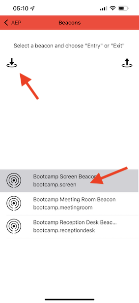

# 3.4測試您的歷程

若要測試您的歷程，您必須使用在練習3.2中建立的事件事件ID，如下所示。

事件ID需要傳送至Adobe Experience Platform才能觸發歷程。 在此範例中，eventID為：
`e76c0bf0c77c3517e5b6f4c457a0754ebaf5f1f6b9357d74e0d8e13ae517c3d5`.

開啟行動應用程式並前往首頁。 按一下&#x200B;**設定**&#x200B;圖示。

在欄位中貼上您的eventID **信標事件ID** 並按一下 **儲存**.

繼續之前，請在您的電腦上開啟此網頁： [https://bootcamp.aepdemo.net/content/aep-bootcamp-experience/language-masters/en/screen.html](https://bootcamp.aepdemo.net/content/aep-bootcamp-experience/language-masters/en/screen.html)

然後您會看到以下內容：

接著，返回首頁。 按一下 **beacon** 圖示。

然後您會看到此內容。 首先，選取 **Bootcamp畫面信標** 然後按一下 **登入** 按鈕。 這可讓您模擬信標專案。

現在，請檢視店內畫面。 您會在5秒內看到最後檢視的產品。

您也會收到推播通知。

您現在已經完成此練習。

[返回使用者流程3](./uc3.md)

[返回所有模組](../../overview.md)
