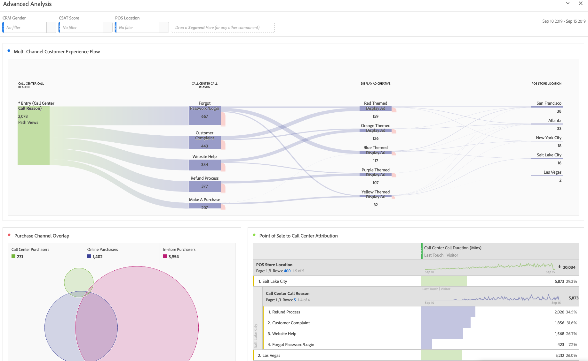

# 4.1Customer Journey Analytics101

## 目標

- 瞭解CJA應用程式服務
- 瞭解如何定位CJA
- 瞭解CJA工作流程：從資料連線到深入分析

## 4.1.1什麼是Customer Journey Analytics？

Customer Journey Analytics(CJA)為商業智慧和資料科學團隊提供工具組，用於拼接和分析跨管道資料（線上和離線）。 CJA中的功能為複雜的多管道客戶歷程提供背景和清晰度。 所提供的背景可引導您採取可操作的見解，從客戶轉換流程中移除痛點，並為最重要的時刻設計和提供卓越的體驗。

CJA將Analysis Workspace放在Adobe Experience Platform之上。 Adobe Experience Platform是溝通與協調的大腦，有了CJA，品牌現在可以將所有這些資料與情境聯絡起來，並以視覺化方式呈現，讓商業和見解團隊可以透過分析完整的線上到離線客戶歷程來從中學習。

商業和見解團隊可以使用Analysis Workspace的拖放、點選和使用者友好的UI與CJA交談、提出問題並快速獲得答案。

## 4.1.2主要優點

客戶的三大優點包括：

- 讓每個人都能檢視深入分析（亦即普及資料存取）的能力
- 能夠在情境式歷程中檢視客戶（也就是說，資料可以依序視覺化，橫跨線上和離線多個管道）
- 無需使用即可駕馭資料的強大功能（也就是說，它可讓一般人使用資料，解鎖深入見解和分析，進而啟動行銷）

## 4.1.3為何選擇Customer Journey Analytics？

CJA並非為了取代目前的BI應用程式，例如Power BI、Microstrategy、Locker或Tableau。 這些BI應用程式的用途是將資料視覺化，以建立公司儀表板，以便組織中的每個人都可以快速檢視重要量度。\
CJA的目標是讓行銷和業務團隊擁有分析能力，使其成為這些角色的「必備」分析工具。

傳統上，BI應用程式無法提供真正的客戶情報：

- 他們無法進行歸因，也無法進行客戶歷程分析。
- BI應用程式需要提前知道問題
- 互動式查詢受到資料庫結構的限制
- 需要SQL技能。
- BI應用程式無法讓您詢問為何發生某些事情。
- BI應用程式無法直接連線到客戶接觸點。

由於上述原因，業務使用者和分析師幾乎立即陷入死胡同，導致分析成本高昂、速度慢、缺乏靈活性且無法與作業系統連線。

透過CJA，您可以使用離線和線上資料，以完整檢視客戶歷程，並搭配適當工具縮短洞察時間，讓業務使用者獨立瞭解某些事情為何發生，以及如何回應。

## 4.1.4瞭解Customer Journey Analytics工作流程

在開始下一個練習之前，關鍵是要瞭解將資料從Adobe Experience Platform引入CJA所需的步驟，以便將其視覺化並獲得一些深入見解。 我們稱之為CJA工作流程。 讓我們來看一下：

在開始上述步驟之前，請別忘了步驟0，也就是瞭解Adobe Experience Platform中可用的資料。

**垃圾進，垃圾出。** 還記得嗎？ 您必須清楚瞭解哪些資料可供使用，以及Adobe Experience Platform中的結構描述的設定方式。 瞭解Adobe Experience Platform中的資料可讓事情變得更輕鬆，不僅在資料連線部分，而且在建立視覺效果和進行分析時也是如此。

## 4.1.5步驟0：瞭解Adobe Experience Platform結構描述和資料集

前往此URL登入Adobe Experience Platform： [https://experience.adobe.com/platform](https://experience.adobe.com/platform).

登入後，您會登入Adobe Experience Platform的首頁。

在繼續之前，您需要選取 **沙箱**. 要選取的沙箱已命名 ``Bootcamp``. 您可以按一下文字來執行此操作 **[!UICONTROL Prod]** 在熒幕的右上角。 選取適當的沙箱後，您會看到畫面變更，現在您已進入專屬沙箱。

請在Adobe Experience Platform中檢視這些結構描述和資料集。

| 資料集 | 方案 |
| ----------------- |-------------| 
| 示範系統 — 網站的事件資料集（全域v1.1） | 示範系統 — 網站的事件結構（全域v1.1） |
| 示範系統 — 客服中心的事件資料集（全域v1.1） | 示範系統 — 客服中心的事件結構（全域v1.1） |
| 示範系統 — 語音助理的事件資料集（全域v1.1） | 示範系統 — 語音助理的事件結構描述（全域v1.1） |

請務必至少檢查下列專案：

- 身分： CRMID、電話號碼、ECID、電子郵件。 哪些身分是主要識別碼，哪些是次要識別碼？
您可以開啟結構描述並檢視物件來尋找識別碼 `_experienceplatform.identification.core`. 檢視結構描述 [示範系統 — 網站的事件結構（全域v1.1）](https://experience.adobe.com/platform/schema).

- 探索結構描述內的商業物件 [示範系統 — 網站的事件結構（全域v1.1）](https://experience.adobe.com/platform/schema).

- 預覽所有 [資料集](https://experience.adobe.com/platform/dataset/browse?limit=50&amp;page=1&amp;sortDescending=1&amp;sortField=created) 並檢視資料

您現在已準備好開始使用Customer Journey AnalyticsUI。

下一步： [4.2Customer Journey Analytics中的連線Adobe Experience Platform資料集](./ex2.md)

[返回使用者流程4](./uc4.md)

[返回所有模組](../../overview.md)
