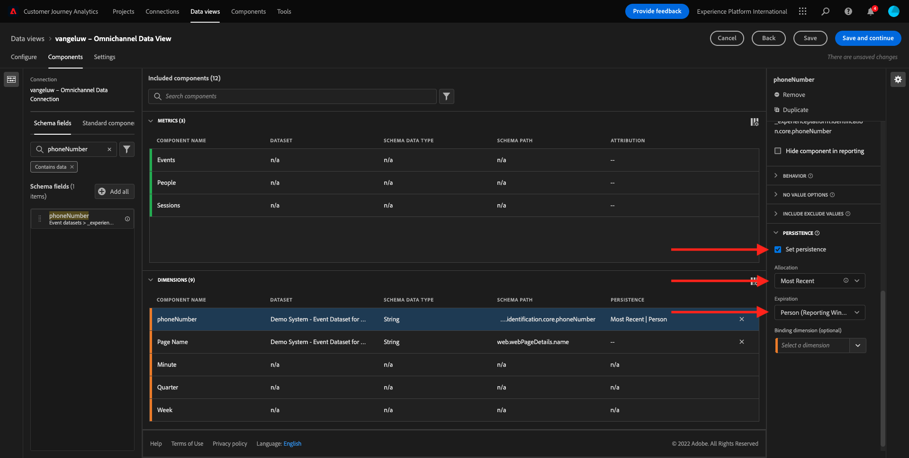

# 4.3建立資料檢視

## 目標

- 瞭解資料檢視UI
- 瞭解造訪定義的基本設定
- 瞭解資料檢視中的歸因分配和持續性

## 4.3.1資料檢視

連線完成後，您現在可以逐漸影響視覺效果。 Adobe Analytics和CJA的區別在於CJA需要資料檢視，以便在視覺化之前清理和準備資料。

資料檢視類似於Adobe Analytics中虛擬報表套裝的概念，您可以在其中定義內容感知造訪定義、篩選以及元件的呼叫方式。

每個連線至少需要一個資料檢視。 不過，對於某些使用案例，針對相同的連線擁有多個資料檢視是很好的選擇，其目的是為不同的團隊提供不同的深入分析。
如果您希望公司成為資料導向型公司，您應該調整每個團隊中檢視資料的方式。 部分範例：

- 僅限UX設計團隊的UX量度
- 對Google Analytics的KPI和量度使用與Customer Journey Analytics相同的名稱，好讓數位分析團隊只能說1種語言。
- 資料檢視經過篩選，僅針對一個市場、一個品牌或行動裝置顯示例項資料。

在&#x200B;**連線**&#x200B;畫面上，勾選您剛建立的連線前面的核取方塊。 按一下&#x200B;**建立資料檢視**。

您將會被重新導向至&#x200B;**建立資料檢視**&#x200B;工作流程。

## 4.3.2資料檢視定義

您現在可以設定資料檢視的基本定義。

您在上一個練習中建立的&#x200B;**連線**&#x200B;已經選取。 您的連線名為`yourLastName – Omnichannel Data Connection`。

接下來，依照此命名慣例為資料檢視命名： `yourLastName – Omnichannel Data View`。

為描述輸入相同的值： `yourLastName – Omnichannel Data View`。

| 名稱 | 說明 |
| ----------------- |-------------| 
| `yourLastName – Omnichannel Data View` | `yourLastName – Omnichannel Data View` |

對於&#x200B;**時區**，請選取時區&#x200B;**柏林、斯德哥爾摩、羅馬、伯爾尼、布魯塞爾、維也納、阿姆斯特丹GMT+01:00**。 這是非常有趣的設定，因為有些公司在不同國家/地區和地區營運。 為每個國家分配正確的時區將避免典型的資料錯誤，例如，相信秘魯大部分人在凌晨4:00購買T恤。

您也可以修改主要量度命名（「人員」、「工作階段」和「事件」）。 此為不必要操作，但有些客戶偏好使用人員、造訪和點選，而非人員、工作階段和事件(來自Customer Journey Analytics的預設命名慣例)。

您現在應該已設定下列設定：

按一下&#x200B;**儲存並繼續**。

## 4.3.3資料檢視元件

在本練習中，您將設定分析資料所需的元件，並使用Analysis Workspace加以視覺化。 在此UI中，有三個主要區域：

- 左側：所選資料集中的可用元件
- 中間：新增元件至資料檢視
- 右側：元件設定

>[!IMPORTANT]
>
>如果您找不到特定量度或維度，請檢查欄位`Contains data`是否已從資料檢視中移除。 如果沒有，請刪除該欄位。
>
>

您現在必須將分析所需的元件拖放至&#x200B;**新增的元件**。 若要這麼做，您需要在左側選單中選取元件，並將它們拖放到中間的畫布上。

讓我們從第一個元件開始： **名稱(web.webPageDetails.name)**。 搜尋此元件，然後將其拖放到畫布上。

此元件是頁面名稱，因為您可以從讀取結構描述欄位`(web.webPageDetails.name)`衍生。

不過，使用&#x200B;**Name**&#x200B;作為名稱並非商務使用者快速瞭解此維度的最佳命名慣例。

讓我們將名稱變更為&#x200B;**頁面名稱**。 按一下元件，然後在&#x200B;**元件設定**&#x200B;區域中重新命名它。

真正重要的是&#x200B;**持續性設定**。 CJA中不存在evar和prop的概念，但持續性設定使得類似的行為成為可能。

如果您不變更這些設定，CJA會將維度解譯為&#x200B;**Prop** （點選層級）。 此外，我們也可以變更持續性，讓維度成為&#x200B;**eVar** （在整個歷程中持續儲存值）。

如果您不熟悉eVar和Prop，可以[在檔案](https://experienceleague.adobe.com/docs/analytics/landing/an-key-concepts.html?lang=zh-Hant)中進一步瞭解它們。

讓「頁面名稱」保持為Prop。 因此，您不需要變更任何&#x200B;**持續性設定**。

| 要搜尋的元件名稱 | 新名稱 | 持續性設定 |
| ----------------- |-------------| --------------------| 
| 名稱(web.webPageDetails.name) | 頁面名稱 |          |

接著，選取維度&#x200B;**phoneNumber**&#x200B;並將其拖曳至畫布上。 新名稱應為&#x200B;**電話號碼**。

最後，讓我們變更持續性設定，因為行動號碼應持續存在於使用者層級。

若要變更持續性，請在右側選單中向下捲動，然後開啟&#x200B;**持續性**&#x200B;標籤：

核取核取方塊以修改持續性設定。 選取「**最近**」和「**人員（報告視窗）**」範圍，因為我們只關心該人員的最後一個行動電話號碼。 如果客戶在未來的造訪中未填寫行動裝置，您仍會看到已填入此值。

| 要搜尋的元件名稱 | 新名稱 | 持續性設定 |
| ----------------- |-------------| --------------------| 
| phonenumber | 電話號碼 | 最近，人員（報告期間） |

下一個元件是`web.webPageDetails.pageViews.value`。

在左側功能表中，搜尋`web.webPageDetails.pageViews.value`。 將此量度拖放至畫布上。

在&#x200B;**元件設定**&#x200B;下將名稱變更為&#x200B;**頁面檢視**。

| 要搜尋的元件名稱 | 新名稱 | 歸因設定 |
| ----------------- |-------------| --------------------| 
| web.webPageDetails.pageViews.value | 頁面檢視 |         |

對於歸因設定，此欄位將保留空白。

注意：量度的持續性設定也可以在Analysis Workspace中變更。 在某些情況下，您可能會選擇在此設定它，以避免業務使用者必須考慮哪個是最佳持續性模式。

接下來，您必須設定許多Dimension和量度，如下表所示。

### Dimension

| 要搜尋的元件名稱 | 新名稱 | 持續性設定 |
| ----------------- |-------------| --------------------| 
| brandName | 品牌名稱 | 最近，工作階段 |
| callfeeling | 通話感覺 |          |
| 呼叫ID | 通話互動型別 |          |
| callTopic | 呼叫主題 | 最近，工作階段 |
| ecid | ECID | 最近，人員（報告期間） |
| 電子郵件 | 電子郵件ID | 最近，人員（報告期間） |
| 付款類型 | 付款類型 |          |
| 產品廣告方式 | 產品廣告方式 | 最近，工作階段 |
| 事件類型 | 事件類型 |         |
| 名稱(productListItems.name) | 產品名稱 |         |
| SKU | SKU （工作階段） | 最近，工作階段 |
| 交易 ID | 交易 ID |         |
| URL (web.webPageDetails.URL) | URL |         |
| 使用者代理 | 使用者代理 | 最近，工作階段 |
| level | 熟客級別 |          |
| 點 | 客戶期限值 |          |

### 量度

| 要搜尋的元件名稱 | 新名稱 | 歸因設定 |
| ----------------- |-------------| --------------------| 
| 數量 | 數量 |          |
| commerce.order.priceTotal | 收入 |         |

您的設定應該會如下所示：

別忘了&#x200B;**儲存**&#x200B;您的資料檢視。 按一下[立即儲存&#x200B;**&#x200B;**]。

## 4.3.4計算量度

雖然我們已將所有元件組織在「資料檢視」中，您仍需調整部分元件，讓業務使用者可開始分析。

如果您記得，我們並未明確將新增至購物車、產品檢視或購買等量度帶入資料檢視。
不過，我們有一個稱為&#x200B;**事件型別**&#x200B;的維度。 因此，讓我們建立3個計算量度以匯出這些互動型別。

讓我們從第一個量度開始： **產品檢視**。

在左側，請搜尋&#x200B;**事件型別**&#x200B;並選取維度。 然後將其拖放到&#x200B;**包含的元件**&#x200B;畫布中。

按一下以選取新的量度&#x200B;**事件型別**。

現在將元件名稱和說明變更為下列值：

| 元件名稱 | 元件說明 |
| ----------------- |-------------| 
| 產品檢視 | 產品檢視 |

現在僅可計算&#x200B;**產品檢視**&#x200B;事件。 若要這麼做，請向下捲動&#x200B;**元件設定**，直到您看到&#x200B;**包含排除值**&#x200B;為止。 請確定啟用選項&#x200B;**設定包含/排除值**。

由於我們只想計算&#x200B;**產品檢視**，請在條件下指定&#x200B;**commerce.productViews**。

您的計算量度現已準備就緒！

接著，對&#x200B;**加入購物車**&#x200B;和&#x200B;**購買**&#x200B;事件重複相同的程式。

### 新增至購物車

請先拖放相同的維度&#x200B;**事件型別**。

您將看到重複欄位的快顯視窗警報，因為我們使用相同的變數。 請按一下&#x200B;**新增**：

現在，請依照我們處理量度「產品檢視」的相同程式進行：
- 請先變更名稱和說明。
- 最後新增&#x200B;**commerce.productListAdds**&#x200B;作為僅計算「加入購物車」的條件

| 名稱 | 說明 | 標準 |
| ----------------- |-------------| -------------|
| 新增至購物車 | 新增至購物車 | commerce.productListAdds |

### 購買次數

首先拖放相同的維度&#x200B;**事件型別**，如同我們之前對兩個量度所做的一樣。

您將看到重複欄位的快顯視窗警報，因為我們使用相同的變數。 請按一下&#x200B;**新增**：

現在，請依照我們處理量度「產品檢視」和「加入購物車」的相同程式進行：
- 請先變更名稱和說明。
- 最後新增&#x200B;**commerce.purchases**&#x200B;作為僅計算購買的條件

| 名稱 | 說明 | 標準 |
| ----------------- |-------------| -------------|
| 購買次數 | 購買次數 | commerce.purchases |

您的最終設定應該看起來類似這樣。 按一下&#x200B;**儲存並繼續**。

## 4.3.5資料檢視設定

系統會將您重新導向至此畫面：

在此標籤中，您可以修改一些重要設定，以變更資料的處理方式。 讓我們從將&#x200B;**工作階段逾時**&#x200B;設定為30分鐘開始。 有了每個體驗事件的時間戳記，您就可以將工作階段的概念擴充至所有管道。 例如，如果客戶在造訪網站後呼叫呼叫中心，會發生什麼情況？ 使用自訂工作階段逾時，您可以在決定工作階段是什麼以及該工作階段如何將資料合併在一起方面有極大的彈性。

在此索引標籤中，您可以使用區段/篩選器來修改其他內容，例如篩選資料。 在本練習中，您不需要執行此動作。

完成之後，請按一下[儲存]並完成&#x200B;**。**

>[!NOTE]
>
>您之後可以返回此資料檢視，並隨時變更設定和元件。 變更將會影響歷史資料的顯示方式。

您現在可以繼續視覺化和分析部分！

下一步：Customer Journey Analytics[&#128279;](./ex4.md)中的4.4資料準備

[返回使用者流程4](./uc4.md)

[返回所有模組](./../../overview.md)
