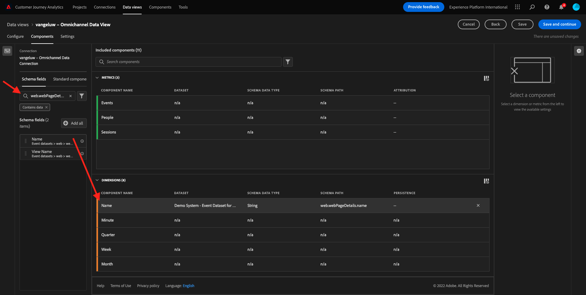
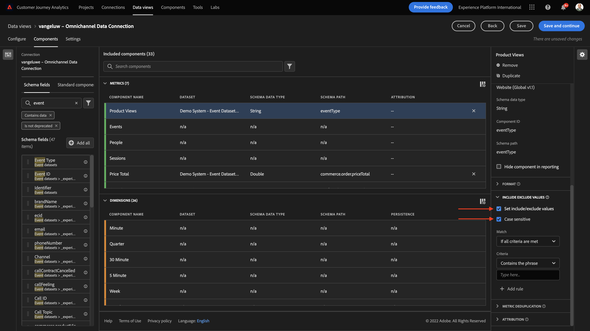

# 4.3建立資料檢視

## 目標

- 瞭解資料檢視UI
- 瞭解造訪定義的基本設定
- 瞭解資料檢視中的歸因和持續性

## 4.3.1資料檢視

連線完成後，您現在可以繼續影響視覺效果。 Adobe Analytics和CJA的區別在於CJA需要資料檢視，以便在視覺化之前清理和準備資料。

資料檢視類似於Adobe Analytics中虛擬報表套裝的概念，您可以在其中定義內容感知的造訪定義、篩選以及元件的呼叫方式。

每個連線至少需要一個資料檢視。 不過，對於某些使用案例，針對相同連線擁有多個資料檢視是很好的選擇，其目的是為不同的團隊提供不同的深入分析。
如果您希望貴公司成為資料導向型公司，您應調整每個團隊中檢視資料的方式。 部分範例：

- UX量度僅適用於UX設計團隊
- Google Analytics的KPI和量度名稱與Customer Journey Analytics相同，因此數位分析團隊只能說1種語言。
- 資料檢視經過篩選，僅針對一個市場、一個品牌或行動裝置顯示例項資料。

於 **連線** 畫面，勾選您剛才建立之連線前面的核取方塊。 按一下 **建立資料檢視**.

系統會將您重新導向至 **建立資料檢視** 工作流程。

## 4.3.2資料檢視定義

您現在可以設定資料檢視的基本定義。

此 **連線** 已選取您在上一個練習中建立的。 您的連線已命名 `yourLastName – Omnichannel Data Connection`.

接下來，依照此命名慣例為資料檢視命名： `yourLastName – Omnichannel Data View`.

為描述輸入相同的值： `yourLastName – Omnichannel Data View`.

| 名稱 | 說明 |
| ----------------- |-------------| 
| `yourLastName – Omnichannel Data View` | `yourLastName – Omnichannel Data View` |

對於 **時區**，選取時區 **柏林、斯德哥爾摩、羅馬、伯爾尼、布魯塞爾、維也納、阿姆斯特丹GMT+01:00**. 這是非常有趣的設定，因為有些公司在不同國家/地區和地區營運。 為每個國家分配正確的時區將避免典型的資料錯誤，例如，相信在秘魯，大多數人會在凌晨4:00購買T恤。

您也可以修改主要量度命名（「人員」、「工作階段」和「事件」）。 雖然這不是必要操作，但有些客戶偏好使用「人員」、「造訪」和「點選」，而非「人員」、「工作階段」和「事件」(Customer Journey Analytics的預設命名慣例)。

您現在應該已設定下列設定：

按一下 **儲存並繼續**.

## 4.3.3資料檢視元件

在本練習中，您將設定分析資料所需的元件，並使用Analysis Workspace加以視覺化。 在此UI中，有三個主要區域：

- 左側：所選資料集中的可用元件
- 中間：新增元件至資料檢視
- 右側：元件設定

>[!IMPORTANT]
>
>如果您找不到特定量度或維度，請檢查欄位中是否 `Contains data` 會從您的資料檢視中移除。 如果沒有，請刪除該欄位。
>
>

您現在必須將分析所需的元件拖放至 **新增的元件**. 若要這麼做，您需要在左側選單中選取元件，並將它們拖放到中間的畫布上。

讓我們從第一個元件開始： **名稱(web.webPageDetails.name)**. 搜尋此元件，然後將其拖放到畫布上。

此元件是頁面名稱，因為您可以從讀取結構欄位衍生 `(web.webPageDetails.name)`.

不過，使用 **名稱** 因為名稱不是業務使用者快速瞭解此維度的最佳命名慣例。

讓我們將名稱變更為 **頁面名稱**. 按一下元件，然後在 **元件設定** 區域。

真正重要的事情是 **持續性設定**. CJA中不存在evar和prop的概念，但持續性設定使得類似的行為成為可能。

如果您不變更這些設定，CJA會將維度解譯為 **Prop** （點選層級）。 此外，我們也可以變更持續性，讓維度成為 **eVar** （在整個歷程中保留值）。

如果您不熟悉eVar和Prop，您可以 [如需詳細資訊，請參閱檔案](https://experienceleague.adobe.com/docs/analytics/landing/an-key-concepts.html).

讓我們將「頁面名稱」保留為Prop。 因此，您不需要變更任何 **持續性設定**.

| 要搜尋的元件名稱 | 新名稱 | 持續性設定 |
| ----------------- |-------------| --------------------| 
| 名稱(web.webPageDetails.name) | 頁面名稱 |          |

接下來，選取維度 **phonenumber** 然後將其拖放到畫布上。 新名稱應為 **電話號碼**.

最後，讓我們變更「持續性」設定，因為「行動電話號碼」應持續存在於使用者層級。

若要變更持續性，請在右側選單中向下捲動並開啟 **持續性** 標籤：

核取核取方塊以修改持續性設定。 選取 **最近** 和 **人員（「報表」視窗）** 範圍，因為我們只關心該人員的最後一個行動電話號碼。 如果客戶在未來的造訪中未填入行動裝置，您仍會看到填入此值。

| 要搜尋的元件名稱 | 新名稱 | 持續性設定 |
| ----------------- |-------------| --------------------| 
| phonenumber | 電話號碼 | 最近，人員（報告視窗） |

下一個元件為 `web.webPageDetails.pageViews.value`.

在左側功能表中，搜尋 `web.webPageDetails.pageViews.value`. 將此量度拖放至畫布上。

將名稱變更為 **頁面檢視** 在 **元件設定**.

| 要搜尋的元件名稱 | 新名稱 | 歸因設定 |
| ----------------- |-------------| --------------------| 
| web.webPageDetails.pageViews.value | 頁面檢視 |         |

對於歸因設定，我們會保留空白。

注意：量度的持續性設定也可以在Analysis Workspace中變更。 在某些情況下，您可能會選擇在此設定它，以避免業務使用者必須考慮哪個是最佳持續性模型。

接下來，您必須設定許多Dimension和量度，如下表所示。

### Dimension

| 要搜尋的元件名稱 | 新名稱 | 持續性設定 |
| ----------------- |-------------| --------------------| 
| brandName | 品牌名稱 | 最近，工作階段 |
| callfeeling | 通話感覺 |          |
| 呼叫ID | 通話互動型別 |          |
| callTopic | 呼叫主題 | 最近，工作階段 |
| ecid | ECID | 最近，人員（報告視窗） |
| 電子郵件 | 電子郵件ID | 最近，人員（報告視窗） |
| 付款型別 | 付款型別 |          |
| 產品新增方法 | 產品新增方法 | 最近，工作階段 |
| 活動類型 | 活動類型 |         |
| 名稱(productListItems.name) | 產品名稱 |         |
| SKU | SKU （工作階段） | 最近，工作階段 |
| 交易 ID | 交易 ID |         |
| URL (web.webPageDetails.URL) | URL |         |
| 使用者代理 | 使用者代理 | 最近，工作階段 |
| level | 忠誠度等級 |          |
| 點 | 客戶期限值 |          |

### 量度

| 要搜尋的元件名稱 | 新名稱 | 歸因設定 |
| ----------------- |-------------| --------------------| 
| 數量 | 數量 |          |
| commerce.order.priceTotal | 收入 |         |

您的設定應該會如下所示：

別忘了 **儲存** 您的資料檢視。 所以按一下 **儲存** 立即。

## 4.3.4計算量度

雖然我們已在資料檢視中組織了所有元件，但您仍需調整其中一些元件，以便業務使用者可以開始他們的分析。

如果您記得，我們並未特別將新增至購物車、產品檢視或購買等量度帶入資料檢視。
不過，我們有一個稱為的維度： **事件型別**. 因此，讓我們建立3個計算量度以衍生出這些互動型別。

讓我們從第一個量度開始： **產品檢視**.

請在左側搜尋 **事件型別** 並選取尺寸。 然後將其拖放至 **包含的元件** 畫布。

按一下以選取新量度 **事件型別**.

現在將元件名稱和說明變更為下列值：

| 元件名稱 | 元件說明 |
| ----------------- |-------------| 
| 產品檢視 | 產品檢視 |

現在僅供計算 **產品檢視** 事件。 若要這麼做，請向下捲動至 **元件設定** 直到您看到 **包含排除值**. 請務必啟用選項 **設定包含/排除值**.

因為我們只想計算 **產品檢視**，請說明 **commerce.productViews** 在條件底下。

您的計算量度現已準備就緒！

接下來，對以下專案重複相同的程式 **加入購物車** 和 **購買** 事件。

### 加入購物車

第一個拖放相同的維度 **事件型別**.

當使用相同的變數時，您會看到重複欄位的快顯警示訊息。 請按一下 **仍要新增**：

現在，請遵循與我們對量度「產品檢視」相同的流程：
- 請先變更名稱和說明。
- 最後新增 **commerce.productListAdds** 作為僅計入加入購物車的條件

| 名稱 | 說明 | 標準 |
| ----------------- |-------------| -------------|
| 加入購物車 | 加入購物車 | commerce.productListAdds |

### 購買

第一個拖放相同的維度 **事件型別** 就像我們之前處理兩個量度時一樣。

當使用相同的變數時，您會看到重複欄位的快顯警示訊息。 請按一下 **仍要新增**：

現在，請遵循與處理「產品檢視」和「加入購物車」量度相同的程式：
- 請先變更名稱和說明。
- 最後新增 **commerce.purchases** 作為僅計算購買次數的條件

| 名稱 | 說明 | 標準 |
| ----------------- |-------------| -------------|
| 購買 | 購買 | commerce.purchases |

您的最終設定應該看起來類似這樣。 按一下 **儲存並繼續**.

## 4.3.5資料檢視設定

系統會將您重新導向至此畫面：

在此索引標籤中，您可以修改一些重要設定以變更資料的處理方式。 讓我們從設定開始 **工作階段逾時** 至30分鐘。 由於每個體驗事件的時間戳記都有，您可以跨所有管道擴展工作階段的概念。 例如，如果客戶在造訪網站後呼叫呼叫中心會發生什麼情況？ 使用自訂工作階段逾時，您可以在決定工作階段是什麼以及該工作階段如何合併資料時具有很大彈性。

在此索引標籤中，您可以使用區段/篩選器來修改其他專案，例如篩選資料。 在本練習中，您不需要執行此動作。

完成後，請按一下 **儲存並完成**.

>[!NOTE]
>
>您之後可以返回此資料檢視，並隨時變更設定和元件。 變更將會影響歷史資料的顯示方式。

您現在可以繼續視覺化和分析部分！

下一步： [4.4Customer Journey Analytics中的資料準備](./ex4.md)

[返回使用者流程4](./uc4.md)

[返回所有模組](./../../overview.md)
