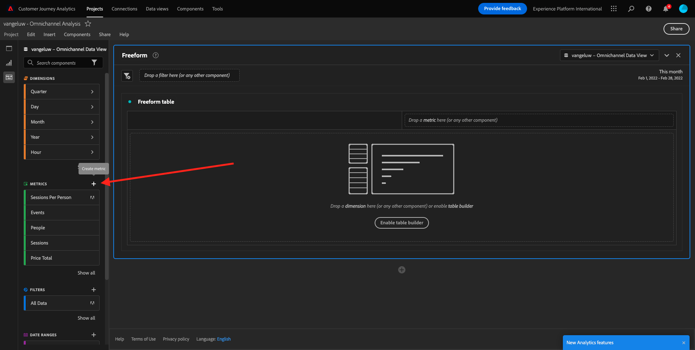

# 4.4 Analysis Workspace中的資料準備

## 目標

- 瞭解CJA中的Analysis Workspace UI
- 瞭解Analysis Workspace中的資料準備概念
- 瞭解如何進行資料計算

## 4.4.1 CJA中的Analysis Workspace UI

Analysis Workspace移除單一Analytics報表的所有一般限制。 它為建立自訂分析專案提供了強大且彈性的畫布。 將任意數量的資料表格、視覺效果和元件（維度、量度、區段和時間粒度）拖放至專案。 立即建立劃分和區段、建立同類群組進行分析、建立警報、比較區段、進行流量和流失分析，以及組織和排程報表，以便與業務中的任何人員共用。

Customer Journey Analytics以平台資料為基礎提供此解決方案。 我們強烈建議您觀看這支時長四分鐘的概述影片：

>[!VIDEO](https://video.tv.adobe.com/v/35109?quality=12&learn=on)

如果您之前未使用Analysis Workspace，強烈建議您觀看此影片：

>[!VIDEO](https://video.tv.adobe.com/v/26266?quality=12&learn=on)

### 建立您的專案

現在該建立您的第一個CJA專案了。 前往CJA內的專案標籤。
按一下「**新增**」。

然後您會看到此內容。 選取 **空白專案** 然後按一下 **建立**.

然後您會看到一個空白專案。

首先，請務必在熒幕右上角選取正確的資料檢視。 在此範例中，要選取的資料檢視為 `CJA Bootcamp - Omnichannel Data View`.

接下來，您將儲存專案並為其命名。 您可以使用下列指令進行儲存：

| 作業系統 | 捷徑 |
| ----------------- |-------------| 
| Windows | Control + S |
| Mac | Command + S |

您會看到此快顯視窗：

請使用此命名慣例：

| 名稱 | 說明 |
| ----------------- |-------------| 
| `yourLastName - Omnichannel Analysis` | `yourLastName - Omnichannel Analysis` |

接下來，按一下 **儲存**.

## 4.4.2計算量度

雖然我們已在資料檢視中組織了所有元件，但您仍需調整其中一些元件，以便業務使用者可以開始他們的分析。 此外，在任何分析期間，您可以建立計算量度，以更深入瞭解見解發現。

例如，我們將建立計算 **轉換率** 使用 **購買** 我們在資料檢視上定義的量度/事件。

### 轉換率

讓我們開始開啟計算量度產生器。 按一下 **+** 以在Analysis Workspace中建立第一個計算量度。

此 **計算量度產生器** 將會顯示：

尋找 **購買** 在左側功能表的量度清單中。 下 **量度** 按一下 **全部顯示**

現在拖放 **購買** 計算量度定義中的量度。

通常轉換率是指 **轉換/工作階段**. 讓我們在計算量度定義畫布中執行相同的計算。 尋找 **工作階段** 量度並將其拖放至定義產生器的 **購買** 事件。

請注意，系統會自動選取除法運運算元。

轉換率通常以百分比表示。 因此，讓我們將格式變更為百分比，並選取2個小數。

最後，變更計算量度的名稱和說明：

| 標題 | 說明 |
| ----------------- |-------------| 
| yourLastName — 轉換率 | yourLastName — 轉換率 |

熒幕上有類似以下的畫面：

別忘了 **儲存** 計算量度。

## 4.4.3計算Dimension：篩選器（細分）和日期範圍

### 篩選器：計算Dimension

計算不僅適用於量度。 在開始任何分析之前，建立一些分析也是很有趣的 **計算Dimension**. 這基本上意味著 **區段** 返回Adobe Analytics。 在Customer Journey Analytics中，這些區段稱為 **篩選器**.

建立篩選器將可協助業務使用者以某些重要的計算維度開始分析。 這樣不僅可自動化部分工作，還可協助採用部分。 以下是一些範例：

1. 自有媒體、付費媒體、
2. 新造訪與回訪
3. 有放棄購物車的客戶

這些篩選器可以在分析零件之前或分析零件期間建立（您將在下一個練習中進行）。

### 日期範圍：計算時間Dimension

時間Dimension是另一種型別的計算維度。 有些量度已建立，但您也可以在資料準備階段建立自己的自訂時間Dimension。

這些計算時間Dimension可協助分析人員和業務使用者記住重要日期，並使用它們來篩選和變更報表時間。 當我們進行分析時，腦海中浮現出典型的問題和疑問：

- 去年的「黑色星期五」是什麼時候？ 21日到29日？
- 我們在12月是何時進行該電視促銷活動的？
- 我們何時舉辦2018夏季銷售會？ 我想與2019年比較。 順便問一下，您知道2019年的確切日期嗎？

您現在已使用CJA Analysis Workspace完成資料準備練習。

下一步： [4.5使用Customer Journey Analytics的視覺效果](./ex5.md)

[返回使用者流程4](./uc4.md)

[返回所有模組](./../../overview.md)
