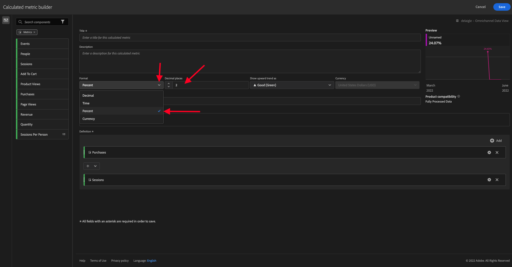

# 4.4Analysis Workspace的資料準備

## 目標

- 了解CJA中的Analysis Workspace UI
- 了解Analysis Workspace中的資料準備概念
- 了解如何計算資料

## 4.4.1 CJA中的Analysis Workspace UI

Analysis Workspace會移除單一Analytics報表的所有一般限制。 它提供強大、有彈性的畫布，供您建立自訂分析專案。 拖放任意數量的資料表格、視覺效果和元件（維度、量度、區段和時間粒度）至專案。 立即建立劃分和區段、建立同類群組以供分析、建立警報、比較區段、執行流量和流失分析，以及組織和排程報表以供與企業中的其他人共用。

Customer Journey Analytics將此解決方案整合在Platform資料之上。 強烈建議您觀看這部4分鐘的概述影片：

>[!VIDEO](https://video.tv.adobe.com/v/35109?quality=12&learn=on)

如果您之前未使用Analysis Workspace，強烈建議您觀看此影片：

>[!VIDEO](https://video.tv.adobe.com/v/26266?quality=12&learn=on)

### 建立專案

現在是時候建立您的第一個CJA專案了。 前往CJA內的專案標籤。
按一下「**新增**」。

你會看到這個。 選擇 **空白專案** 然後按一下 **建立**.

然後你會看到一個空的項目。

首先，請務必在畫面的右上角選取正確的資料檢視。 在此範例中，要選取的資料檢視是 `CJA Bootcamp - Omnichannel Data View`.

接下來，您會儲存專案並命名。 您可以使用下列命令來儲存：

| 作業系統 | 短切 |
| ----------------- |-------------| 
| Windows | Control + S |
| Mac | Command + S |

您會看到此快顯視窗：

請使用此命名慣例：

| 名稱 | 說明 |
| ----------------- |-------------| 
| `yourLastName - Omnichannel Analysis` | `yourLastName - Omnichannel Analysis` |

下一步，按一下 **儲存**.

## 4.4.2計算量度

雖然我們已在資料檢視中組織了所有元件，您仍需調整其中某些元件，讓業務使用者可以開始進行分析。 此外，在任何分析期間，您都可以建立計算量度，以深入分析結果。

例如，我們將建立計算 **轉換率** 使用 **購買** 我們在資料檢視中定義的量度/事件。

### 轉換率

開始開啟計算量度產生器。 按一下 **+** 以在Analysis Workspace中建立第一個計算量度。

此 **計算量度產生器** 會顯示：

尋找 **購買** 在左側功能表的「量度」清單中。 在 **量度** 按一下 **全部顯示**

現在，拖放 **購買** 量度中的。

轉換率通常表示 **轉換/工作階段**. 因此，讓我們在計算的量度定義畫布中執行相同的計算。 尋找 **工作階段** 量度，並將其拖放至定義產生器下方的 **購買** 事件。

請注意，會自動選取除法運算子。

轉換率通常以百分比表示。 因此，我們將格式變更為百分比，並選取2個小數。

最後，變更計算量度的名稱和說明：

| 標題 | 說明 |
| ----------------- |-------------| 
| yourLastName — 轉換率 | yourLastName — 轉換率 |

螢幕上會有類似的內容：

別忘了 **儲存** 計算量度。

## 4.4.3計算Dimension:篩選（分段）和日期範圍

### 篩選器：計算Dimension

計算不只適用於量度。 開始進行任何分析之前，建立一些 **計算Dimension**. 這基本上就是說 **區段** 回到Adobe Analytics。 在Customer Journey Analytics中，這些區段稱為 **篩選器**.

建立篩選器有助於商務使用者從一些有價值的計算維度開始進行分析。 這會自動執行部分工作，並協助採用。 以下是一些範例：

1. 自有媒體、付費媒體、
2. 新造訪與回訪
3. 具有放棄的購物車的客戶

這些篩選器可在分析部分之前或期間建立（您將在下一練習中進行）。

### 日期範圍：計算時間Dimension

時間Dimension是另一種計算維度類型。 有些已建立，但您也可以在資料準備階段建立自己的自訂時間Dimension。

這些計算時間Dimension將可協助分析師和業務使用者記住重要日期，並使用它們來篩選和變更報表時間。 當我們進行分析時，會想到一些典型的問題和懷疑：

- 去年的黑色星期五是什麼時候？ 21-29街？
- 12月我們什麼時候開展電視宣傳？
- 2018年夏季銷售從何時開始？ 我想和2019年做比較。 順便問一句，你知道2019年的確切日子嗎？

您現在已使用CJA Analysis Workspace完成資料準備練習。

下一步： [4.5使用Customer Journey Analytics的視覺效果](./ex5.md)

[返回用戶流4](./uc4.md)

[返回所有模組](./../../overview.md)
