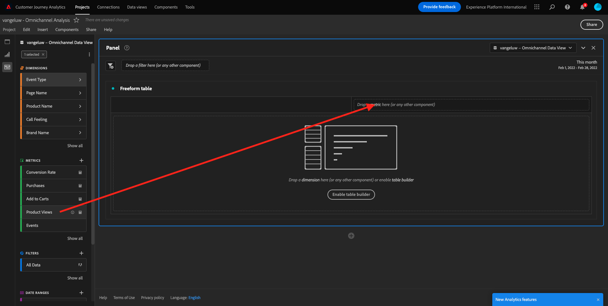
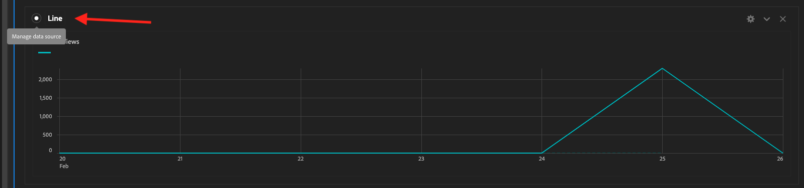
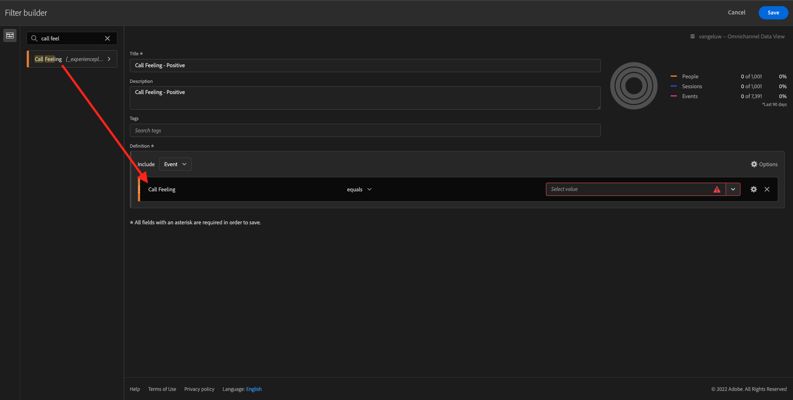

# 4.5使用Customer Journey Analytics的視覺效果

## 目標

- 瞭解Analysis Workspace UI
- 瞭解讓Analysis Workspace與眾不同的部分功能。
- 瞭解如何使用Analysis Workspace在CJA中分析

## 內容

在本練習中，您將使用CJA中的Analysis Workspace來分析產品檢視、產品漏斗、流失率等。

讓我們使用您在中建立的專案 [4.4 Analysis Workspace中的資料準備](./ex4.md)，請前往 [https://analytics.adobe.com](https://analytics.adobe.com).

開啟您的專案 `yourLastName - Omnichannel Analysis`.

開啟您的專案並開啟資料檢視時 `CJA Bootcamp - Omnichannel Data View` 選取「 」，您就可以開始建立第一個視覺效果了。

## 我們每日檢視多少產品

首先，我們需要選擇正確的日期來分析資料。 前往畫布右側的行事曆下拉式清單。 按一下並選取適用的日期範圍。

>[!IMPORTANT]
>
>最新的可用資料擷取日期為2022年9月19日，請選取包含此日期的日期範圍。

在左側選單（元件區域）中，找到計算量度 **產品檢視**. 將其選取並拖放至畫布中（位於自由表格右上方）。

自動設定維度 **日** 將會新增以建立您的第一個表格。 現在您可以看到問題得到即時解答。

接下來，以滑鼠右鍵按一下量度摘要。

按一下 **視覺化** 然後選取 **折線圖** 做為視覺效果。

您會看到每天的產品檢視次數。

您可以按一下「 」，逐日變更時間範圍 **設定** 在視覺效果中。

按一下旁的點 **折線圖** 至 **管理資料來源**.

接下來，按一下 **鎖定選取範圍** 並選取 **選取的專案** 鎖定此視覺效果，使其一律顯示產品檢視的時間軸。

## 已檢視的前4大產品

前4大產品檢視內容為何？

請記得偶爾儲存專案。

| 作業系統 | 捷徑 |
| ----------------- |-------------| 
| Windows | Control + S |
| Mac | Command + S |

讓我們開始找出檢視的前4項產品。 在左側功能表中，尋找 **產品名稱** -Dimension。

現在請拖放 **產品名稱** 取代 **日** 維度：

結果如下

接下來，嘗試依品牌名稱劃分其中一項產品。 搜尋 **brandName** 並將其拖曳至第一個產品名稱下。

接下來，使用忠誠度等級進行劃分。 搜尋 **忠誠度等級** 並將其拖曳至品牌名稱下。

然後您會看到以下內容：

最後，您可以新增更多視覺效果。 在左側的「視覺效果」下方，搜尋 `Donut`. Take `Donut`，將其拖放至畫佈下方的 **折線圖** 視覺效果。

接下來，在表格中選取3 **忠誠度等級**  劃分的列(我們在 **Google Pixel XL 32GB黑色智慧型手機** > **花旗訊號**. 選取3列時，按住 **CTRL** 按鈕（在Windows上）或 **命令** 按鈕(在Mac上)。

您會看到環形圖已變更：

您甚至可以調整設計，使兩者都更易讀取 **折線圖** 圖表與 **環形圖** 圖表稍微小一點，以便彼此相配：

按一下旁的點 **環形圖** 至 **管理資料來源**.
接下來，按一下 **鎖定選取範圍** 鎖定此視覺效果，使其一律顯示產品檢視的時間軸。

若要進一步瞭解使用Analysis Workspace的視覺效果，請前往這裡：

- [https://experienceleague.adobe.com/docs/analytics/analyze/analysis-workspace/visualizations/freeform-analysis-visualizations.html?lang=zh-Hant](https://experienceleague.adobe.com/docs/analytics/analyze/analysis-workspace/visualizations/freeform-analysis-visualizations.html?lang=zh-Hant)
- [https://experienceleague.adobe.com/docs/analytics/analyze/analysis-workspace/visualizations/t-sync-visualization.html](https://experienceleague.adobe.com/docs/analytics/analyze/analysis-workspace/visualizations/t-sync-visualization.html)

## 產品互動漏斗，從檢視到購買

有許多方法可解決此問題。 其中之一是使用產品互動型別，並在自由表格上使用。 另一種方式是使用 **流失視覺效果**. 讓我們使用最後一個專案，因為我們要同時視覺化及分析。

按一下此處，關閉目前的面板：

現在按一下「 」，新增一個空白面板 **+新增空白面板**.

按一下視覺效果 **流失**.

選取與上一個練習相同的日期範圍。

然後您會看到此內容。

尋找維度 **事件型別** 在左側的元件下：

按一下箭頭以開啟尺寸：

您會看到所有可用的事件型別。

選取專案 **commerce.productViews** 並將其拖放至 **新增接觸點** 內的欄位 **流失視覺效果**.

對執行相同操作 **commerce.productListAdds** 和 **commerce.purchases** 並將它們拖放至 **新增接觸點** 內的欄位 **流失視覺效果**. 您的視覺效果現在看起來像這樣：

您可以在這裡完成許多工作。 部分範例：比較一段期間、依裝置比較每個步驟，或依忠誠度比較。 但是，如果我們想要分析有趣的事情，例如為什麼客戶在將專案新增到購物車之後不購買，我們可以使用CJA中的最佳工具：按一下右鍵。

以滑鼠右鍵按一下接觸點 **commerce.productListAdds**. 然後按一下 **在此接觸點劃分流失**.

將會建立新的自由表格，以分析使用者未購買時所做的動作。

變更 **事件型別** 作者： **頁面名稱**，檢視他們前往的頁面，而非「購買確認頁面」。

## 訪客在到達「取消服務」頁面前會在網站上做什麼？

同樣地，有許多方法可以執行此分析。 讓我們使用流量分析來啟動探索部分。

按一下此處關閉目前的面板：

現在按一下「 」，新增一個空白面板 **+新增空白面板**.

按一下視覺效果 **流量**.

然後您會看到以下內容：

選取與上一個練習相同的日期範圍。

尋找維度 **頁面名稱** 在左側的元件下：

按一下箭頭以開啟尺寸：

您會找到所有檢視的頁面。 尋找頁面名稱： **取消服務**.
拖放 **取消服務** 至中間欄位的「流量視覺效果」：

然後您會看到以下內容：

現在，讓我們分析造訪過此網站的客戶是否 **取消服務** 網頁也稱為callcenter，其結果是什麼。

在維度底下，返回並尋找 **通話互動型別**.
拖放 **通話互動型別** 取代「 」內右側第一個互動 **流量視覺效果**.

您現在可以看到拜訪客服中心之客戶的支援票證 **取消服務** 頁面。

接下來，在維度底下搜尋 **通話感覺**.  將其拖放以取代內右側的第一個互動 **流量視覺效果**.

然後您會看到以下內容：

如您所見，我們已使用「流量視覺效果」執行了全通路分析。 多虧了這一點，我們發現似乎有些客戶在考慮取消其服務後，在致電呼叫中心後有了積極的感覺。 我們是否可能藉由促銷活動來改變他們的想法？

## 擁有正面呼叫中心聯絡人的客戶在主要KPI方面的表現如何？

讓我們先將資料分段，以僅讓使用者使用 **正面** 呼叫。 在CJA中，區段稱為篩選器。 前往元件區域（左側）中的篩選器，然後按一下 **+**.

在篩選產生器中，為篩選命名

| 名稱 | 說明 |
| ----------------- |-------------| 
| 通話感覺 — 正面 | 通話感覺 — 正面 |

在元件底下（在篩選產生器內），尋找 **通話感覺** 並將其拖放至篩選產生器定義中。

現在選取 **正面** 做為篩選器的值。

將範圍變更為 **個人** 層級。

若要完成，只需按一下 **儲存**.

然後您就會回到這裡。 如果尚未完成，請關閉上一個面板。

現在按一下「 」，新增一個空白面板 **+新增空白面板**.

選取與上一個練習相同的日期範圍。

按一下 **自由表格**.

現在請拖放您剛建立的篩選器。

新增部分量度的時間。 開始於 **產品檢視**. 拖放至自由表格中。 您也可以刪除 **事件** 量度。

對執行相同操作 **人員**，  **加入購物車** 和 **購買**. 您最後會得到一個這樣的表格。

有了第一個流量分析，我想到了一個新問題。 因此，我們決定建立此表格，並針對區段檢查一些KPI以回答此問題。 如您所見，洞察時間比使用SQL或其他BI解決方案快得多。

## Customer Journey Analytics和Analysis Workspace回顧

如同您在本實驗中學到的，Analysis Workspace會將來自所有管道的資料拼接在一起，以分析完整的客戶歷程。 此外，請記住，您可以將資料帶入未連結至歷程的相同工作區。
將中斷連線的資料帶入您的分析，為歷程提供內容真的很有用。 例如NPS資料、調查、Facebook Ads事件或離線互動（未識別）。

下一步： [4.6從深入分析到行動](./ex6.md)

[返回使用者流程4](./uc4.md)

[返回所有模組](./../../overview.md)
