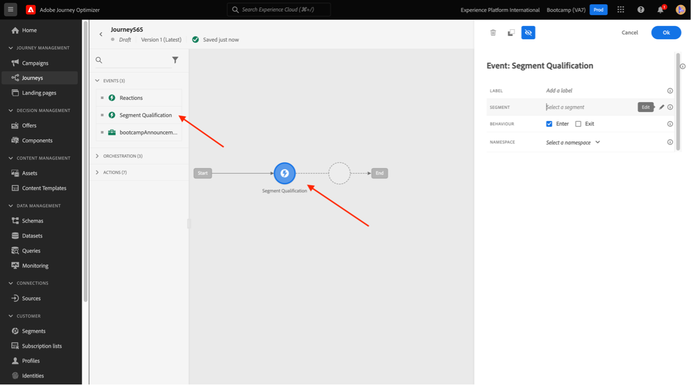

# 4.6從見解到行動

## 目標

- 了解如何根據在Customer Journey Analytics中收集的檢視來建立受眾
- 在Real-Time CDP和Adobe Journey Optimizer中使用此對象

## 4.6.1建立受眾並發佈

在您的專案中，您建立的篩選器稱為 **調情** 並且能夠檢視呼叫呼叫分類為 **正面**. 您現在可以與這些使用者建立區段，並在歷程或通訊管道中啟用他們。

第一步是：在上次練習中建立的面板中，選取行 **1. 呼叫感覺 — 積極**，按一下滑鼠右鍵並選取 **從選取項目建立受眾** 選項：

接下來，依照模型為對象命名 **yourLastName - CJA對象呼叫感覺正面**:

請注意，您可以預覽要建立的對象：

最後，按一下 **發佈**.

## 4.6.2將您的受眾作為區段的一部分

返回Adobe Experience Platform，轉到 **區段>瀏覽** 而且，您將能看到在CJA中建立的區段已就緒，可供您的啟動和歷程使用！

現在，讓我們在Facebook啟動和客戶歷程中使用此區段！

## 4.6.3即時在Real-Time CDP中使用區段

在Adobe Experience Platform中，前往 **區段>瀏覽** 並尋找您在CJA中建立的對象：

按一下您的區段，然後按一下 **啟動至目的地**:

選擇命名的目標 **bootcamp-facebook**，然後按一下 **下一個**.

按一下 **下一個** 。

選取 **對象的來源** 選項，並將其設為 **直接從客戶**，按一下 **下一個**.

按一下&#x200B;**完成**。

您的區段現在已連線至Facebook的自訂對象。 現在，讓我們在Adobe Journey Optimizer中使用相同區段。

## 4.6.4在Adobe Journey Optimizer中使用您的區段

在Adobe Experience Platform中，按一下 **Journey Optimizer**，然後在左側功能表中，按一下 **歷程** 並透過按一下 **建立歷程**.

然後，在左側功能表的下方 **事件**，選取 **區段資格** 並將其拖曳至歷程：

在「區段」底下，按一下 **編輯** 若要選取區段：

選取您先前在CJA中建立的對象，然後按一下  **儲存**.

準備！ 從這裡，您可以為符合此區段資格的客戶建立歷程。

[返回用戶流4](./uc4.md)

[馬杜洛斯山](./../../overview.md)
