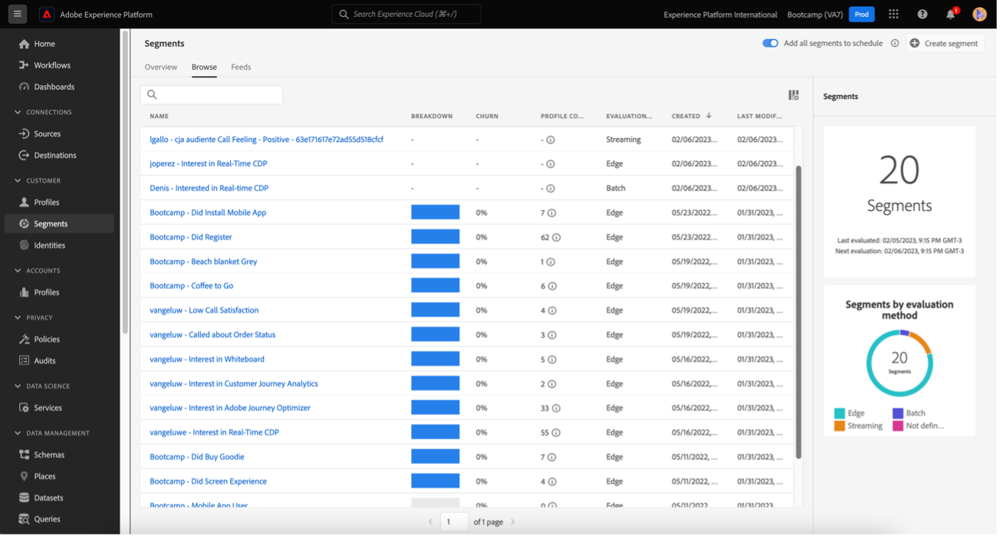

# 4.6從深入分析到動作

## 目標

- 瞭解如何根據Customer Journey Analytics中收集的檢視建立對象
- 在Real-Time CDP和Adobe Journey Optimizer中使用此對象

## 4.6.1建立受眾並發佈

在您的專案中，您已建立名為&#x200B;**通話感覺**&#x200B;的篩選器，並能檢視被歸類為&#x200B;**正面**&#x200B;之呼叫中心的使用者人數。 您現在將能夠與這些使用者建立區段，並在歷程或通訊頻道中啟用他們。

第一個步驟是：在上一個練習建立的面板中，選取第&#x200B;**行。 通話感覺 — 正面**，按一下滑鼠右鍵並選取&#x200B;**從選取專案建立對象**&#x200B;選項：

接下來，依照模型&#x200B;**yourLastName - CJA對象呼叫感覺良好**&#x200B;為您的對象命名：

請注意，可以預覽正在建立的對象：

最後，按一下&#x200B;**Publish**。

## 4.6.2使用您的對象作為區段的一部分

返回Adobe Experience Platform，前往&#x200B;**區段>瀏覽**，您將能夠在CJA中看到建立的區段已準備就緒，並可用於您的啟用和歷程！

現在，讓我們在Facebook啟動和客戶歷程中使用此區段！

## 4.6.3在Real-Time CDP中即時使用您的區段

在Adobe Experience Platform中，前往&#x200B;**區段>瀏覽**&#x200B;並尋找您已在CJA中建立的對象：

按一下您的區段，然後按一下&#x200B;**啟用至目的地**：

選取名為&#x200B;**bootcamp-facebook**&#x200B;的目的地，然後按一下[下一步] ****。

再按一下&#x200B;**下一步**。

選取&#x200B;**您的對象來源**&#x200B;選項，並將其設定為&#x200B;**直接來自客戶**，按一下&#x200B;**下一步**。

按一下&#x200B;**完成**。

您的區段現在已連線至Facebook的自訂對象。 現在，讓我們在Adobe Journey Optimizer中使用相同的區段。

## 4.6.4在Adobe Journey Optimizer中使用您的區段

在Adobe Experience Platform中，按一下&#x200B;**Journey Optimizer**，然後在左側功能表中按一下&#x200B;**歷程**，然後按一下&#x200B;**建立歷程**&#x200B;以開始建立歷程。

然後，在左側功能表的&#x200B;**事件**&#x200B;下方，選取&#x200B;**區段資格**，並將其拖曳至歷程：

在「區段」底下，按一下&#x200B;**編輯**&#x200B;以選取區段：

選取您先前在CJA中建立的對象，然後按一下&#x200B;**儲存**。

準備就緒！ 從這裡，您可以為符合此區段資格的客戶建立歷程。

[返回使用者流程4](./uc4.md)

[Voltar para todos os módulos](./../../overview.md)
