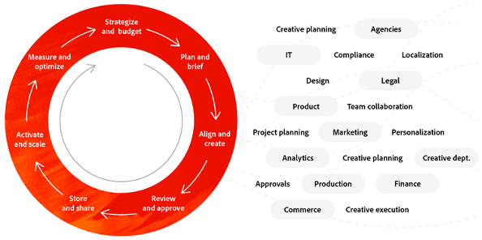
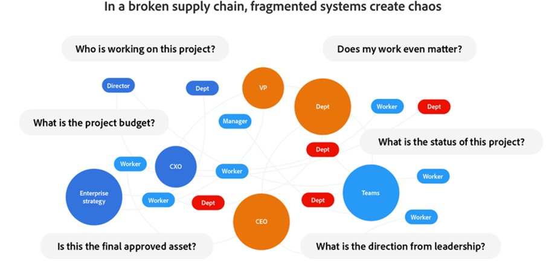

# 內容供應鏈分4個階段

如今，世界是數字優先。 這是企業被迫接受的現實，而且它不會很快消失。 作為數字世界的一部分，我們面臨 [內容激增](https://www.prnewswire.com/news-releases/content-marketing-market-size-to-grow-by-usd-487-24-billion--by-objective-platform-end-user-and-geography---forecast-and-analysis-2022-2026--301562808.html) 受更多人瀏覽社交媒體、在數位空間花時間、以及遠程工作的推動。

這對您意味著有更多渠道、市場和格式可以傳送內容 — 而且更需要動態地優化該內容。

_來源：_ [_Deloitte Digital_](https://www2.deloitte.com/content/dam/Deloitte/uk/Documents/consultancy/deloitte-uk-future-of-experience-time-to-market.pdf)

好消息是，儘管跟上對內容的需求是有挑戰的，但有一種方法可以更快、更輕鬆地規劃、製作和交付內容。 這叫  **內容供應鏈**. 如果您能夠用流程流暢、強大的策略和堅實的實踐，使其能夠啟動並運行，則您可以簡化整個內容生命週期。

## 協作是平穩的內容供應鏈的關鍵

內容供應鏈是將人員、工具和工作流集合在一起，以有效地規劃、建立、管理和交付內容的過程。 隨著客戶以越來越快的速度要求更多、更好的體驗，您需要在此時而非稍後立即取得您的內容。 這樣可打破孤立環境並統一工作流程，讓所有團隊承受壓力。 而且，您的技術投資還將獲得更多價值，幫助您提高效率和價值。

從理論上講，這個過程應該有助於世界各地的企業更快地將內容發佈出去。 但實際上，大多數供應鏈都因為跨功能的內容生命週期是自然而然的而被打破。 不幸的是，當這些鏈斷裂時，它們會造成內部失調、預算減少、員工流失，並降低向市場傳遞關鍵資訊的速度。

### 是什麼破壞了您的內容供應鏈？

- [**70%**](https://business.adobe.com/resources/reports/future-creative-experiences.html) 非核心工作耗費了時間，跨角色在不同系統中管理手動任務。
- [**21%**](https://business.adobe.com/resources/reports/future-creative-experiences.html) 創意人員在整個內容流程中找出瓶頸，這是建立有效體驗的挑戰。
- [**31%**](https://www.fotoware.com/blog/dam-industry-trends-by-fotoware) 創意人員和行銷人員表示，他們最大的挑戰是無法與多個利害關係人共用資產。

為了更好地研究內容供應鏈斷裂背後的共同罪魁禍首，看看這三個高層階段中的每一個，會有所幫助：

1. 在  **規劃**  階段、缺乏統一的項目流程或跟蹤資源的中央方法導致了多次修訂、成本過高、時間過長的延遲以及無法平衡工作。 此外，團隊成員之間的斷開會導致週期浪費和優先順序更改緩慢。
2. 期間  **生產** 、孤立的系統和中斷的工作流程限制了即時協作、資產查找、延遲和工作倦怠。 由於創意人員必須手動追蹤工作和資產，並手動執行重複性工作，因此最終會導致成本較高和錯誤更多。
3. 是時候  **傳遞** 而沒有中央資產管理系統以及有限的內容自動化，則會降低團隊跨管道啟動具凝聚力且個人化體驗的能力。 除此之外，零散的傳遞工具和資料限制了資產效能的精確測量。

## 是時候糾纏你的內容供應鏈了

就像任何遭遇過失和溝通錯誤的事情一樣，總有辦法改善這一過程。 堅持這三個階段，讓我們深入探討一個優秀的內容供應鏈對於您的企業可能是什麼樣子。

### 通過簡化的規劃優化操作

理想情況下，您的行銷團隊應使用工作管理解決方案，以便進行跨功能協作，並將專案與規劃的資料導向結果連結。 它也應能讓行銷團隊有策略性地排定工作優先順序，並向您的創意團隊宣佈這些優先順序。 從那裡開始，創意概要、內容版本和意見應在每個專案內系結在一起，讓您的團隊不必再透過舊電子郵件來搜尋內容，就能找到他們想要的。

您的創意團隊應以 [出色的數位資產管理](https://business.adobe.com/products/experience-manager/assets/digital-asset-management.html)[(DAM)](https://business.adobe.com/products/experience-manager/assets/digital-asset-management.html)[ 系統](https://business.adobe.com/products/experience-manager/assets/digital-asset-management.html) 與您的創意和工作管理工具整合。 如此，他們便可輕鬆尋找、使用、更新或重新調整相關資產的用途。 通過執行上述操作，您可以提高上市速度並簡化內部操作和流程。

### 透過順暢的工作流程提高生產效率

在您的規劃就緒後，一個良好的生產階段將圍繞一個統一的資產管理解決方案進行，該解決方案與您的工作管理應用程式一起，將元資料同步到所有系統。 這可協助您自動執行重複性的格式設定工作，以加快輸出速度，同時不影響品質。 當您的工作管理解決方案與創意工具整合時，您的創意團隊不僅可以管理請求、工作流程和審核，甚至可以在他們已使用的工具中核准並完成內容。

如果您接著將人工智慧(AI)新增至內容工作流程，您可以建立符合客戶興趣的個人化內容，所有內容都可大規模自動執行。 這表示您的團隊都可以盡其所能 — 您的創意人員可以建立吸引人的內容，而您的行銷人員可以使用前瞻分析來自訂該內容。 所有這一切都讓您開始提供絕妙的體驗。

### 提供資產並衡量內容效率

當您需要提供內容時，所有重要的使用者或團隊都必須能夠存取他們需要的內容。 請確定您的DAM是根據您的需求所建置，而且您的團隊可以依類型或您選擇的任何其他標籤來編目、追蹤和尋找資產。 客戶移動得很快，而您的團隊需要移動得更快，在快閃記憶體中查找視頻、資訊圖形、照片、消息等。

除此之外，真正出色的內容供應鏈還使用DAM，可自動調整影像大小、管理版本控制並避免地理位置之間的重複。 它還應整合到您的整個技術堆棧中，包括您的創意工具、工作管理解決方案和內容管理系統，以便您的團隊能夠快速輕鬆地建立新內容並將其提供給任何渠道。 借助AI，您可以自動生成適應客戶位置、興趣和操作的相關內容。

## 在Adobe，我們正在構建一個一流的內容供應鏈

我們的 [Adobe Experience Cloud業務](https://business.adobe.com/) 著重於遵循先前概述的步驟，生動呈現行銷活動並支援多個區段。 我們的願景是在全球範圍內提供符合我們的行銷活動框架和訊息傳送的引人入勝的內容。

端對端內容建立程式的關鍵，是配對 [Adobe Workfront](https://business.adobe.com/products/workfront/main.html/) 和 [Adobe Experience Manager Assets](https://business.adobe.com/products/experience-manager/assets/aem-assets.html). 讓我們來看看我們如何通過這三個高級別階段來處理我們的進程。

我們先從  **規劃** ，我們會從各個業務中接收數百個內容請求，然後根據每季度的優先順序排列這些請求的優先順序。 接著，我們會在Workfront中使用內容建議書控制面板，以提供透明度，以便與利害關係人保持一致，並快速在行銷、創意、網頁和銷售團隊中獲得簽核。 通過這樣做，我們將建立我們對本季度目標的記錄，同時我們還讓創意團隊和網路團隊能夠洞察總請求量，以便他們能夠規劃資源。 此外，經理可以輕鬆監視其團隊的工作負載。

當我們搬進  **生產** ，核准的請求會變成可為我們的創意團隊提供更多詳細資料的專案，例如創意簡報、網頁登陸位置、促銷需求等。 然後，我們的內容策略師與Workfront的利害關係人和創意人員合作，審核內容並趕上截止日期。 因為我們在Workfront中執行了所有這些操作，我們消除了重複步驟、不必要的電子郵件和多個表單填充，甚至開始按資產類型追蹤生產週期。 這可讓我們平衡員工資源，並視需要重新排列優先順序，透過深入檢視專案資料來完成所有工作。

當我們的內容準備好  **傳遞** ，我們 [發佈優惠方案、資產和促銷內容](https://business.adobe.com/customer-success-stories/adobe-content-hub-case-study.html) Experience Manager Assets。 具體來說，這些內容都會進入我們的內部行銷中心，公司內的任何人都可以在需要時，快速找到所需的確切內容。

我們從構建有效的內容供應鏈中看到了一些重大收益。 具體來說，我們通過遷移到單個工作管理系統將重複資料條目減少了一半。 而且，儘管總有改進的空間，但我們知道我們正走在一個流程的道路上，這將幫助我們在客戶期望值之前保持一步。

>[!NOTE]
>
> 這篇文章最初發表在 [_Adobe Experience Cloud部落格_](https://business.adobe.com/blog/how-to/create-a-content-supply-chain-that-will-stand-the-test-of-time).

## 第四階段：前瞻分析

內容供應鏈不是解決所有問題的神奇解決方案。 這是一種工作方式，可讓您更有效率，並管理您要帶給客戶的所有體驗。 你需要爬，才能走路，最終跑。

在您最終開始運行後，您還可以從端到端的內容供應鏈中獲得另外一項資訊：深入分析。 實際上，過了一段時間，你就可以開始探索某些動作如何影響時間、預算……在訓練營的結尾我們也會報導。

下一步： [創意簡報](./creative-brief.md)

[返回所有模組](./overview.md)
