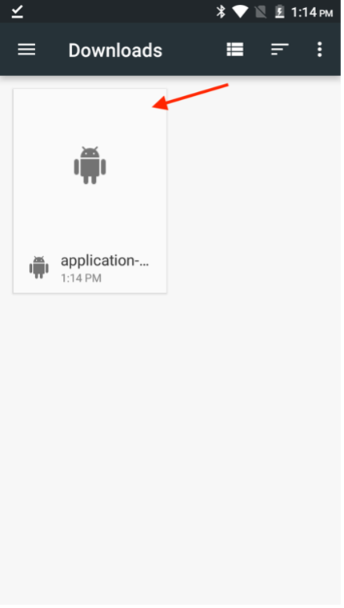

# 驗證行動應用程式

## Android

- 從您Android裝置上的[這裡](https://tinyurl.com/CSCBootcampApp)下載行動應用程式。 您可以在[Android模擬器](https://developer.android.com/studio/run/emulator)或實體Android裝置上下載它。

- 點選已下載的檔案以將其開啟。

- 在快顯視窗中，按一下安裝按鈕，然後按一下「仍要安裝」進行確認。

- 成功安裝應用程式後，按一下「開啟」按鈕以開啟它。

## iOS

>[!WARNING]
>
> 確定您已連線至Bootcamp Wifi網路。 這點很重要，因為應用程式只有在您使用同一個Wifi網路時才能運作。

由於這不是正式發佈的應用程式，因此iOS的設定與您慣用的有所不同。

- 從[App Store](https://itunes.apple.com/app/apple-store/id982107779)下載Expo Go App。

- 在iPhone相機應用程式中，掃描Adobe團隊將在訓練營投影的二維碼。 出現提示時，按一下顯示的按鈕。

- 如此將載入可讓您在iPhone上開啟應用程式的網頁。 按一下「Expo Go」按鈕，在您剛下載的應用程式中開啟它。

- 在彈出的對話方塊中，選取「開啟」，以便Expo Go應用程式可載入正確的資訊。

- Expo Go應用程式開啟後，會提示您尋找本機網路上的裝置。 如前所述，這是必要的，這樣我們才能從Adobe裝置將應用程式下載至您的手機。 按一下「允許」以載入此專案。

- 您一開始可能會收到錯誤頁面。 只需按一下「再試一次」按鈕，即可最終將應用程式載入您的裝置。 請注意，關閉Expo Go應用程式或中斷裝置與Wifi網路的連線將會導致應用程式不再回應。

## 導覽應用程式

在應用程式中，您可以從下拉式清單中選取您的團隊。 這會動態載入您在AEM中編寫的內容。 如果您對內容不滿意，您可以隨時在我們先前編寫的內容片段中更新內容，然後重新發佈內容。 接著，您會看到應用程式反映的變更。

選擇團隊前
選取團隊後

下一步： [階段3 — 傳遞：在AEM](./page-in-aem.md)中建立頁面

[回到第2階段 — 生產：建立行動應用程式內容](../production/app.md)

[返回所有模組](../../overview.md)
