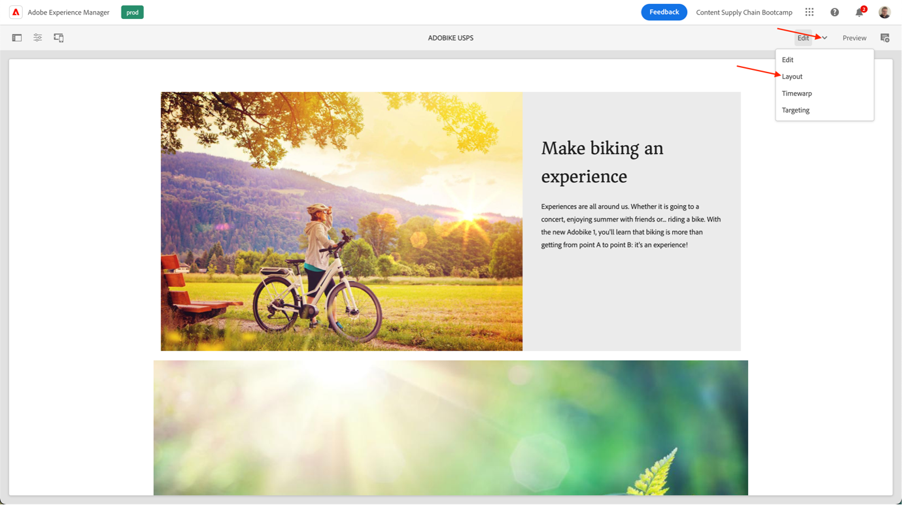

# 在AEM中建立頁面

AEM提供您兩個環境：作者環境和Publish環境。 這些互動可讓您在網站上提供內容，讓您的訪客可以體驗。

製作環境提供可在實際發佈內容之前，建立、更新和檢閱此內容的機制：

- 作者建立和檢閱內容（可能是幾種型別；例如，頁面、資產、出版物等）
- 這些將在某個時間點發佈到您的網站。

身為作者，您需要在AEM中組織您的網站。 這涉及建立和命名內容頁面，以便：

- 您可以在作者環境中輕鬆找到他們
- 您網站的訪客可在發佈環境中輕鬆瀏覽這些專案

網站的結構可視為儲存內容頁面的樹狀結構。 這些內容頁面的名稱會用於組成URL，而標題則會在您檢視頁面內容時顯示。 在以下範例中，頁面的無障礙URL將為/content/adobike/language-masters/en.html

讓我們來審視如何將一些新頁面新增至現有網站，以及如何重複使用某些內容。

## 建立首頁

如上一節所述，AEM的頁面階層是以樹狀結構運作。 這表示我們會從最上層的頁面開始：首頁。

- 前往[https://author-p71057-e991028.adobeaemcloud.com/](https://author-p71057-e991028.adobeaemcloud.com/)上的AEM作者，並使用我們提供的憑證登入。

- 從AEM開始功能表中選取導覽\>網站

- 首先，讓我們導覽現有的樹狀結構，至我們想建立首頁的位置。 在第一欄選取「Adobike」，然後在第二欄選取「Bootcamp」，導覽樹狀結構。 然後，若要在此頁面底下建立頁面，請按一下「建立」按鈕，然後在彈出的功能表中選取「頁面」。

- 這會開啟一個新畫面，讓您設定「新頁面」 。 首先，我們要選取一個頁面範本。 AEM中的頁面範本可讓您定義頁面的結構，以及定義可以在此頁面上使用的內容。 由於我們想要建立首頁（此為登陸頁面），因此我們將選取登陸頁面範本，然後按一下「下一步」按鈕以繼續。

- 在下一個畫面中，您將會在頁面中填入一些初始資訊。 最重要的資訊是標題（必填屬性，以\*表示），這表示您可以為頁面提供有意義的名稱。 如果您未填寫「名稱」，AEM將會根據SEO最佳實務自動產生您的頁面可用的URL。 在此情況下，您可以將此欄位保留空白。 您也可以填寫其他屬性，您可以探索其他標籤，但若是要使用此啟動營，請勿填寫任何其他屬性。 當您準備好建立頁面時，只要按一下「建立」按鈕即可。

- AEM現在將建立您的頁面。 完成後，您會看到快顯視窗，可讓您按一下「開啟」按鈕以開啟新建立的頁面。

- 您現在會進入AEM編輯器。 這是「所見即所得」（或WYSIWYG）編輯器，您可以在其中將元件拖放至頁面以建置頁面。 讓我們來看看導覽：
  
   - 在左側，您有側邊面板，其中包含可用於頁面上的資產、可用於此頁面的元件（或建置區塊），以及可顯示頁面結構方式的方便樹狀檢視。 按一下任一圖示以開啟其檢視。
   - 在右側，您會看到「配置容器」。 這是您可以放置所需元件的區域。
   - 讓我們將一些內容填入頁面中。 您可以視需要隨時填入首頁。 在以下範例中，我們使用了連結至產品頁面的影像元件，以及兩個Teaser元件。

## 善用體驗片段，重複使用體驗

我們現在已撰寫首頁，並已完全準備好迎接我們的Adobike啟動。 但是，其中的某些內容（例如我們的腳踏車獨特賣點）可以在多個頁面上重複使用。

理想情況下，我們只想要建立一次這種獨特的銷售點體驗，以便集中管理並確保個人化但一致的體驗。 在AEM中，我們可以對「體驗片段」執行此操作。 體驗片段是一組一或多個元件，包括可在頁面中參考的內容和版面。 它們可以包含任何元件。

立即使用吧：

- 前往[https://author-p71057-e991028.adobeaemcloud.com/](https://author-p71057-e991028.adobeaemcloud.com/)上的AEM作者，並使用我們提供的憑證登入。

- 從AEM開始功能表中選取導覽\>體驗片段

- 在下列畫面中，讓我們建立資料夾，供您的團隊用來儲存可重複使用的體驗。 在欄檢視中，導覽至Adobike \> Bootcamp ，然後按一下「建立\>資料夾」按鈕。

- 在彈出的強制回應視窗中，為您的資料夾提供團隊的名稱。 您可以讓名稱欄位保持空白，AEM會自動為您產生。 為資料夾命名後，按一下「建立」按鈕以建立資料夾。

- 您現在應該會看到資料夾快顯視窗。 按一下它，然後按一下建立\>體驗片段按鈕。

- 首先，讓我們選取體驗片段範本。 就像頁面一樣，體驗片段可以根據多個範本，每個範本都會預先定義體驗。 在此案例中，由於我們想要在網站中重複使用內容，因此我們將選取左上方的核取方塊，然後按一下「下一步」按鈕，以選擇「體驗片段Web變數範本」。

- 為您的體驗片段提供有意義的標題，例如「Adobike USPs」，然後按一下「建立」按鈕。

- 建立體驗片段後，請按一下強制回應視窗中的「開啟」按鈕，這樣我們就能在體驗片段中新增一些內容。

- 就像編輯頁面一樣，您可以看到可在其中新增部分內容的版面容器。

- 我們將複製首頁的元件。 在新標籤中，依上一章所述導覽至首頁，選取您要複製的元件，然後按一下復製圖示。

- 然後，返回您的體驗片段，按一下版面容器並按一下貼上按鈕。

>[!NOTE]
>
> 提示：AEM可讓您在任何頁面或體驗片段中使用「佈局模式」。 這可讓您調整元件大小，並為任何裝置最佳化體驗。

- 從頂端選單開啟下拉式清單，選取「配置」以進入配置模式。

- 然後，您可以選取任何元件並調整其大小，只要拖曳元件兩側的操作框以跳接至熒幕上可見的欄即可。

- 依預設，您正在編輯所有中斷點。 不過，如果您想要編輯特定中斷點，您可以從頁面頂端的工具列選取相符的裝置。 接著將會反白顯示您接著要編寫的中斷點。

- 如您所見，行動裝置上的兩欄版面看起來不妙。 讓我們在行動裝置上建立一個單欄配置。 如您在桌上型電腦上所見，我們的體驗保持不變，但在行動裝置上，我們現在只有一欄內容有更好的體驗。

- 最後，我們現在可以在首頁上重複使用此體驗。 將「體驗片段」元件拖放至頁面上您要顯示內容的位置。 您可以刪除我們複製的內容，因為我們將從體驗片段中使用該內容。

- 開啟體驗片段元件的設定對話方塊，並使用路徑選擇器選取您建立體驗片段的位置。

- 最後，我們的頁面上也有可重複使用的體驗。

## 建立產品頁面

使用與AEM整合的Adobe Commerce時，您可以擁有通用的產品詳細資料頁面，當您從產生的概覽導覽網站時可使用此頁面。 不過，有時我們也希望看到一個勵志頁面，將產品專屬內容與勵志內容結合在一起。 讓我們複製自己預先製作的市集，然後建立勵志產品頁面。

- 前往[https://author-p71057-e991028.adobeaemcloud.com/](https://author-p71057-e991028.adobeaemcloud.com/)上的AEM作者，並使用我們提供的憑證登入。

- 從AEM開始功能表中選取導覽\>網站

- 在欄總覽中，導覽至預先建立的網站至商店： Adobike \>語言主版\> Adobike \>商店。 然後，選取包含核取方塊的「商店」頁面，並按一下「建立\>即時副本」。 在不涉及太多細節的情況下，這將建立可在您的網站中使用的頁面復本，以便您可以使用AEM的多網站管理員重複使用現有的頁面和內容。

- 在隨即顯示的畫面中，選取團隊名稱旁的核取方塊，以選取團隊的網站作為目的地。 然後，按一下「下一步」按鈕。

- 由於我們不會深入探討「多網站管理員」，您可以接手此設定。\
  Title： Shop\
  名稱：商店\
  轉出設定：標準轉出設定\
  設定即時副本後，按一下「建立」按鈕。

>[!NOTE]
>
> 想進一步瞭解即時副本嗎？ 簽出[「建立和同步處理即時副本」。](https://experienceleague.adobe.com/docs/experience-manager-cloud-service/content/sites/administering/reusing-content/msm/creating-live-copies.html?lang=en)

- 完成後，您現在應該會看到網站上有該商店。 選取該頁面，然後按一下「建立\>頁面」 ，建立啟發靈感的產品頁面。

- 由於我們要在頁面上顯示產品資訊，因此現在請使用產品頁面範本建立頁面。 選取該專案，然後按一下「下一步」按鈕。

- 填寫頁面中繼資料，然後按一下「建立」按鈕，就像首頁一樣。 建立頁面後，您可以按一下「開啟」按鈕以開啟頁面。 如您所見，其中已填入產品詳細資料元件。

- 首先，我們將新增先前建立的體驗片段。 然後，我們可以在頁面上新增任何仍需要的額外內容。 最後，我們將設定產品詳細資料元件，以顯示Adobike產品，方法是在設定對話方塊中選取產品尋找器，然後選取我們的Adobike類別，並核取產品旁的方塊。 然後，按一下「新增」按鈕。

- 現在，我們有了完整的勵志頁面，包括來自Adobe Commerce的集中管理內容和產品資訊。

下一步： [階段3 — 傳遞：行銷活動執行/不執行](./go-nogo.md)

[回到第3階段 — 傳送：驗證行動應用程式](./app.md)

[返回所有模組](../../overview.md)
