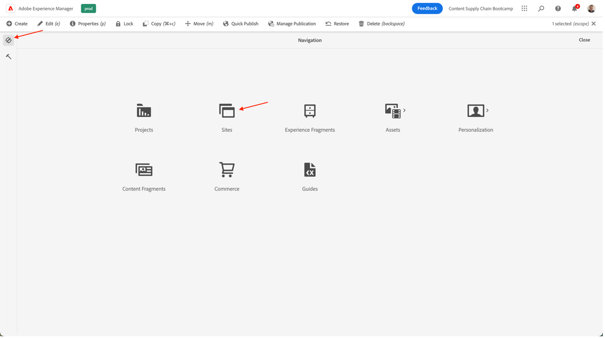
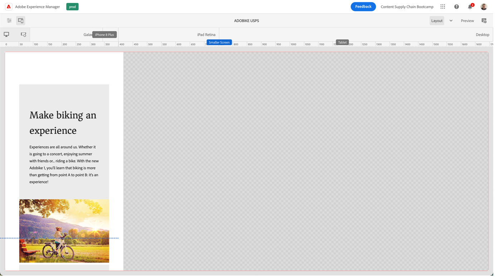

# 在AEM中建立頁面

AEM提供兩種環境：製作環境和發佈環境。 這些互動可讓您將內容提供至您的網站，讓您的訪客能體驗。

製作環境提供在實際發佈前建立、更新和檢閱此內容的機制：

- 作者會建立並檢閱內容(這可以是數種類型；例如頁面、資產、出版物等)
- 在某個時候，它將發佈到您的網站。

身為作者，您需要在AEM中組織網站。 這包括建立和命名您的內容頁面，以便：

- 您可在製作環境中輕鬆找到這些標籤
- 您網站的訪客可在發佈環境中輕鬆瀏覽網站

網站的結構可視為存放您內容頁面的樹狀結構。 這些內容頁面的名稱會用來形成URL，而標題會在檢視頁面內容時顯示。 在以下範例中，可存取的頁面URL為/content/adobike/language-masters/en.html

讓我們來檢閱如何將一些新頁面新增至現有網站，以及如何重複使用某些內容。

## 建立首頁

如前一節所述，AEM頁面階層以樹狀結構運作。 這表示我們將從最高層級的頁面開始：首頁。

- 前往AEM作者 [https://author-p71057-e991028.adobeaemcloud.com/](https://author-p71057-e991028.adobeaemcloud.com/) 並使用我們提供的憑據登錄。

- 從「AEM開始」菜單中，選擇導航\>站點

- 首先，我們將導覽現有的樹狀結構，以找到要建立首頁的位置。 在第一欄中選取「Adobike」，在第二欄中選取「Bootcamp」，即可導覽樹狀結構。 然後，要在此頁面下建立頁面，請按一下「建立」按鈕，然後在彈出的菜單中選擇「頁面」。

- 這會開啟新畫面，並設定新頁面。 首先，我們可以選取頁面範本。 AEM中的頁面範本可讓您定義頁面的結構，以及定義可在此頁面上使用的內容。 因為我們想要建立首頁（即著陸頁面），我們將選取「著陸頁面範本」，然後按一下「下一步」按鈕以繼續。

- 在下一個畫面中，您將能夠填入您的頁面中一些初始資訊。 最重要的資訊是標題（強制屬性，以\*表示），這代表您為頁面命名有意義的名稱。 如果您未填入「名稱」，AEM會遵循SEO最佳作法，自動產生可用頁面的URL。 在此情況下，您可以將此欄位留空。 您也可以填入其他屬性，您可以探索其他索引標籤，但為了這個bootcamp的目的，目前還不會填入任何其他屬性。 準備好建立頁面時，只需按一下「建立」按鈕。

- AEM現在會建立您的頁面。 完成後，您會看到快顯視窗，按一下「開啟」按鈕即可開啟新建立的頁面。

- 您現在會到達AEM編輯器。 這是「您所看到的是您獲得的內容」（或WYSIWYG）編輯器，您可以在其中拖放元件至頁面，以建立您的頁面。 讓我們查看導覽：
   
   - 在左側，您有可在頁面上使用的資產的側面板、可在此頁面上使用的元件（或建置區塊），以及可顯示頁面結構的實用樹狀檢視。 按一下任一圖示以開啟其檢視。
   - 右側會顯示「版面容器」。 這是可放置所需元件的區域。
   - 讓我們在頁面中填入一些內容。 您可以視需要填入首頁。 在以下範例中，我們使用連結至產品頁面的影像元件，以及兩個宣傳預告元件。

## 運用體驗片段以重新使用體驗

我們現在已製作首頁，已完全準備就緒，可供Adobike啟動。 不過，其中的部分內容（例如我們的腳踏車的獨特賣點）可在多個頁面上重複使用。

理想情況下，我們只需建立一次此獨特的銷售點體驗，這樣我們就能集中管理，並確保提供個人化且一致的體驗。 在AEM中，我們可以使用「體驗片段」執行此操作。 體驗片段是一或多個元件的群組，包括可在頁面中參照的內容和版面。 它們可包含任何元件。

讓我們直接用一下：

- 前往AEM作者 [https://author-p71057-e991028.adobeaemcloud.com/](https://author-p71057-e991028.adobeaemcloud.com/) 並使用我們提供的憑據登錄。

- 從「AEM開始」功能表，選取導覽\>體驗片段

- 在下列畫面中，我們將建立資料夾，供您的團隊用來儲存可重複使用的體驗。 在欄檢視中，導覽至Adobike \> Bootcamp，然後按一下「建立\>資料夾」按鈕。

- 在強制回應視窗中，為資料夾命名您的團隊。 您可以將名稱欄位保留為空白，AEM會自動為您產生。 為資料夾命名後，按一下「建立」按鈕以建立資料夾。

- 現在應該會看到資料夾快顯視窗。 按一下「 」，然後按一下「建立\>體驗片段」按鈕。

- 首先，我們來選取體驗片段範本。 就像頁面一樣，體驗片段可以以多個範本為基礎，每個範本都預先預先定義體驗。 在此情況下，由於我們想要重複使用網站中的內容，因此我們將選取左上方的核取方塊，然後按一下「下一步」按鈕，以選擇「體驗片段Web變異範本」。

- 為您的體驗片段提供有意義的標題，例如「Adobike USP」，然後按一下「建立」按鈕。

- 建立體驗片段後，按一下強制回應視窗中的「開啟」按鈕，以便我們在體驗片段中新增一些內容。

- 就像編輯頁面時一樣，您可以看到一個版面容器，可在其中新增一些內容。

- 我們將從首頁複製元件。 在新索引標籤中，依上一章所述導覽至首頁，選取您要複製的元件，然後按一下復製圖示。

- 然後，返回您的體驗片段，按一下版面容器，然後按一下貼上按鈕。

>[!NOTE]
>
> 提示：AEM可讓您在任何頁面或體驗片段中使用「版面模式」。 這可讓您調整元件大小，並針對任何裝置最佳化體驗。

- 從頂端功能表中，開啟下拉式清單，然後選取「配置」以進入配置模式。

- 然後，您可以選取任何元件，並只需拖曳元件兩側的控點，即可將其調整大小，以貼上至螢幕上可見的欄。

- 預設情況下，您正在編輯所有斷點。 但是，如果要編輯特定斷點，則可以從頁面頂部的工具欄中選擇匹配的設備。 然後將突出顯示您要為其編寫的斷點。

- 如您所見，行動裝置上的兩欄版面看起來並不理想。 讓我們在行動裝置上建立一個欄版面。 如您在案頭上所見，我們的體驗保持不變，但在行動裝置上，我們現在只有一欄內容，可提供更好的體驗。

- 最後，我們現在可以在首頁上重複使用此體驗。 將「體驗片段」元件拖放至您要內容顯示位置的頁面上。 您可以刪除我們複製的內容，因為我們將從體驗片段中使用它。

- 開啟體驗片段元件的設定對話方塊，並使用路徑選擇器選取您建立體驗片段的位置。

- 最後，我們的頁面現在提供可重複使用的體驗。

## 建立產品頁面

使用與AEM整合的Adobe Commerce時，您可以有一個一般產品詳細資料頁面，當您從產生的概述導覽網站時會使用此頁面。 不過，有時候我們也想要預測一個鼓舞人心的頁面，它將產品特定內容與激勵內容結合在一起。 讓我們以預先製作的方式複製商店，然後建立鼓舞人心的產品頁面。

- 前往AEM作者 [https://author-p71057-e991028.adobeaemcloud.com/](https://author-p71057-e991028.adobeaemcloud.com/) 並使用我們提供的憑據登錄。

- 從「AEM開始」菜單中，選擇導航\>站點

- 在欄概述中，導覽預先建立的網站至商店：Adobike \>語言主版\> Adobike \>購物。 接著，選取含有核取方塊的「購物」頁面，然後按一下「建立\>即時副本」。 這不會過多說明，而是會建立您可在網站中使用的頁面副本，以便您使用AEM Multi Site Manager重複使用現有的頁面和內容。

- 在彈出的畫面中，選取團隊名稱旁的核取方塊，以選取您的團隊網站作為目的地。 然後，按一下「下一步」按鈕。

- 由於我們不打算深入到多站點管理器，因此您只需接管此配置即可。\
   標題：商店\
   名稱：商店\
   轉出設定：標準轉出設定\
   設定即時副本後，按一下「建立」按鈕。

>[!NOTE]
>
> 想要更多關於即時副本的資訊？ 結帳 [&quot;建立和同步Live Copy&quot;。](https://experienceleague.adobe.com/docs/experience-manager-cloud-service/content/sites/administering/reusing-content/msm/creating-live-copies.html?lang=en)

- 完成後，您現在應該會在網站中看到可用的商店。 選取它，然後按一下「建立\>頁面」以建立鼓舞人心的產品頁面。

- 由於我們想要在頁面上顯示產品資訊，現在請使用產品頁面範本建立頁面。 選取它，然後按一下「下一步」按鈕。

- 填寫頁面中繼資料，然後按一下「建立」按鈕，就像首頁一樣。 建立頁面後，按一下開啟按鈕即可開啟頁面。 如您所見，它已填入產品詳細資料元件。

- 首先，我們會新增先前建立的體驗片段。 然後，我們可以在頁面上新增我們仍要的任何其他內容。 最後，我們將配置產品詳細資訊元件以顯示Adobe產品，方法是在配置對話框中選擇產品查找器，然後選擇我們的Adobike類別並核取產品旁邊的框。 然後，按一下「新增」按鈕。

- 我們現在有充分啟發的頁面，包括來自Adobe Commerce的集中管理內容和產品資訊。

下一步： [第3階段 — 交付：促銷活動開始/不開始](./go-nogo.md)

[返回第3階段 — 傳遞：驗證行動應用程式](./app.md)

[返回所有模組](../../overview.md)
