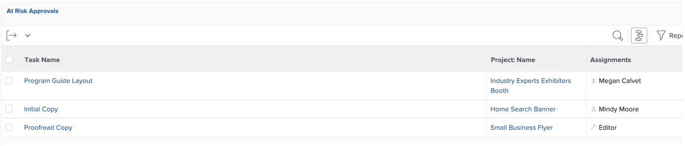

# 專案經理的深入分析

## 互動式專案進度報表

在「PIN」行上，按一下「行動應用程式感知度」，然後按一下「量度」：

在這裡，您可以以圖形化方式檢視單一專案/行銷活動的狀態。

>[!NOTE]
>
> 可點按每個區域以取得更多詳細資料，這是Workfront中大部分深入分析的情形。 試試看！

## 促銷活動特定報表

在「PIN」行上，按一下「專案：

在左側欄中按一下「促銷活動狀態」：

上半部分提供您關於1個單一行銷活動的深入分析，每個管道的1個行銷活動&#x200B;**計畫與實際**&#x200B;花費小時以及2個&#x200B;**行銷活動條件**：

底部會提供&#x200B;**促銷活動交付專案**&#x200B;狀態的深入分析：

## 以多個專案為基礎的深入分析

仍然在左欄，按一下「監視」

上半部分會從&#x200B;**任務狀態**&#x200B;檢視和&#x200B;**專案狀態**&#x200B;檢視，提供您有關一組專案狀態的深入分析：

底部顯示所有&#x200B;**有風險的核准**，並將需要追蹤：

## 內容控制面板

仍然在左欄，按一下「內容控制面板」：

頂端部分提供您所有&#x200B;**檔案校訂核准**&#x200B;狀態的深入分析（是否已核准、我們需要多少版本等）

底部是&#x200B;**校訂核准稽核**，可為校訂核准狀態提供另一個視角：

下一步：[階段4 — 行銷經理的深入分析](./marketing-manager.md)

[回到第4階段 — 深入分析：概觀](./overview.md)

[返回所有模組](../../overview.md)
