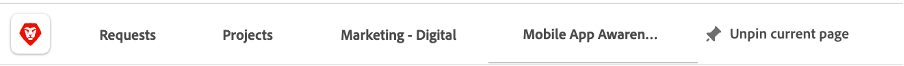

# 規劃

>[!NOTE]
>
> 在Bootcamp期間，您會戴上好幾個帽子：請求者、專案經理、Designer和上層管理。 這會讓您略過每個設定檔的使用者體驗。

現在來看看工作管理平台Adobe Workfront。 Workfront可讓整個組織看見您的目標，讓每個人都能策略性地排定工作的優先順序、追蹤進度並評估結果。 隨著您的目標不斷發展，Workfront會將資訊級聯到在實地執行工作的團隊。 結果如何？ 更佳的協調性、焦點與速度，讓您以更快的速度取得成功。

瀏覽至[adobebootcampemea-02032301.testdrive.workfront.com](https://adobebootcampemea-02032301.testdrive.workfront.com)，並使用Adobe團隊提供給您的認證登入Workfront設定檔。

您將面臨此登入頁面。  以您訂閱啟動訓練營的專業電子郵件地址登入，使用者名稱為：

成功登入後，您將面臨此首頁：

## 準備Workfront以供使用

我們現在會定期使用Workfront，準備首頁。  這表示我們將前往取得工作流程的相關頁面，並在首頁上「釘選」這些頁面。

首先，讓我們前往取得團隊的工作負載頁面。  按一下右上方的華夫餅並選取「團隊」

一旦我們的TEAM (Marketing - Digital)出現在熒幕上，只要將其「釘選」到您的最上方色帶即可：

您最上層的功能區現在看起來應該像這樣：

現在來釘選一個專案，我們稍後將更密切地分析該專案。  按一下「已釘選專案」頁面，然後按一下搜尋按鈕。  輸入「行動應用程式感知促銷活動」，然後按一下專案名稱：

一旦專案出現在您的熒幕上，請像之前一樣將它釘選到您的頂端功能區：

再次釘選

您最上層的功能區現在看起來應該像這樣：

最後，再按一下右上方的華夫餅並選取PORTFOLIO。

按一下搜尋按鈕並輸入&#39;TRANSFORM&#39;。  按一下「轉換客戶體驗」Portfolio以開啟：

開啟Portfolio後，將它釘選到您的頂端功能區：

您最上層的功能區現在看起來應該像這樣：

我們現在已準備好使用介面來開始工作流程，該介面會定期向我們顯示確切的需求。

## 請求者

我們現在將以請求者的帽子開始實際的工作錄入。 例如產品經理等請求者，我們想將新Adobike行銷活動的請求正規化，並提供行銷簡報的資訊。

- 在左上方，按一下要求：

- 接著，按一下「新要求」：

- 要求型別請選取「行銷要求」，然後選取「CSB — 行銷活動要求」：

- 輸入主旨： &quot;Adobike Campaign - \*team\*&quot; （填寫您的團隊編號）。 您可以隨意新增說明和優先順序。

- 「CSB — 行銷活動簡報」標頭下方的所有內容皆可完全自訂。 在此情況下，這些都是自訂欄位，您可以根據自己的行銷簡要需求進行調整。 以下是我們已為此Bootcamp建立的簡短欄位：

Workfront中的

- 讓我們開始填寫以下簡報：

   - 將開始日期設為01/06/2023 — 將結束日期設為30/06/2023：

  

   - 選取AEM Assets，因為我們將有一些資產可用於那裡的這個行銷活動：

  

   - 在「新增內容」上，請注意，如果您按一下「是」，會出現一個附有時間線警告的額外（條件）欄位：

  

   - 由於期限很緊，我們將選擇變更為「否」：

  

   - 在管道中，我們依預設選擇預先選取一些管道。 這些就是我們下一步所需的專案，因此這裡不需要變更：

  

   - Adobe Commerce，選取「是」：

  

- 最後，在檔案區段中，您可以新增請求的任何相關檔案。  在此，我們將使用AEM聯結器來顯示如何從我們的AEM Assets例項取得現有內容。

   - 按一下「新增或連結檔案」並從「experience-manager」選取「連結」。

  

   - 您現在必須使用AEM Assets資料夾，並透過這些資料夾瀏覽（和/或使用搜尋引擎）以取得請求所需的檔案/資產：

  

   - 您可以隨時從AEM Assets附加任何您認為與此專案相關的專案（如果有的話）。 完成後，請按一下「連結」以連結至資產，如果未連結任何資料夾，請按一下「關閉」。

  

- 我們已完成請求，並準備提交請求：

## 專案經理

現在我們已以「請求者」（例如產品經理）身分提交請求，我們將更換帽子，並戴上「專案經理」的頭銜。

- 按一下「Adobe」標誌，您就會進入「新行銷請求」頁面（這是典型的「專案經理」首頁）：

- 在「行銷 — 新行銷活動請求」區段下，您可以找到新建立的請求：

- 按一下請求名稱：

- 按一下「請求詳細資料」：

- 向下捲動至「CSB — 行銷活動簡報」區段，並將其展開：

- 您可以檢視請求者簡介的所有詳細資訊，有了這些資訊，您就可以根據範本來開始專案計畫。
   - 在上方、請求名稱旁，按一下三個點：

  

   - 按一下「從範本轉換為專案」：

  

   - 選取「CSB — 行銷活動」，然後按一下「使用範本」：

  

   - 按一下頁面底部的「轉換為專案」：

  

- 我們現在擁有以範本為基礎的Campaign專案工作流程。 讓我們稍後釘選專案。 按一下「釘選目前頁面」：

- 需要注意的方面：

1. 期間概念 — 它是完成任務的機會視窗。\
   計畫時數的概念 — 完成任務所需的實際時間。

1. 前置任務概念（亦稱為相依性） — 這些是任務之間可以具有的限制條件（通常，此任務不能在此另一個任務完成之前開始）。 這可讓我們擁有清楚的甘特圖，其中包含每個專案的關鍵路徑。 按一下下方圖示以檢視甘特圖：
   

1. 指派的概念 — 在建立專案時，指派仍是一般性的，因為它們來自範本。 它們會提供給職務角色（以槌子圖示表示，亦即具有完成此特定任務之技能的人員群組）或團隊（以人員圖示表示，亦即由您的公司人員群組所定義）。 現在到了將這些工作指派給個人的時候。

- 今天，我們將專注於團隊預先指派，以及如何將這些指派給個人。

- 如您所見，工作11「製作社群媒體廣告」已指派給「行銷 — 數位」團隊：
  

- 讓我們透過開啟該團隊的資源管理頁面，來瞭解這如何反映該團隊的計畫。 按一下頁面上方的「行銷 — 數位」PIN碼：
  

- 您現在有此「團隊規劃」檢視：

1. 頂端部分涵蓋該特定團隊的「未指派」工作。 它列出專案團隊指派的專案，按一下這裡的箭頭，您就可以看到專案需要涵蓋的確切任務：
   

1. 底部涵蓋團隊中個人的指派工作，但不僅顯示：它確實顯示團隊每個成員的實際工作量，也顯示其排程（例如週一至週五或週一至週六）、其假日等。
   

- 若要將任務指派給個人，只要將任務從頂端拖曳至底部單一個人行即可 — 請參閱Bea的工作負載已如何調整，以及其任務指派的詳細資訊已新增：
  

下一步： [階段1 — 計畫：其他前置工作](./prework.md)

[返回創意簡介](../../creative-brief.md)

[返回所有模組](../../overview.md)
