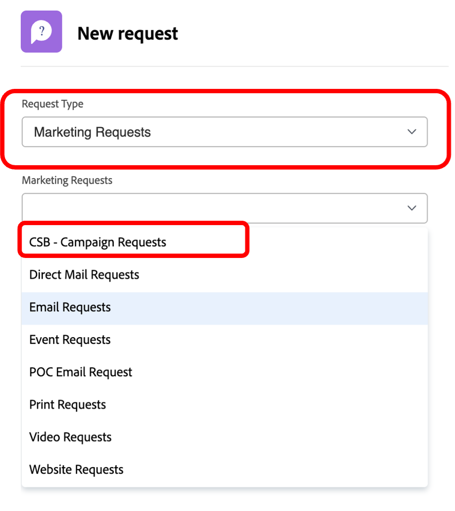
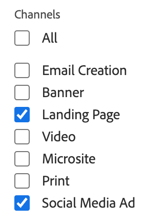
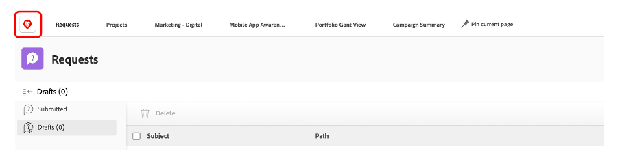

# 規劃

>[!NOTE]
>
> 在布特坎普期間，你會戴幾頂帽子：申請人、項目經理、設計師和高級管理人員。 這可讓您一目瞭然地了解每個設定檔的使用者體驗。

現在來看看工作管理平台，Adobe Workfront。 Workfront可讓您的目標在整個組織中可見，讓每個人都能策略性地排定工作優先順序、追蹤進度並衡量結果。 隨著你的目標的發展，Workfront將資訊傳遞給執行實地工作的團隊。 結果呢？ 更協調一致、更專注、更快取得成功。

瀏覽至，登入您的Workfront設定檔 [adobebootcampemea-02032301.testdrive.workfront.com](https://adobebootcampemea-02032301.testdrive.workfront.com) 並使用Adobe團隊提供給您的憑證登入。

此登入頁面將會對您造成影響。  以用戶名的形式以您訂購到bootcamp的專業電子郵件地址登錄：

成功登入後，您會面臨此首頁：

## 準備Workfront以供使用

我們現在會準備首頁，就像定期使用Workfront一樣。  這表示我們將前往，取得稍後工作流程的相關頁面，並在首頁頂端「PIN」這些頁面。

首先，讓我們去獲取我們的TEAM的工作負載頁。  按一下右上方的華夫餅，然後選取「團隊」

一旦我們的團隊（行銷 — 數位）上螢幕，只需將其「PIN」到您的頂端功能區：

您的頂端功能區現在應該如下所示：

現在，請確定一個項目，我們稍後將更詳細地分析該項目。  按一下「項目已固定」頁，然後按一下搜索按鈕。  輸入「行動應用程式感知行銷活動」，然後按一下專案名稱：

在您的螢幕上顯示項目後，像以前一樣將其固定到您的頂部功能區：

您的頂端功能區現在應該如下所示：

最後，再按一下右上角的華夫餅，然後選取PORTFOLIO。

按一下搜尋按鈕，然後輸入&#39;TRANSFORM&#39;。  按一下「轉換客戶體驗」Portfolio以開啟：

Portfolio開啟後，將其釘選到頂部功能區：

您的頂端功能區現在應該如下所示：

現在，我們已準備好透過介面開始工作流程，該介面會定期向我們顯示我們需要的內容。

## 請求者

現在，我們將從申請人的帽子開始實際工作。 如果申請人（例如產品經理）想要正式化新Adobe促銷活動的請求，並提供行銷簡報的資訊。

- 按一下左上角的「請求」 :

- 然後，按一下「新請求」：

- 由於是請求類型，請依序選取「行銷請求」、「CSB — 行銷活動請求」：

- 輸入主題：「Adobike促銷活動 — \*team\*」（填入您的團隊編號）。 您可以自由新增說明和優先順序。

- 「CSB — 行銷活動簡報」標題下的所有項目皆可完全自訂。 在此案例中，這些都是您可以根據自己行銷簡報需求調整的自訂欄位。 以下是我們為此Bootcamp建立的Brief欄位：

- 讓我們開始填寫簡報：

   - 將開始日期設為01/06/2023 — 將結束日期設為30/06/2023:

   

   - 選取AEM Assets，因為我們將在此促銷活動中使用一些資產：

   

   - 請注意，在「新內容」上，如果按一下「是」，會出現額外（條件性）欄位，並出現時間列警告：

   

   - 由於我們的最後期限很緊，因此我們將選擇改為「否」：

   

   - 在管道上，我們已選取預設預先選取部分。 我們下一步需要的就是這些，因此這裡不需要任何改變：

   

   - Adobe Commerce，選擇是：

   

- 最後，在檔案區段中，您可以為請求新增任何相關檔案。  在此，我們將利用AEM連接器，說明如何從我們的AEM Assets例項取得現有內容。

   - 按一下「新增或連結檔案」，然後選取「experience-manager」中的「連結」。

   

   - 您現在會面臨AEM Assets資料夾，可以瀏覽這些資料夾（和/或使用搜尋引擎），以取得您要求所需的檔案/資產：

   

   - 您可以隨時附加AEM Assets中您認為可能與此專案相關的任何項目（如果有的話）。 完成後，按一下「連結」以連結至資產，或按一下「關閉」以連結任何資料夾。

   

- 我們現在已完成請求並準備提交：

## Project Manager

現在，我們已以「請求者」（例如產品經理）的身份提交請求，我們將更換帽子，並戴上其中一個項目經理。

- 按一下「Adobe」標誌，然後您就會進入「新行銷請求」頁面（這是典型的「專案經理」首頁）:

- 在「行銷 — 新促銷活動請求」區段下，您可以找到新建立的請求：

- 按一下請求名稱：

- 按一下「請求詳細資料」：

- 向下捲動至「CSB — 行銷活動簡報」區段並展開：

- 您可以查看申請人的簡介的所有詳細資訊，並透過此資訊，您可以根據範本啟動專案計畫。
   - 在頂端的「請求」名稱旁，按一下三個點：

   

   - 按一下「從範本轉換為專案」：

   

   - 選取「CSB — 行銷活動」，然後按一下「使用範本」：

   

   - 按一下頁面底部的「轉換為專案」：

   

- 我們現在有以範本為基礎的Campaign專案工作流程。 我們稍後再確定項目。 按一下「釘上目前的頁面」：

- 一些值得注意的領域：

1. 持續時間的概念 — 完成任務的機會窗口。\
   計畫小時數的概念 — 完成任務所需的實際時間。

1. 前置任務的概念（也稱為相依性） — 這些是任務之間可以有的約束（通常，在完成另一個任務之前無法啟動此任務）。 這樣，我們就可以擁有清晰的Gant圖，其中包含每個項目的關鍵路徑。 按一下以下表徵圖可查看全局圖：
   

1. 分配的概念 — 在建立項目時，分配仍然是泛型的，因為它們來自模板。 它們由「工作角色」（由「錘子」表徵圖表示）或「團隊」（由「人員」表徵圖表示）（由「公司人員」組定義）組成。 現在是把這些任務分配給個人的時候了。

- 今天，我們將專注於團隊預分配以及如何將這些分配給個人。

- 如您所見，工作11「製作社交媒體廣告」已指派給「行銷 — 數位」團隊：
   

- 在「資源管理」(Resource Management)頁開啟，讓我們查看這如何反映此團隊的計畫。 按一下頁面頂端的「行銷 — 數位」PIN碼：
   

- 您現在擁有此「團隊」計畫檢視：

1. 頂部覆蓋了該特定團隊的「未分配」工作。 它列出了團隊在中分配的項目，按一下此處的箭頭，您可以看到需要由項目覆蓋的確切任務：
   

1. 底部部分涵蓋團隊中個人的「已分配」工作，但不僅限於：它確實顯示了小組每個成員的實際工作量，也顯示了他們的日程安排（例如週一至週五或週一至週六）、節假日等。
   

- 要將任務分配給個人，只需將任務從頂部拖到底部某個人的行即可 — 查看Bea的工作量如何調整以及其任務分配的詳細資訊已添加：
   

下一步： [第1階段 — 規劃：其他前期工作](./prework.md)

[返回Creative Brief](../../creative-brief.md)

[返回所有模組](../../overview.md)
