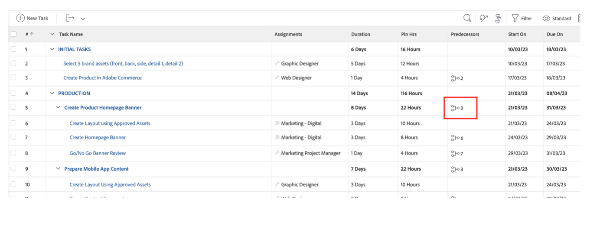

# 其他預先作業

## 選取品牌Assets

如創意簡報中所述，我們需要一些資產才能有效啟動我們的行銷活動。 這些品牌資產將新增至Workfront中的行銷活動，因此我們得以集中存取。

- 展開工作1「初始工作」，然後按一下以開啟工作「選取5個品牌資產（前、後……）」。

- 按一下「檔案」，然後按一下「新增：

- 選取「從Experience-manager」；這可讓我們選取AEM Assets上已提供的品牌資產：

來自experience-manager

- 顯示AEM資料夾階層後，請導覽至以下路徑： Experience-manager > Adobike Assets >腳踏車快照選取5個資產，然後按一下「連結」。

- 我們的任務現在有品牌資產。 這表示我們可以設定任務2為100%完成：

## Adobe Commerce示範

Adobe Commerce是Adobe Experience Cloud中的眾多產品之一，可協助您為客戶提供最佳數位體驗。 然而，在訓練營中時間太少，無法一起做所有事情。

本影片可讓您熟悉Adobe Commerce，並展示我們建立以供在啟動營中使用的產品。 在實際情況中，您會將先前選取的品牌資產上傳至Adobe Commerce至產品設定。

>[!VIDEO](https://video.tv.adobe.com/v/3418945?quality=12&learn=on&enablevpops)

完成此工作後，您可以在Workfront中將工作3標示為100%完成。

## 彈性的行銷活動是先決條件

在檢閱工作計畫時，我們注意到一個小問題：我們的產品經理（請求者）已提出更新，但忘記請求「產品首頁橫幅」。  我們將此專案新增至專案計畫。

- 前往任務清單，在任務4「生產」下方新增我們的「建立產品首頁橫幅」任務。 若要這麼做，請選取「準備行動應用程式內容」工作，然後按一下「在上方新增工作」圖示：

- 為新增的工作提供有意義的名稱，例如「建立產品首頁橫幅」。

- 既然我們已建立任務，接下來就可以新增一些內容了。 按一下專案標題右側的三個點，然後選取「附加範本」：

- 選取「建立產品首頁橫幅」並按一下「自訂並附加」：

- 在自訂畫面中，請務必提及「建立產品首頁橫幅」工作作為父項：

- 最後，請確定您使用任務3的前置任務來標籤父任務「建立產品首頁」，因為在Adobe Commerce中建立產品之前無法開始生產：

我們現在有已完成並規劃好的行銷活動，這表示我們現在可以從行銷活動的生產和傳送開始！

下一步： [階段2 — 生產：建立產品首頁橫幅](../production/banner.md)

[返回第1階段 — 計畫：計畫](./planning.md)

[返回所有模組](../../overview.md)
