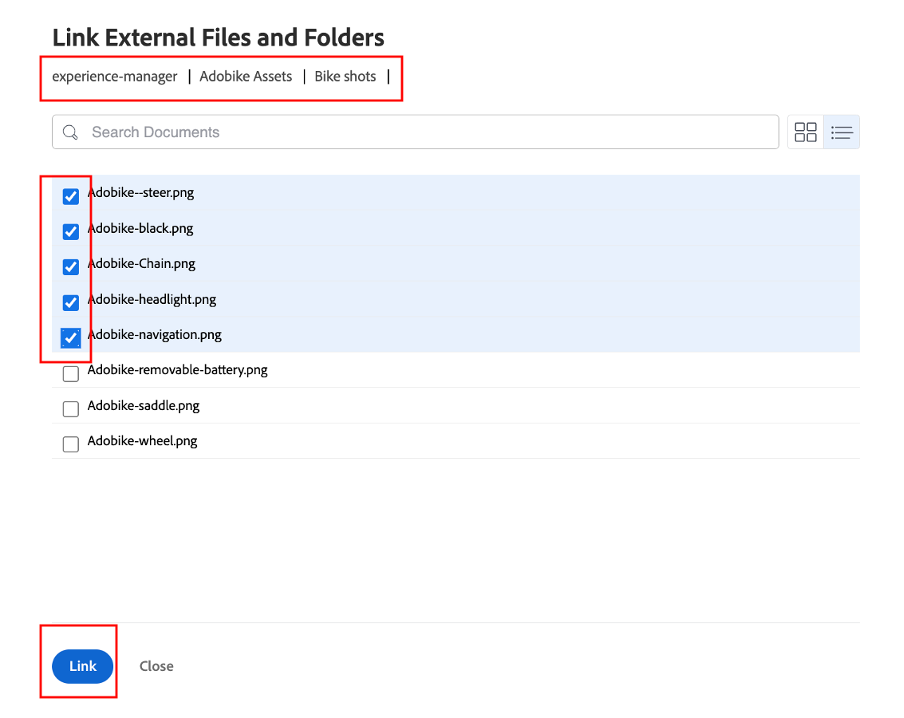

# 其他前期工作

## 選取品牌資產

如創意簡報所述，為了有效啟動我們的行銷活動，需要一些資產。 這些品牌資產將會新增至Workfront的行銷活動中，以便我們集中存取。

- 展開任務1「初始任務」，然後按一下該任務，開啟「選擇5個品牌資產（前、後、...）」任務。

- 按一下「文檔」，然後按一下「添加新：

- 選取「從experience-manager」；這可讓我們挑選AEM Assets上已可用的品牌資產：

- 顯示AEM資料夾階層後，請導覽至下列路徑：experience-manager > Adobike Assets >腳踏車鏡頭選取5個資產，然後按一下「連結」。

- 現在，我們的任務中已有品牌資產。 這表示我們可以將任務2設定為100%完成：

## Adobe Commerce示範

Adobe Commerce是Adobe Experience Cloud中眾多可協助您為客戶提供最佳數位體驗的產品之一。 但是，在訓練營期間，沒有多少時間一起做任何事。

此影片可讓您熟悉Adobe Commerce，並顯示我們建立用於訓練營期間的產品。 在實際案例中，您會將先前選取的品牌資產上傳至Adobe Commerce至產品設定。

>[!VIDEO](https://video.tv.adobe.com/v/3418945?quality=12&learn=on)

完成此任務後，您可以在Workfront中將任務3標示為100%完成。

## 彈性的行銷活動是先決條件

在審查我們的工作計畫時，我們注意到了一個小問題：我們的產品經理（請求者）已發佈更新，他忘記要求「產品首頁橫幅」。  我們將將此添加到項目計畫中。

- 轉至「任務」清單，並在任務4「生產」的正下方添加「建立產品首頁橫幅」任務。 若要這麼做，請選取「準備行動應用程式內容」任務，然後按一下「上方新增任務」圖示：

- 為新增的任務指定有意義的名稱，例如「建立產品首頁橫幅」。

- 既然我們已建立任務，現在來為其添加一些內容。 按一下專案標題右側的三個點，然後選取「附加範本」：

- 選擇「建立產品首頁橫幅」，然後按一下「自訂並附加」：

- 在自訂畫面中，請確定您提及「建立產品首頁橫幅」任務作為父項：

- 最後，請務必將父任務「建立產品首頁」標籤為任務3的前置任務，因為在Adobe Commerce中建立產品之前，不能啟動任何生產：

我們現在有已完成並已規劃的行銷活動，這表示我們現在可以從製作和提供行銷活動開始！

下一步： [第2階段 — 生產：建立產品首頁橫幅](../production/banner.md)

[返回第1階段 — 計畫：規劃](./planning.md)

[返回所有模組](../../overview.md)