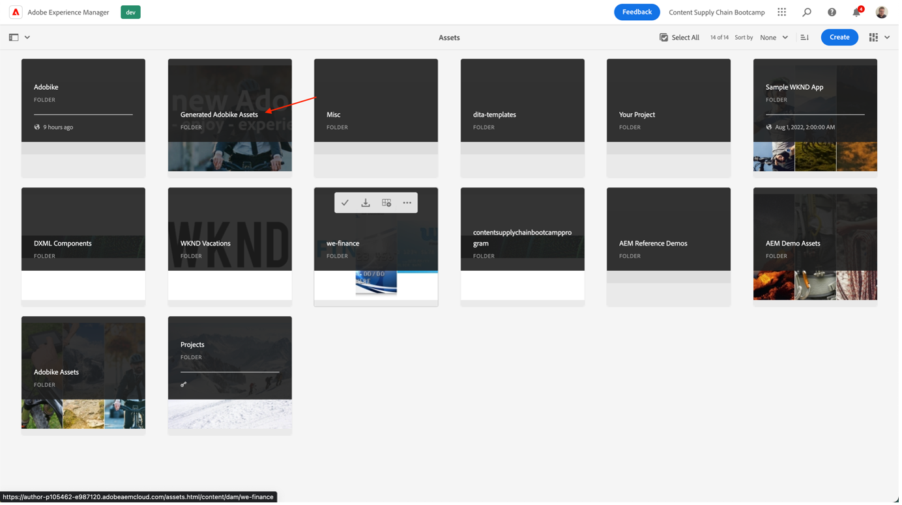

# 建立產品首頁橫幅

## 橫幅的製作

內容自動化將Adobe Creative Cloud的強大功能帶給Experience Manager Assets，讓行銷人員能夠大規模自動化資產生產，大幅加快變數的建立。 讓我們使用這些功能產生要在首頁上使用的橫幅！

- 前往AEM作者 [https://author-p105462-e991028.adobeaemcloud.com/](https://author-p105462-e991028.adobeaemcloud.com/) 並使用我們提供的憑據登錄。

- 從首頁，導覽至「工具>資產>處理設定檔」。

- 在介面中，您會看到所有現有的處理設定檔。 這些功能可用於啟用某些自動化。

- 您感興趣的以下項目：
   - Adobike橫幅深：會根據選取的資產，建立具有深色覆蓋的Adobike橫幅
      
   - Adobike橫幅燈：會根據選取的資產，建立具有淺色覆蓋的Adobike橫幅
      
   - Adobike橫幅綠色：會根據選取的資產，建立帶有綠色覆蓋的Adobike橫幅
      

- 選取您要建立的橫幅類型後，請選取該處理設定檔，然後選取「將設定檔套用至資料夾」。

- 在下一個畫面中，瀏覽至您團隊在AEM Assets中的資料夾。 然後，從左上方選取「建立」按鈕，以建立新資料夾並提供有意義的名稱，例如「建立深色橫幅」。

- 建立資料夾後，核取其名稱旁的方塊，然後按一下右上方的「套用」按鈕。

現在我們已完成必要的設定，讓我們產生橫幅。

- 按一下左上角的AEM標誌以開啟導覽，然後導覽至「導覽>資產\>檔案」。

- 找出「產生的Adobe Assets」資料夾，然後按一下資訊卡以開啟資料夾。 此時會顯示產生的橫幅。

- 開啟新標籤，然後再次導覽至AEM Assets。 接著，導覽至我們套用處理設定檔的資料夾。

- 在資料夾中，將您要建立橫幅的影像拖曳至瀏覽器，或按一下介面右上角的「建立\>檔案」 ，即可上傳該影像。

- 等候資產處理一分鐘，然後重新載入畫面。 如果您在「新」狀態中看到資產，表示已完成處理。

- 導覽回上一個標籤，並在此重新載入畫面。 您應該會注意到狀態為「新」的新資產。 這是我們生成的橫幅，全部來自DAM! 還沒看到嗎？ 再等一分鐘，然後重新載入您的螢幕。

>[!NOTE]
>
> 對結果不滿意？ 您可以將另一個處理設定檔套用至您的資料夾，然後重新上傳資產以產生不同的橫幅（當然也可以上傳其他資產）。 在重新上傳期間，系統會詢問您要對現有資產執行什麼動作，請選取「取代」。
> 

我們現在有產生的橫幅，可供稍後在行銷活動期間使用。 請務必選取橫幅，然後按一下功能區上的「快速發佈」按鈕，以便發佈橫幅。

## Workfront的後續行動

如果您需要資產的正式且可稽核的審核與核准程式，請以Workfront為準。

>[!NOTE]
>
> 雖然我們在此明確提及，但是在您完成Workfront中的任務後，仍需更新這些任務。 您應一律努力建立>檢閱>核准流程。

- 讓我們回到專案，並展開「前往/不前往橫幅檢閱」設定追蹤器，按一下以開啟上述任務：

- 按一下任務的「文檔」部分（左欄），然後按一下AEM Assets連結的資料夾「Final」。 按一下資產的區域，然後按一下「建立校樣」，以選取資產。 證明是以結構化和協作方式校對內容（例如圖片、文本、視頻、網站等）的能力，其中收集了相關利益相關方的注釋、更正、修改，可以比較版本和結果，並通過按一下即可生成最終批准。

- 因為我們想要複雜的核准程式，請選取「進階校樣」。

>[!NOTE]
>
> 我們將手動決定誰將審閱和/或批准我們在這個私營的證明。 在大部分的實際使用案例中，我們會使用已針對每種校樣定義之核准流程的預先設定範本。

- 依預設，我們的工作流程類型為「基本」，我們將選取您的Workfront Bootcamp專家作為審核者和核准者。 鍵入您的Bootcamp Workfront專員的姓名，其中顯示「鍵入聯繫人姓名或電子郵件地址以添加收件人：

- 將它們設定為「審核者和批准者」：

- 按一下「建立校樣」。 Workfront需要一些時間來提供證明：

- 您的Workfront專員現在會收到新通知，通知他們有可檢閱和/或核准的證明：

- 按一下通知後，他們將會面對您的校樣，並能夠提出一些意見和/或核准此校樣。

   - 如果畫面上有注釋，可以按一下「新增注釋」：

   

   - 然後，他們不僅可以添加註釋，還可以使用指針工具欄來明確定義需要更改的區域。

   

   - 通過添加註釋，他們可以通知您需要對新版本的校樣進行額外工作。 重新整理Workfront標籤後，您會收到新通知，通知您確實知道。 在您知道必須進行哪些變更後，請在AEM中進行變更，然後在此處上傳您的新版本：

   

   - 選取您更新的資產（如果Bootcamp情境中不需要變更，只要再次上傳相同的資產即可），然後按一下「連結」：

   

   - 然後，按一下右側的「建立校樣」。

   

   - 產生校樣（可能需要一些時間）後，您的Workfront專員就會收到通知，並且可以檢閱並希望核准此新版本。  例如，使用校樣比較按鈕，他們可以看到V1和V2與已做出的所有註解並排比較。

   

   

   

我們現在已獲得使用我們橫幅的正式批准。 在程式中，您可以輕鬆追蹤我們的位置，並自動觸發通知的更新，讓您盡可能有效率地工作。

下一步： [第2階段 — 生產：建立社交媒體廣告](./social.md)

[返回第1階段 — 計畫：其他前期工作](../planning/prework.md)

[返回所有模組](../../overview.md)
