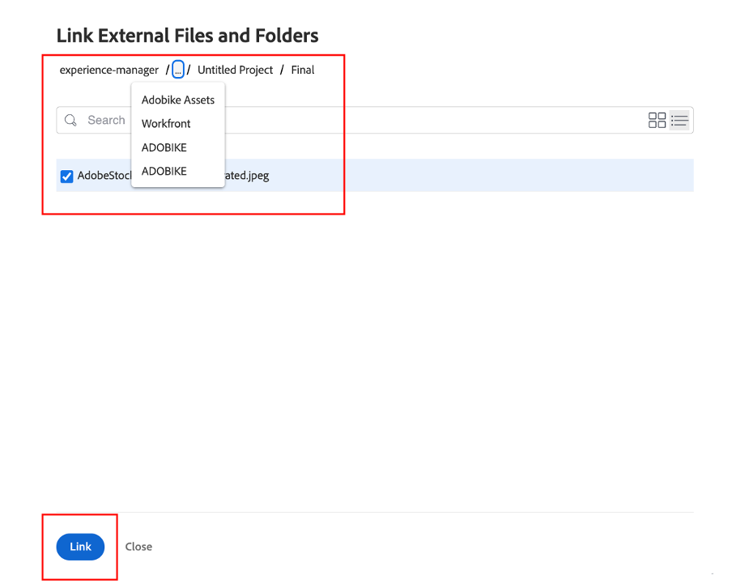

# 建立產品首頁橫幅

## 製作橫幅

內容自動化為Experience Manager Assets帶來了Adobe Creative Cloud的強大功能，讓行銷人員能夠大規模自動化資產的製作，大幅加快變體的建立速度。 讓我們使用這些功能來產生橫幅，以便用於首頁！

- 前往[https://author-p105462-e991028.adobeaemcloud.com/](https://author-p105462-e991028.adobeaemcloud.com/)上的AEM作者，並使用我們提供的憑證登入。

- 從首頁，導覽至「工具」 \> 「Assets」 \> 「處理設定檔」 。

- 在介面中，您會看到所有現有的處理設定檔。 這些最多可用於啟用某些自動化。

- 以下是您感興趣的內容：
   - Adobike橫幅深色：根據選取的資產建立具有深色覆蓋圖的Adobike橫幅

     
   - Adobike橫幅淺色：根據選取的資產建立淺色覆蓋的Adobike橫幅

     
   - Adobike橫幅綠色：根據選取的資產，建立覆蓋綠色的Adobike橫幅

     

- 選擇您要建立的橫幅型別後，請選取該處理設定檔，然後選取「將設定檔套用至資料夾」。

- 在下一個畫面中，瀏覽至AEM Assets中的團隊資料夾。 然後，從左上方選取「建立」按鈕，以建立新資料夾並為其指定有意義的名稱，例如「建立深色橫幅」。

- 建立資料夾後，核取資料夾名稱旁的方塊，然後按一下右上方的「套用」按鈕。

現在我們已經完成必要的設定，接下來就可以產生橫幅了。

- 按一下左上角的AEM標誌以開啟導覽，然後導覽至導覽\> Assets \>檔案。

- 找到「已產生的Adobike Assets」資料夾，然後按一下卡片以將其開啟。 這是產生橫幅的顯示位置。

- 開啟新標籤，然後再次導覽至AEM Assets。 然後，導覽至我們套用處理設定檔的資料夾。

- 在資料夾中，拖放至瀏覽器或按一下介面右上角的「建立\>檔案」 ，上傳您要建立橫幅的影像。

使用建立檔案

- 請稍候片刻，讓您的資產處理，然後重新載入畫面。 如果您看到資產處於「新」狀態，就表示它已完成處理。

- 導覽回到上一個標籤，並在這裡重新載入畫面。 您應會注意到新資產處於「新」狀態。 這是我們從DAM產生的橫幅！ 還沒看到嗎？ 再等一分鐘，然後重新載入您的熒幕。

>[!NOTE]
>
> 對結果不滿意？ 您可以隨意將另一個處理設定檔套用至資料夾，並重新上傳資產以產生不同的橫幅（當然也可以上傳另一個資產）。 重新上傳期間，系統會詢問您要如何處理現有資產，選取「取代」。
> 

我們現在已產生橫幅，稍後可用於傳送行銷活動期間。 請務必選取橫幅，然後按一下功能區上的「快速Publish」按鈕以發佈橫幅。

## Workfront中的後續追蹤

如果您需要對Assets進行正式且可稽核的稽核及核准流程，可以選擇Workfront。

>[!NOTE]
>
> 雖然我們在這裡明確提及，但其目的是為了在您完成任務後更新Workfront中的任務。 您應該一律努力建立>檢閱>核准流程。

- 讓我們回到專案，展開「前往/不前往「橫幅評論」摺疊式功能表，按一下以開啟上述任務：

- 按一下工作的檔案區段（左欄），然後按一下AEM Assets連結的資料夾「最後」。 按一下資產的區域並點選「建立校訂」以選取資產。 校訂是以有條理的合作方式校訂內容（例如圖片、文字、影片、網站等）的能力，可收集相關利害關係人的評論、修改、版本和結果，並透過按一下即可比較和最終核准。

- 由於我們想要複雜的核准流程，請選取「進階校訂」。

>[!NOTE]
>
> 我們將手動決定誰將稽核和/或核准我們在此訓練營中的校訂。 在大多數實際使用案例中，我們會使用已針對每種校樣型別定義的預先設定核准流程範本。

- 依預設，我們處於工作流程型別「基本」，我們將選取您的Workfront Bootcamp Specialist作為檢閱者和核准者。 輸入您的Bootcamp Workfront專員名稱，上面顯示「輸入連絡人名稱或電子郵件地址，即可新增收件者：

- 將他們設為「檢閱者和核准者」：

- 按一下「建立校訂」。 Workfront需要一些時間才能產生證明：

- 您的Workfront專員現在將收到新通知，通知他們他們有要檢閱和/或核准的證明：

- 按一下通知後，他們就會面對您的校訂，並能夠發表一些意見和/或核准此校訂。

   - 如果他們有註釋，可以按一下畫面上方的「新增註釋」：

  

   - 然後，他們不僅能夠新增評論，還能使用小指標工具列來明確定義哪些區域需要變更。

  

   - 新增註解後，他們可以告知您，新版本的校樣需要額外完成一些工作。 重新整理Workfront標籤，您將會收到新通知，讓您明確瞭解此資訊。 知道必須進行的變更後，請在AEM中進行變更，然後前往這裡上傳新版本：

  

   - 選取您更新的資產（如果啟動營情境中不需要變更，只需再次上傳相同的資產即可）並按一下「連結」：

  

   - 然後，按一下右側的「建立校訂」。

  

   - 校訂產生後（可能需要一些時間），您的Workfront專員會收到通知，並得以檢閱及滿懷希望地核准此新版本。  例如，使用校訂比較按鈕，他們可以看到V1和V2的並排比較以及所有已作出的評論。

  

  

  

我們現在已獲得使用橫幅的正式核准。 我們可輕鬆追蹤處理程式的進度，而您所做的更新會自動觸發通知，因此您可以儘可能有效率地工作。

下一步： [階段2 — 生產：建立社群媒體廣告](./social.md)

[回到第1階段 — 規劃：其他前置工作](../planning/prework.md)

[返回所有模組](../../overview.md)
