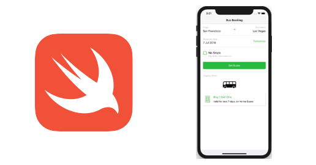

# 資料彙集教學課程

Data Collection是Adobe推出的新一代網站標籤與行動SDK管理功能。 資料收集可讓客戶透過簡單的方式部署及管理必要的分析、行銷及廣告解決方案，以便支援相關客戶體驗。 使用這些影片和教學課程來協助學習此關鍵技術。

## 新增功能

* **[伺服器API總覽（影片）](server-api/overview.md)**
  *使用安全、經過驗證的伺服器API傳送資料。*
* **[在行動應用程式中實作Adobe Experience Cloud （教學課程）](https://experienceleague.adobe.com/docs/platform-learn/implement-mobile-sdk/overview.html)**
  *使用Mobile SDK實作Experience Cloud應用程式。*
* **[移動使用者端標籤（教學課程）](event-forwarding/consider-moving-tags.md)**
  *請考慮將使用者端標籤移動到事件轉送。*

## 工作人員選擇

<table>
<tr>
  <td>
    
    

      <a href="https://experienceleague.adobe.com/docs/platform-learn/implement-web-sdk/overview.html?lang=zh-Hant" target="_blank">
    <strong>使用Web SDK實作Experience Cloud</strong>
    </a>
    

    

    <em>使用標籤來實作Platform Web SDK</em>
    

  </td>
  <td>
    
    

      <a href="https://experienceleague.adobe.com/docs/platform-learn/implement-mobile-sdk/overview.html" target="_blank">
    <strong>在行動應用程式中實作Experience Cloud</strong>
    </a>
    

    

    <em>使用標籤來實作Platform Mobile SDK</em>
    

  </td>
</tr>
</table>

*Apple、Apple 標誌、iPad、iPhone、iPod 和 iPod touch 為 Apple Inc. 在美國及其他國家/地區的註冊商標。Swift 和 Swift 標誌為 Apple Inc. 的商標。*
