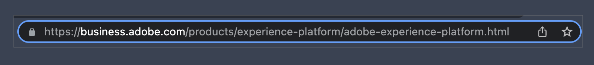

# API 101 - API基本簡介

API代表應用程式設計介面。 這代表它所說的一切 — 在程式之間有介面，這些介面允許這些程式通訊。 當程式設計師開發軟體應用程式時，他們通常需要軟體來與其他軟體或硬體通訊。 API定義這些通訊和互動的內容、方式、時間、地點及原因。

API是解決軟體業務挑戰的方法。 在大多數企業中，這是一項共同作業。 透過共同瞭解關鍵術語、概念和步驟，共同作業會更輕鬆。

如果您考慮按一下網頁中的連結，在您按一下連結時，瀏覽器會使用許多API。 瀏覽器會辨識該點按、要求您要造訪的頁面、透過網際網路擷取頁面，然後顯示在您的熒幕上。 中間有許多較小的步驟，但您的瀏覽器是軟體，會與各種API通訊及互動，只是為了向您顯示網頁。 在本文中，我們將重點說明使用或討論API時的重要術語、概念和步驟。

到本文結束時，您應該已清楚瞭解這些基本用語、概念和步驟。 API檔案非常詳盡，有關使用API處理特定使用案例的討論可能非常詳細。 透過清晰的基本知識和共同理解，導覽檔案和討論API會更輕鬆、更有效率。

>[!NOTE]
>
> 雖然有許多API，但我們將著重於網頁和瀏覽器API：基本上，當一個軟體應用程式透過網際網路與另一個軟體應用程式互動時。

## API術語和概念

單字或片語是什麼意思，我如何簡單輕鬆地思考？ 在API中，「應用程式」部分是指軟體應用程式或程式。 「程式設計介面」部分是指應用程式為特定目的與另一個應用程式互動的方式和位置。 在我們的網頁範例中，當您按一下連結時，瀏覽器會傳送請求給網頁的伺服器。


在此熒幕擷圖中，滑鼠游標暫留在Adobe Experience Platform連結上。 底部是網頁瀏覽器狀態列，其中顯示瀏覽器將取得的頁面「位址」。 換言之，按一下Adobe Experience Platform連結會告訴瀏覽器「為我取得該頁面，以便我能夠在畫面上看見」。

點按連結時，瀏覽器會向伺服器要求取得頁面。 這是`GET`要求，是常搭配Web API使用的要求方法之一。 瀏覽器需要滿足請求的一件事是頁面「地址」 — 它在網頁上的什麼位置？

### URL部分



大部分的瀏覽器都有「位址列」，會顯示網頁的部分或全部「位址」。 當瀏覽器「取得」我們點按之連結的頁面時，它會顯示此位址列中的頁面「位址」。 那麼網頁的「位址」為何？

上面的`https://business.adobe.com/tw/products/experience-platform/adobe-experience-platform.html`是網頁的位址，稱為URL或統一資源定位器。 URL可以指代像這樣的頁面、影像檔案、視訊或其他檔案型別。


這個位址(URL)包含與網頁和瀏覽器API非常相關的特定部分。

**配置**

上述`scheme`也稱為具有網頁API的`protocol`，通常為`http`或`https`。 HTTP或HyperText傳輸通訊協定是網頁等資源如何從網頁伺服器傳輸到網頁瀏覽器。 HTTPS是安全的版本，透過網際網路進行傳輸，其安全性旨在防止干擾正在傳輸的資源。 透過HTTPS檢視頁面時，經常會在瀏覽器位址列中看到小鎖定圖示。

對於網頁API，這些資源的傳輸會透過HTTP請求進行，換句話說，就是透過HTTP請求。

**主機和網域**

`business.adobe.com`是所要求資源的主機。 當我們的範例連結被點按時，瀏覽器會使用URL的這個部分來尋找託管頁面的伺服器。 它並不總是與網頁伺服器完全相同，但從基本層級來看，我們可以將其視為瀏覽器將取得我們所要求頁面的伺服器。

網域名稱是網域名稱系統（又稱為DNS）的一部分。 大部分人都將`adobe.com`或`example.com`視為「網域名稱」，但有些部分與API相關。 `www.adobe.com`和`business.adobe.com`可以稱為網域名稱，但`www.`和`business.`部分稱為子網域。 API通常會與包含子網域（如`api.example.com`或`sub.www.example.com`）的URL互動。

經常會看到術語&#x200B;_主機_&#x200B;是指包含任何子網域（如`business.adobe.com`）的完整網域名稱。 在參照沒有子網域的主機（例如`adobe.com`）時，通常也會看到字詞&#x200B;_網域_&#x200B;或&#x200B;_網域名稱_。 記住主機的每個部分和變數的特定字詞在這裡並不重要。 但請務必瞭解這些詞語是常用的，以便於您釐清業務和討論的任何相關細節。

**Origin**

Origin是另一個要注意的術語，與URL的部分密切相關。 在基本層級，來源大致為`scheme`加上`host`加上`domain`，如`https://business.adobe.com/tw`。 不同的值通常代表不同的來源，例如`https://business.adobe.com/tw`和`http://business.adobe.com/tw`不是相同來源，因為它們有不同的配置。 由於子網域不同，`https://www.adobe.com`和`https://business.adobe.com/tw`在許多使用中也不是相同來源。

**路徑**

上述URL範例中的最後一個位元是資源的`path`，也就是我們範例中的頁面。 `/products/experience-platform/`部分通常代表網頁伺服器上的資料夾或目錄。 就像我們在電腦上擁有檔案和像片的資料夾或目錄一樣，我們也在Web伺服器上擁有資料夾來整理內容。 最後，`/adobe-experience-platform.html`部分是檔案的名稱 — 網頁。

URL還有其他更詳細的部分，將在本系列的下一部分重點說明。

### 協力廠商API

Web API有時稱為第三方API。 這就像交易中的當事方一樣。 在我們的連結範例中，您（或更具體地說，您的瀏覽器）是頁面請求中的第一方。 網頁伺服器是第二方。 第三個在哪裡？

網頁通常包含來自其他主機或來源的內容或資源。 在這些情況下，當您的瀏覽器開始顯示頁面時，會對託管這些資源的其他主機或「第三方」發出另一組請求。 這很常見，尤其是針對視訊或影像等媒體內容，也針對在檢視或使用資料時需要更新的資料。 取得當天的目前時間、目前的天氣或特定人員的個人化歡迎訊息，都是第三方API可以在正確時間提供正確資源的範例。 這些請求通常來自這些協力廠商API。

## Web API的常見用法

除了白天時間、天氣或個人化內容之外，Web API還有許多用途。 twitter、TikTok、Facebook、LinkedIn、Snapchat、Pinterest等社群媒體平台有多種程式設計師可搭配其應用程式使用的API。 當然，Adobe也有[多種程式設計師使用的API](https://developer.adobe.com/apis)，讓他們的軟體可以與Adobe產品和服務互動。 軟體產品和服務透過這些API存取其他軟體產品和服務。

## 範例API

瀏覽器API可讓程式設計師直接與瀏覽器的功能互動。 Battery API可讓軟體檢查裝置的電池狀態，以便視需要提醒您。 剪貼簿API可讓軟體隨裝置的剪貼簿複製或貼上。 全熒幕API可讓軟體提供選項，將檢視展開至裝置的全熒幕，例如YouTube。

Adobe Experience Platform資料存取API是網頁API，可讓程式設計師從Adobe Experience Platform存取及下載資料集檔案，以便在自己的程式中使用客戶設定檔資料。 這類API經常會成為軟體自動化流程的一部分，也就是將軟體設定為使用數個API組合來執行一系列步驟。 與手動執行這些相同步驟相比，這通常可大幅節省成本。

## api端點

當程式設計師在他們的程式中「使用」瀏覽器或網頁API時，他們通常會請求傳送或接收資源，例如我們的請求網頁的範例瀏覽器。 API檔案通常會列出這些請求的「端點」，例如： `https://platform.adobe.io/data/foundation/export/files/{dataSetFileId}`。 這是程式設計師用來取得資料集檔案的平台資料存取API的特定模式或「端點」。

由這些大括弧括住的`{dataSetFileId}`代表程式設計師在要求中需要傳送的值。 因此，實際API要求中的URL類似於`https://platform.adobe.io/data/foundation/export/files/xyz123brb`，其中`xyz123brb`必須是程式設計師想要接收的資料集檔案的有效ID。

換句話說，就像瀏覽器在特定URL取得頁面、API請求從特定端點取得資源，或傳送資源給特定端點（例如此資料集範例）。

## HTTP要求方法

此時，應該清楚網頁API會對網頁或資料集等資源提出請求。 和大多數軟體概念一樣，這些HTTP請求遵循可重複的模式。 要求會從軟體應用程式傳送至另一個軟體應用程式，評估要求並做出回應：瀏覽器會從網頁伺服器要求頁面，並做出頁面內容的回應。

從請求到回應的整個程式涉及許多較小且非常詳細的步驟，但請求方法卻相當簡單明瞭。 請求方法會定義所請求的作業。

**`GET`**

在要求提供可提供資源的回應（例如我們的網頁和資料集範例）時，會使用`GET`要求方法。 當我們在瀏覽器中按一下連結，或在行動裝置上點選連結，我們即會在幕後提出`GET`請求。

**`POST`**

`POST`方法隨要求傳送資料。 「要求」傳送資料聽起來可能有些奇怪，但提出API要求就是要求端點（接收軟體）接受要求，而且在`POST`的情況下，也接受傳送的資料。 傳送的資料通常會像資料庫或檔案一樣寫入資料存放區，以便儲存。

**`PUT`**

`PUT`要求方法類似於`POST`，因為它會傳送資料，但如果要傳送的資料已經存在於端點，`PUT`會取代現有資料以更新現有資料。 `POST`不會更新，而只是傳送，因此多個`POST`請求可以建立已傳送資料的多筆記錄，而非更新任何現有記錄。

**`PATCH`**

`PATCH`要求方法用於傳送可更新部分現有記錄的資料，例如當我們透過更新帳戶設定檔來變更地址時。 透過`POST`要求，可以建立額外的設定檔，透過`PUT`，可以取代現有的設定檔，但透過`PATCH`方法，我們只會更新現有記錄的相關部分，例如地址。

**`DELETE`**

`DELETE`要求方法會移除要求中指定的資源，就像我們按一下連結以完全刪除帳戶設定檔一樣。

還有其他幾個方法，但以下是使用API時最常見的方法清單。

### 請求範例

現在您已瞭解API的基本術語、概念和步驟，接下來可檢視實際的API要求範例。

瀏覽器範例中的頁面具有URL `https://business.adobe.com/tw/products/experience-platform/adobe-experience-platform.html`。 按一下Adobe Experience Platform連結時，瀏覽器會針對此頁面發出`GET`要求。 由於我們有瀏覽器來為我們工作，因此我們只需按一下，但如果程式設計師希望該請求在軟體應用程式中發生，他們必須提供API請求的所有必要詳細資訊，才能成功履行。

以下為程式碼中的可能外觀：

```js
fetch(
  "https://business.adobe.com/tw/products/experience-platform/adobe-experience-platform.html",
  {
    headers: {
      accept:
        "text/html,application/xhtml+xml,application/xml;q=0.9,image/webp,image/apng,*/*;q=0.8,application/signed-exchange;v=b3;q=0.9",
      "accept-language": "en-US,en;q=0.9",
      "sec-ch-ua":
        '" Not A;Brand";v="99", "Chromium";v="101", "Microsoft Edge";v="101"',
      "sec-fetch-dest": "document",
      "sec-fetch-mode": "navigate",
      "sec-fetch-site": "none",
      "sec-fetch-user": "?1",
      "upgrade-insecure-requests": "1",
    },
    referrerPolicy: "strict-origin-when-cross-origin",
    body: null,
    method: "GET",
    mode: "cors",
    credentials: "include",
  }
);
```

在上面的程式碼中，您可以看到瀏覽器正在要求的`URL`，而在底部附近是`method: "GET"`要求方法。 其他幾行程式碼也是請求的一部分，但超出了本文章的範圍。


*[API]：應用程式設計介面
*[URL]：統一資源定位器
*[HTTP]： HyperText傳輸通訊協定
*[DNS]：網域名稱系統
