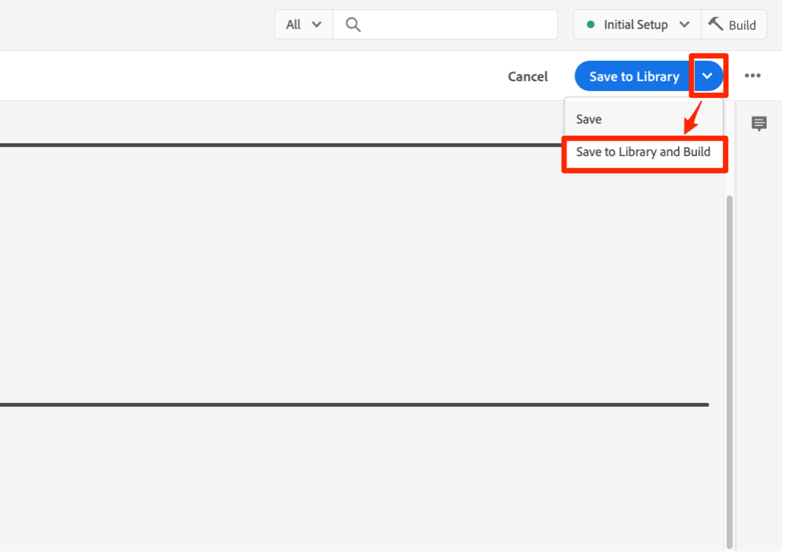

# 使用Platform Web SDK擴充功能，使用同意管理平台(CMP)實作同意

許多法律隱私權法規針對資料收集、個人化和其他行銷使用案例，提出了主動和特定同意的要求。 為符合這些需求，Adobe Experience Platform可讓您擷取個別客戶設定檔中的同意資訊，並使用這些偏好設定作為決定如何在下游Platform工作流程中使用每個客戶資料的因素。

>[!NOTE]
>
>Adobe Experience Platform Launch已整合至Adobe Experience Platform，為資料收集技術的套件。 介面中已推出數個術語變更，在使用此內容時應注意：
>
> * platform launch（用戶端）現在為 **[[!DNL tags]](https://experienceleague.adobe.com/docs/experience-platform/tags/home.html)**
> * platform launch伺服器端現在是 **[[!DNL event forwarding]](https://experienceleague.adobe.com/docs/experience-platform/tags/event-forwarding/overview.html)**
> * 現在提供邊緣設定 **[[!DNL datastreams]](https://experienceleague.adobe.com/docs/experience-platform/edge/fundamentals/datastreams.html)**


本教學課程示範如何使用資料收集中的Platform Web SDK擴充功能，實作和啟用從同意管理平台(CMP)取得的同意資料。 我們將同時使用Adobe標準和IAB TCF 2.0同意標準，以OneTrust或Sourcepoint為例，執行此作業。

本教學課程使用Platform Web SDK擴充功能，將同意資料傳送至Platform。 如需Web SDK的概觀，請參閱 [本頁](https://experienceleague.adobe.com/docs/experience-platform/edge/home.html?lang=zh-Hant).

## 先決條件

列出使用Web SDK的必要條件 [此處](https://experienceleague.adobe.com/docs/experience-platform/edge/fundamentals/prerequisite.html?lang=en#fundamentals).

該頁面上需要「事件資料集」，而且這個資料集可保留您的體驗事件資料，就像聽起來一樣。 若要使用事件傳送同意資訊，請 [隱私權詳細資料欄位群組](https://github.com/adobe/xdm/blob/master/docs/reference/field groups/experience-event/experienceevent-privacy.schema.md)需要新增至您的體驗事件結構：


若為Platform同意標準v2.0，我們還需要存取Adobe Experience Profile，才能建立XDM個別設定檔結構和資料集。 如需建立結構的教學課程，請參閱 [使用結構編輯器建立結構](https://experienceleague.adobe.com/docs/experience-platform/xdm/tutorials/create-schema-ui.html?lang=en#tutorials) 和「所需首選項詳細資訊」配置檔案欄位組請參閱 [XDM檔案](https://experienceleague.adobe.com/docs/experience-platform/landing/governance-privacy-security/overview.html?lang=en).

本教學課程假設您擁有資料收集的存取權，且已建立用戶端標籤屬性並安裝Web SDK擴充功能，以及建立並建置供開發使用的工作程式庫。 這些主題在以下檔案中有詳細說明和展示：

* [建立或設定屬性](https://experienceleague.adobe.com/docs/experience-platform/tags/admin/companies-and-properties.html?lang=en#create-or-configure-a-property)
* [程式庫概觀](https://experienceleague.adobe.com/docs/experience-platform/tags/publish/libraries.html)
* [發佈概觀](https://experienceleague.adobe.com/docs/experience-platform/tags/publish/overview.html)

我們也會使用 [Platform Debugger](https://chrome.google.com/webstore/detail/adobe-experience-platform/bfnnokhpnncpkdmbokanobigaccjkpob) Chrome擴充功能，檢查及驗證我們的實作。

若要在您自己的網站上以CMP實作IAB TCF範例，您將需要存取OneTrust或Sourcepoint之類的CMP，以產生其提供的資料，或者您只需依照此處操作，查看下列結果。

## 搭配Adobe同意標準（v1.0或v2.0）使用Web SDK

>[!NOTE]
>
>1.0標準正在淘汰，以支援v2.0。2.0標準可讓您新增其他同意資料，這些資料可用來手動強制執行同意偏好設定。 Platform Web SDK擴充功能下方的螢幕擷取畫面來自版本 [2.4.0](https://experienceleague.adobe.com/docs/experience-platform/edge/release-notes.html?lang=en#version-2.4.0) 的擴充功能，此擴充功能與Adobe同意標準的v1.0或v2.0相容。

有關這些標準的詳細資訊，請參閱 [支援客戶同意偏好設定](https://experienceleague.adobe.com/docs/experience-platform/edge/consent/supporting-consent.html).

### 步驟1:在Web SDK擴充功能中設定同意

在標籤屬性中安裝Platform Web SDK擴充功能後，我們可以在擴充功能設定畫面上設定用於處理同意資料的選項：


如果使用者先前未提供同意偏好設定，「隱私權」區段會設定SDK的同意層級。 這會設定SDK中同意和事件資料收集的預設狀態。 選取的設定會回答「如果使用者尚未提供明確的同意偏好設定，SDK應該怎麼做？」問題。

* 在中 — 收集使用者提供同意偏好設定前發生的事件。
* 退出 — 刪除在用戶提供同意首選項之前發生的事件。
* 擱置中 — 在使用者提供同意偏好設定之前發生的佇列事件。
* 由資料元素提供

如果預設同意設定為「在中」，則會告訴SDK不應等待明確同意，且應收集在使用者提供同意偏好設定前發生的事件。 這些偏好設定通常會在CMP中處理和儲存。

如果預設同意設定為「退出」，則會告訴SDK，不應收集在使用者選擇加入偏好設定設定設定之前發生的任何事件。 在設定同意偏好設定前發生的訪客活動，不會包含在設定同意後，SDK傳送的任何資料中。 例如，如果您在選取同意橫幅之前捲動並檢視網頁，且已使用此「退出」設定，如果使用者稍後明確同意資料收集，則不會傳送該捲動活動和檢視時間。

如果預設的同意設定為「擱置中」，SDK會將使用者提供同意偏好設定前發生的所有事件加入佇列，因此在設定同意偏好設定後，以及SDK在造訪期間初次設定後，即可傳送這些事件。

使用此「擱置中」設定時，嘗試執行需要使用者選擇加入偏好設定的任何命令（例如，event命令）將導致命令在SDK中排入佇列。 在您將使用者的選擇加入偏好設定傳遞至SDK後，才會處理這些命令。

CMP收集使用者的偏好設定後，我們就能將這些偏好設定傳達給SDK。 在下方的後續章節中，我們會說明如何取得該選擇加入資料，並搭配Web SDK擴充功能使用。

「由資料元素提供」可讓我們存取資料元素，其中包含您網站或資料層中自訂程式碼、CMP所擷取的任何同意偏好設定資料。 用於此目的的資料元素應會解析為「in」、「out」或「pending」。

請注意：此SDK的組態設定不會持續保存至使用者的設定檔，此設定專用於設定SDK的行為，之後訪客才會提供明確的同意偏好設定。

若要進一步了解設定Web SDK擴充功能，請參閱 [Platform Web SDK擴充功能概觀](https://experienceleague.adobe.com/docs/experience-platform/edge/extension/web-sdk-extension-configuration.html?lang=en#configure-the-extension) 和 [支援客戶同意偏好設定](https://experienceleague.adobe.com/docs/experience-platform/edge/consent/supporting-consent.html).

在此範例中，我們將選取「擱置中」的選項，然後選取 **儲存** 儲存配置設定。

### 步驟2:傳達同意偏好設定

我們已設定SDK的預設行為，現在可以使用標籤將訪客的明確同意偏好設定傳送至Platform。 使用Adobe1.0或2.0標準傳送同意資料，可透過標籤規則中Web SDK的setConsent動作輕鬆實作。

#### 使用平台同意標準1.0設定同意

讓我們建立一個規則來演示。 在您的Platform標籤屬性中，選取「規則」，然後在藍色的「新增規則」按鈕上。 將規則命名為「setAdobeConsent」，然後選取以新增事件。 對於「事件類型」，選擇「視窗已載入」，每當網站上載入頁面時，就會觸發此規則。 接下來，在「動作」下方選取「新增」以開啟動作設定畫面。 這是我們設定同意資料的位置。 選取「擴充功能」下拉式清單，選取「平台Web SDK」，然後選取「動作類型」並選取「設定同意」。

在「同意資訊」下，選擇「填寫表格」。 在此Adobe動作中，我們會填入顯示的表單，以使用Web SDK設定規則1.0同意標準的同意：


我們可以選擇透過此「設定同意」動作傳遞「傳入」、「傳出」或「由資料元素提供」。 此處的資料元素應會解析為「in」或「out」。

在此範例中，我們將選取「In」以指出訪客已同意允許Web SDK將資料傳送至Platform。 選取藍色的「保留變更」按鈕以儲存此動作，然後選取「儲存」以儲存此規則。

注意：網站訪客選擇退出後，SDK將不允許您將使用者同意設定於。

您的標籤規則可由多種內建或自訂項目觸發 [事件](https://experienceleague.adobe.com/docs/experience-platform/tags/extensions/adobe/core/overview.html?lang=en) 這可用來在訪客工作階段期間的適當時間傳遞此同意資料。 在上述範例中，我們使用視窗載入事件來觸發規則。 在稍後的章節中，我們將使用CMP的同意偏好設定事件來觸發「設定同意」動作。 您可以在您偏好用來指出選擇加入偏好設定之事件所觸發的規則中使用「設定同意」動作。

#### 使用平台同意標準2.0設定同意

平台同意標準2.0版適用於 [XDM](https://experienceleague.adobe.com/docs/platform-learn/tutorials/schemas/schemas-and-experience-data-model.html?lang=zh-Hant) 資料。 此外，還需要將「隱私權詳細資料」欄位群組新增至Platform中的設定檔結構。 請參閱 [Platform中的同意處理](https://experienceleague.adobe.com/docs/experience-platform/landing/governance-privacy-security/consent/adobe/overview.html) 有關Adobe標準2.0版和此欄位組的詳細資訊。

我們將建立自訂程式碼資料元素，將資料傳遞至以下結構中所示同意物件的收集和中繼資料屬性：


此首選項詳細資訊欄位組包含 [同意與偏好設定XDM資料類型](https://experienceleague.adobe.com/docs/experience-platform/xdm/data-types/consents.html?lang=en#prerequisites) 其中包含我們在規則動作中使用Platform Web SDK擴充功能傳送至Platform的同意偏好設定資料。 目前，實作Platform Consent Standard 2.0唯一需要的屬性是收集值(val)和中繼資料時間值，以紅色強調顯示。

讓我們為此資料建立資料元素。 選取資料元素和藍色的新增資料元素按鈕。 我們將此稱為「xdm-consent 2.0」，並使用核心擴充功能，我們將選取自訂程式碼類型。 您可以輸入或複製下列資料，並貼到自訂程式碼編輯器視窗中：

```js
var dateString = new Date().toISOString();

return {
  collect: {
    val: "y"
  },
  metadata: {
    time: dateString
  }
}
```

時間欄位應指定使用者上次更新同意偏好設定的時間。 我們要在此處建立時間戳記，作為在JavaScript Date物件上使用標準方法的範例。 選取「儲存」以儲存自訂程式碼，然後再次選取「儲存」以儲存資料元素。

接下來，我們選取「規則」，然後選取藍色的「新增規則」按鈕，並輸入名稱「setConsent onLoad - Consent 2.0」。 我們將選擇「視窗已載入」事件作為規則觸發器，然後選取「動作」底下的「新增」 。 選擇「Platform Web SDK擴充功能」，然後針對「動作類型」選擇「設定同意」。 標準應為Adobe，版本應為2.0。對於值，我們將使用剛建立的資料元素，其中包含傳送至Platform所需的收集值和時間值：


若要檢閱此範例動作，我們會從Platform Web SDK擴充功能呼叫「設定同意」，並從表單傳入標準和版本，同時從先前建立的資料元素傳入收集和時間值。

選取藍色的「儲存」按鈕，然後再次選取以儲存規則。

我們現在有兩個規則，每個適用於平台同意標準。 實際上，您可能會在整個網站上選擇一個標準。 接下來，我們將使用IAB TCF 2.0同意標準建立範例。

## 搭配IAB TCF 2.0同意標準使用Web SDK

您可以前往 [IAB歐洲網站](https://iabeurope.eu/transparency-consent-framework/).

若要使用此標準設定同意偏好設定資料，我們需要將「隱私權詳細資料」欄位群組新增至平台中的「體驗事件」結構：


此欄位群組包含IAB TCF 2.0標準所需的同意偏好設定欄位。 如需結構和欄位群組的詳細資訊，請參閱 [XDM系統概述](https://experienceleague.adobe.com/docs/experience-platform/xdm/home.html?lang=zh-Hant).

### 步驟1:建立同意資料元素

為了使用IAB TCF 2.0同意標準從標籤傳送同意事件資料，我們先使用必要的同意欄位來設定xdm資料元素：


在標籤用戶端屬性中，選取資料元素和藍色的「新增資料元素」按鈕。 在此範例中，我們會將此資料元素命名為「xdm-consentStrings」。 這些xdm欄位將包含IAB TCF 2.0標準所需的使用者同意資料。

在「擴充功能」下拉式選單中，選擇「Platform Web SDK」，然後針對「資料元素類型」，選擇「XDM物件」。 應會顯示xdm對應器，讓您選取並展開「consentStrings」項目，如上方螢幕擷取所示。

我們會依下列方式設定每個consentStrings:

* **`consentStandard`**:  `IAB TCF`
* **`consentStandardVersion`**:  `2.0`
* **`consentStringValue`**:  `%IAB TCF Consent String%`
* **`containsPersonalData`**:  `False` （從「選擇值」按鈕中選擇）
* **`gdprApplies`**:  `%IAB TCF Consent GDPR%`

consentStandard和consentStandardVersion只是我們所使用標準（即IAB TCF 2.0版）的文字字串。consentStringValue會參考名為「IAB TCF同意字串」的資料元素。 文字周圍的百分比符號代表資料元素的名稱，我們稍後會看看。 containsPersonalData屬性會指出IAB TCF 2.0同意字串是否包含任何包含「True」或「False」的個人資料。 gdprAppl欄位指出GDPR適用的「true」、GDPR不適用的「false」，或GDPR適用的未知的「未定義」。 目前，Web SDK會將「未定義」視為「true」，因此會將隨「gdprApplift」傳送的同意資料：「未定義」的處理方式，將視為訪客位於適用GDPR的區域。

請參閱 [同意檔案](https://experienceleague.adobe.com/docs/experience-platform/edge/consent/iab-tcf/with-launch.html?lang=en#getting-started) 以取得這些屬性和標籤中IAB TCF 2.0的詳細資訊。

### 步驟2:建立規則以使用IAB TCF 2.0標準設定同意

接下來，我們會建立規則，當網站訪客設定或變更此標準的同意資料時，使用Web SDK設定同意。 在此規則中，我們也將了解如何從CMP(如 [OneTrust](https://www.onetrust.com/products/cookie-consent/) 或 [Sourcepoint](https://www.sourcepoint.com/cmp/).

#### 新增規則事件

在您的Platform標籤屬性中選取「規則」區段，然後在藍色的「新增規則」按鈕上選取。 將規則命名為Consent - IAB ，然後選取「Events」底下的「Add」 。 將此事件命名為tcfapi addEventListener ，然後選取「開啟編輯器」以開啟自訂程式碼編輯器。

將下列程式碼複製並貼到您的編輯器視窗中：

```js
// Wait for window.__tcfapi to be defined, then trigger when the customer has completed their consent and preferences.
function addEventListener() {
  if (window.__tcfapi) {
    window.__tcfapi("addEventListener", 2, function (tcData, success) {
      if (success && (tcData.eventStatus === "useractioncomplete" || tcData.eventStatus === "tcloaded")) {
        // save the tcData.tcString properties in data elements
        _satellite.setVar("IAB TCF Consent String", tcData.tcString);
        _satellite.setVar("IAB TCF Consent GDPR", tcData.gdprApplies);
        trigger();
      }
    });
  } else {
    // window.__tcfapi wasn't defined. Check again in 100 milliseconds
    setTimeout(addEventListener, 100);
  }
}
addEventListener();
```

此程式碼只會建立並執行名為addEventListener的函式。 函式會檢查視窗是否存在。__tcfapi物件存在，若存在，則會根據API的規格新增事件接聽程式。 您可以在 [IAB repo](https://github.com/InteractiveAdvertisingBureau/GDPR-Transparency-and-Consent-Framework) 在GitHub上。 如果成功新增此事件接聽程式，且網站訪客已完成其同意和偏好設定選擇，程式碼會為tcData tcString設定標籤自訂變數，並為GDPR地區設定指標。 若要進一步了解IAB TCF，請參閱IAB [網站](https://iabeurope.eu/transparency-consent-framework/) 和 [GitHub存放庫](https://github.com/InteractiveAdvertisingBureau/GDPR-Transparency-and-Consent-Framework) 以取得技術詳細資訊。 設定這些值後，程式碼會執行觸發此規則的觸發函式來執行。

如果窗口。__tcfapi物件在首次執行此函式時不存在，函式將每100毫秒再次檢查一次，以便新增事件接聽程式。 最後一行程式碼只會執行上方程式碼行中定義的addEventListener函式。

總之，我們建立了一個函式來檢查網站訪客使用CMP（或自訂）同意橫幅設定的同意狀態。 設定同意偏好設定後，此程式碼會建立兩個自訂變數（自訂程式碼資料元素），供我們在規則動作中使用。 將上述程式碼貼入事件的自訂程式碼編輯器視窗後，請選取藍色的「儲存」按鈕以儲存規則事件。

現在來設定「設定同意」規則動作，以使用這些值並將它們傳送至Platform。

#### 新增規則動作

在「動作」區段中選取「新增」 。 在「擴充功能」下方，從下拉式清單中選擇「平台Web SDK」。 在「操作類型」下，選擇「設定同意」。 將此動作命名為setConsent。

在「同意資訊」下的動作設定中，選擇「填寫表單」。 對於「標準」，請選擇「IAB TCF」，對於「版本」，請輸入2.0。對於「值」，我們將使用事件中的自訂變數，然後輸入來自 [tcData](https://github.com/InteractiveAdvertisingBureau/GDPR-Transparency-and-Consent-Framework/blob/master/TCFv2/IAB%20Tech%20Lab%20-%20CMP%20API%20v2.md#tcdata) 我們已在上述規則事件自訂函式中擷取。

在「GDPR套用」底下，我們將使用事件中的其他自訂變數，並輸入%IAB TCF同意GDPR%，這也來自我們在上述規則事件自訂函式中擷取的tcData。 若您知道GDPR肯定會或不會套用至此網站的訪客，您可以選取「是」或「否」（若適用），而不需使用自訂變數（資料元素）選項。 您也可以在資料元素中使用條件式邏輯，以檢查GDPR是否適用並傳回適當的值。

在「GDPR包含個人資料」下方，選取選項以指出此使用者的資料是否包含個人資料。 此處的資料元素應會解析為true或false。


選取藍色「儲存」按鈕以儲存動作，並選取藍色「儲存」（或「儲存至程式庫」）按鈕以儲存規則。 此時，您已成功實作標籤中的資料元素和規則，以透過IAB TCF 2.0同意標準，使用Web SDK擴充功能設定同意。

### 步驟3:儲存至程式庫並建置

如果您使用 [工作庫](https://experienceleague.adobe.com/docs/platform-learn/implement-in-websites/configure-tags/add-data-elements-rules.html?lang=en#use-the-working-library-feature) 先決條件，您已儲存這些變更並建立開發程式庫：



### 步驟4:Inspect及驗證資料收集

在我們的網站上，我們會重新整理頁面，並確認中的程式庫組建 [除錯工具](https://chrome.google.com/webstore/detail/adobe-experience-cloud-de/ocdmogmohccmeicdhlhhgepeaijenapj) Chrome擴充功能，位於「標籤」功能表區段中：


我們也可以在Debugger Platform Web SDK區段中，選取您會看見之網路請求的POST內文線，檢查Adobe1.0或2.0標準的setConsent呼叫 `{"consent":[{"value":{"general":"in"},"version…`:


若要驗證setConsent呼叫和IAB TCF 2.0標準的規則，我們將使用測試網站上的OneTrust同意橫幅來設定同意偏好設定，並建立先前所述的tcData:


選取「我接受」後，您可以在網路請求的「POST內文」行中選取，以檢查除錯程式平台Web SDK區段中IAB TCF 2.0標準的setConsent呼叫 `{"consent":[{"value":"someAlphaNumericCharacters…`.


此處，我們會在資料元素和標籤規則中查看先前設定的資料。 value屬性包含我們先前看到的編碼tcString資料。

實作IAB TCF 2.0標準的OneTrust、Sourcepoint和其他CMP都會在我們的頁面中產生類似的資料。 我們可以擷取該資料，並透過我們在上述建立的規則中使用自訂程式碼事件，在標籤中與Web SDK擴充功能搭配使用。 無論使用哪個CMP產生IAB TCF 2.0資料，自訂程式碼都會相同。 自訂程式碼也可搭配任一平台同意標準（1.0或2.0）使用。

## 使用體驗事件傳送同意資料

您可能已注意到，我們未參考先前在任一規則的資料元素欄位中建立的「xdm-consentStrings」資料元素。 當您需要透過體驗事件傳送同意資料時，此資料元素可供使用。


由於此資料元素包含IAB TCF 2.0標準所需的所有欄位，因此您只需在透過Experience Events傳送此xdm資料時參考資料元素即可：


## 結論

我們已檢查並驗證資料，您應該了解如何使用適用於Platform的Platform Web SDK擴充功能，實作和啟用從CMP取得的同意資料。
