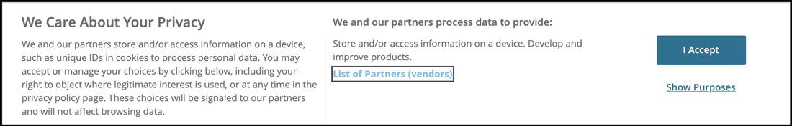

# 使用Platform Web SDK擴充功能透過同意管理平台(CMP)實作同意

許多法律隱私權法規在資料收集、個人化和其他行銷使用案例方面，都引入了對主動和特定同意的需求。 為了滿足這些要求，Adobe Experience Platform可讓您擷取個別客戶設定檔中的同意資訊，並使用這些偏好設定作為決定因素，來決定如何在下游Platform工作流程中使用每個客戶的資料。

>[!NOTE]
>
>Adobe Experience Platform Launch正在以資料收集技術套裝的形式整合到Adobe Experience Platform中。 此介面已推出幾項術語變更，使用此內容時請務必注意：
>
> * platform launch （使用者端）現在為 **[[!DNL tags]](https://experienceleague.adobe.com/docs/experience-platform/tags/home.html)**
> * platform launch伺服器端現在是 **[[!DNL event forwarding]](https://experienceleague.adobe.com/docs/experience-platform/tags/event-forwarding/overview.html)**
> * Edge設定現在為 **[[!DNL datastreams]](https://experienceleague.adobe.com/docs/experience-platform/edge/fundamentals/datastreams.html)**

本教學課程示範如何使用資料收集中的Platform Web SDK擴充功能，實作及啟用從同意管理平台(CMP)取得的同意資料。 我們將使用Adobe標準和IAB TCF 2.0同意標準兩者來執行此操作，以OneTrust或Sourcepoint作為範例CMP。

本教學課程使用Platform Web SDK擴充功能傳送同意資料給Platform。 如需Web SDK的概要介紹，請參閱 [此頁面](https://experienceleague.adobe.com/docs/experience-platform/edge/home.html?lang=zh-Hant).

## 先決條件

列出使用Web SDK的先決條件 [此處](https://experienceleague.adobe.com/docs/experience-platform/edge/fundamentals/prerequisite.html#fundamentals).

在該頁面上，需要「事件資料集」，而且就像聽起來一樣，這是一個資料集，可儲存您的體驗事件資料。 若要隨事件傳送同意資訊，請 [IAB TCF 2.0同意詳細資料](https://experienceleague.adobe.com/docs/experience-platform/landing/governance-privacy-security/consent/iab/dataset.html) 欄位群組需要新增至您的體驗事件結構描述：


針對Platform同意標準v2.0，我們還需要存取Adobe Experience Platform以建立XDM個別設定檔結構描述和資料集。 如需有關架構建立的教學課程，請參閱 [使用結構編輯器建立架構](https://experienceleague.adobe.com/docs/experience-platform/xdm/tutorials/create-schema-ui.html#tutorials) 有關必填的「同意和偏好設定詳細資訊」欄位群組，請參閱 [設定資料集以擷取同意和偏好設定資料](https://experienceleague.adobe.com/docs/experience-platform/landing/governance-privacy-security/consent/adobe/dataset.html).

本教學課程假設您有權存取資料彙集，並已建立使用者端標籤屬性，其中已安裝Web SDK擴充功能，並建立及建置用於開發的工作程式庫。 以下檔案詳細說明了這些主題：

* [建立或設定屬性](https://experienceleague.adobe.com/docs/experience-platform/tags/admin/companies-and-properties.html?lang=en#create-or-configure-a-property)
* [程式庫概觀](https://experienceleague.adobe.com/docs/experience-platform/tags/publish/libraries.html)
* [發佈概觀](https://experienceleague.adobe.com/docs/experience-platform/tags/publish/overview.html?lang=zh-Hant)

我們也會使用 [Platform Debugger](https://chrome.google.com/webstore/detail/adobe-experience-platform/bfnnokhpnncpkdmbokanobigaccjkpob) Chrome擴充功能可檢查並驗證我們的實作。

若要使用CMP在您自己的網站上實作IAB TCF範例，您需要存取OneTrust或Sourcepoint之類的CMP以產生其提供的資料，或者您可以按照這裡並檢視以下結果的方式進行。

## 搭配Adobe同意標準（v1.0或v2.0）使用Web SDK

>[!NOTE]
>
>1.0標準正在逐步淘汰，取而代之的是v2.0。2.0標準允許您新增其他同意資料，這些資料可用於手動強制執行同意偏好設定。 Platform Web SDK擴充功能下方的熒幕擷取畫面來自版本 [2.4.0](https://experienceleague.adobe.com/docs/experience-platform/edge/release-notes.html#version-2.4.0) 與Adobe同意標準v1.0或v2.0相容的擴充功能。

如需這些標準的詳細資訊，請參閱 [支援客戶同意偏好設定](https://experienceleague.adobe.com/docs/experience-platform/edge/consent/supporting-consent.html).

### 步驟1：在Web SDK擴充功能中設定同意

在Tags屬性中安裝Platform Web SDK擴充功能後，我們可以在擴充功能設定畫面上設定指定同意資料的選項：


如果使用者先前未提供同意偏好設定，「隱私權」區段會設定SDK的同意層級。 這會設定SDK中同意和事件資料收集的預設狀態。 選擇的設定可回答「如果使用者尚未提供明確的同意偏好設定，SDK該怎麼做？」的問題。

* 在 — 收集在使用者提供同意偏好設定之前發生的事件。
* 退出 — 丟棄在使用者提供同意偏好設定之前發生的事件。
* 擱置中 — 在使用者提供同意偏好設定之前發生的佇列事件。
* 資料元素提供

如果預設同意設定為「In」，這會告訴SDK不應等待明確同意，且應收集在使用者提供同意偏好設定之前發生的事件。 這些偏好設定通常會在CMP中處理和儲存。

如果預設同意設定為「退出」，這會通知SDK不應收集在設定使用者選擇加入偏好設定之前發生的任何事件。 在設定同意偏好設定之前發生的訪客活動，不會包含在同意設定後SDK傳送的任何資料中。 例如，如果您在選取同意橫幅之前捲動並檢視網頁，且使用此「退出」設定，則當使用者稍後明確同意資料收集時，將不會傳送該捲動活動和檢視時間。

如果預設同意設定為「待定」，SDK會將使用者提供同意偏好設定之前發生的任何事件加入佇列，因此事件可能會在同意偏好設定設定完成後，以及SDK最初在造訪期間設定後傳送。

使用此「擱置」設定，嘗試執行需要使用者選擇加入偏好設定的任何命令（例如事件命令）會導致命令在SDK內排入佇列。 直到您將使用者的選擇加入偏好設定傳達給SDK後，才會處理這些命令。

一旦CMP收集使用者的偏好設定後，我們就能將這些偏好設定傳達SDK。 在下方稍後的章節中，我們將瞭解如何取得該選擇加入資料，並將其與Web SDK擴充功能搭配使用。

「由資料元素提供」可讓我們存取資料元素，這些資料元素包含自訂程式碼或網站上CMP擷取的任何同意偏好設定資料，或資料層中的資料。 用於此目的的資料元素應解析為「in」、「out」或「pending」。

請注意：此SDK組態設定不會儲存至使用者的設定檔，而是專門用來在訪客提供明確同意偏好設定之前設定SDK的行為。

若要進一步瞭解如何設定Web SDK擴充功能，請參閱 [Platform Web SDK擴充功能概觀](https://experienceleague.adobe.com/docs/experience-platform/edge/extension/web-sdk-extension-configuration.html?lang=en#configure-the-extension) 和 [支援客戶同意偏好設定](https://experienceleague.adobe.com/docs/experience-platform/edge/consent/supporting-consent.html).

在此範例中，讓我們選取「擱置中」的選項，然後選取 **儲存** 以儲存我們的組態設定。

### 步驟2：通訊同意偏好設定

現在我們已設定SDK的預設行為，接下來可以使用標籤將訪客的明確同意偏好設定傳送至Platform。 使用Adobe1.0或2.0標準傳送同意資料可透過以下方式輕鬆實作 `setConsent` 標籤規則中Web SDK的動作。

#### 使用Platform Consent Standard 1.0設定同意

讓我們建立一個規則來示範這一點。 在Platform標籤屬性中，選取規則，然後按一下藍色的「新增規則」按鈕。 將規則命名為「setAdobeConsent」，然後選取以新增事件。 對於「事件型別」，請選擇「視窗已載入」 ，這會在頁面載入我們的網站時觸發此規則。 接著，在「動作」底下選取「新增」以開啟動作設定畫面。 這是我們將設定同意資料的位置。 選取「擴充功能」下拉式清單，選取「Platform Web SDK」，然後選取「動作型別」並選取「設定同意」。

在「同意資訊」底下，選擇「填寫表單」。 在此規則動作中，我們將透過填寫顯示的表單來使用Web SDK設定Adobe1.0同意標準的同意：


我們可透過此「設定同意」動作選擇傳遞「輸入」、「輸出」或「資料元素提供」。 這裡的資料元素應解析為「in」或「out」。

在此範例中，我們將選取「加入」以表示訪客同意允許Web SDK傳送資料至Platform。 選取藍色的「保留變更」按鈕以儲存此動作，然後選取「儲存」以儲存此規則。

注意：一旦網站訪客選擇退出，SDK將不允許您將使用者同意設定為加入。

您的標籤規則可由各種內建或自訂觸發 [事件](https://experienceleague.adobe.com/docs/experience-platform/tags/extensions/adobe/core/overview.html) ，可用於在訪客工作階段的適當時間傳遞此同意資料。 在上述範例中，我們使用視窗已載入事件來觸發規則。 在稍後章節中，我們將使用CMP的同意偏好設定事件來觸發「設定同意」動作。 您可以在由任何您偏好指出選擇加入偏好設定之事件所觸發的規則中，使用「設定同意」動作。

#### 使用Platform Consent Standard 2.0設定同意

2.0版的Platform同意標準可與 [XDM](https://experienceleague.adobe.com/docs/platform-learn/tutorials/schemas/schemas-and-experience-data-model.html?lang=zh-Hant) 資料。 您也需要在Platform中將同意和偏好設定詳細資料欄位群組新增到您的設定檔結構描述。 另請參閱 [Platform中的同意處理](https://experienceleague.adobe.com/docs/experience-platform/landing/governance-privacy-security/consent/adobe/overview.html) 以取得有關Adobe standard 2.0版和此欄位群組的詳細資訊。

我們將建立自訂程式碼資料元素，以將資料傳遞至下列結構描述中所顯示同意物件的收集和中繼資料屬性：


此同意和偏好設定詳細資訊欄位群組包含 [同意和偏好設定XDM資料型別](https://experienceleague.adobe.com/docs/experience-platform/xdm/data-types/consents.html#prerequisites) 其中會包含我們在規則動作中透過Platform Web SDK擴充功能傳送至Platform的同意偏好設定資料。 目前，實作Platform Consent Standard 2.0唯一需要的屬性是收集值(val)和中繼資料時間值（以上以紅色反白顯示）。

讓我們為此資料建立一個資料元素。 選取資料元素和藍色的「新增資料元素」按鈕。 假設我們將此稱為「xdm-consent 2.0」，並使用核心擴充功能，選取自訂程式碼型別。 您可以輸入或複製下列資料，並將其貼到自訂程式碼編輯器視窗中：

```js
var dateString = new Date().toISOString();

return {
  collect: {
    val: "y"
  },
  metadata: {
    time: dateString
  }
}
```

時間欄位應指定使用者上次更新其同意偏好設定的時間。 我們在此以JavaScript Date物件使用標準方法的範例建立時間戳記。 選取「儲存」以儲存自訂程式碼，然後再次選取「儲存」以儲存資料元素。

接下來，讓我們選取「規則」，然後按一下藍色的「新增規則」按鈕，並輸入名稱「setConsent onLoad - Consent 2.0」。 讓我們選擇「視窗已載入」事件作為規則觸發器，然後選取「動作」底下的「新增」 。 選擇Platform Web SDK擴充功能，然後針對「動作型別」，選擇「設定同意」。 標準應為Adobe，版本應為2.0。對於Value，我們會使用剛剛建立的資料元素，其中包含我們需要傳送至Platform的收集和時間值：


若要檢閱此範例動作，我們會從Platform Web SDK擴充功能呼叫「設定同意」，並從表單傳入「標準」和「版本」，同時從我們先前建立的資料元素傳入「收集」和「時間」的值。

選取藍色的「儲存」按鈕，然後再次選取以儲存規則。

我們現在有兩個規則，分別適用於平台同意標準。 實際上，您可能會為網站選擇一個標準。 接下來，我們將使用IAB TCF 2.0同意標準建立範例。

## 搭配IAB TCF 2.0同意標準使用Web SDK

若要深入瞭解IAB透明與同意架構2.0版，請前往 [IAB歐洲網站](https://iabeurope.eu/transparency-consent-framework/).

若要使用此標準設定同意偏好設定資料，我們需要將IAB TCF 2.0同意詳細資料結構欄位群組新增至Platform中的「體驗事件」結構描述：


此欄位群組包含IAB TCF 2.0標準要求的同意偏好設定欄位。 如需結構描述和欄位群組的詳細資訊，請參閱 [XDM系統概覽](https://experienceleague.adobe.com/docs/experience-platform/xdm/home.html?lang=zh-Hant).

### 步驟1：建立同意資料元素

為了使用IAB TCF 2.0同意標準從標籤傳送同意事件資料，我們先以必要的同意欄位設定xdm資料元素：


在您的標籤使用者端屬性中，選取「資料元素」，接著按一下藍色的「新增資料元素」按鈕。 在此範例中，我們將此資料元素命名為「xdm-consentStrings」。 這些xdm欄位將包含IAB TCF 2.0標準所需的使用者同意資料。

在「擴充功能」下拉式選單中，選擇「Platform Web SDK」，然後針對「資料元素型別」，選擇「XDM物件」。 xdm對應程式應該會出現，可讓您選取並展開「consentStrings」專案，如上方熒幕擷圖所示。

我們將依照以下方式設定每個consentStrings：

* **`consentStandard`**：  `IAB TCF`
* **`consentStandardVersion`**:  `2.0`
* **`consentStringValue`**:  `%IAB TCF Consent String%`
* **`containsPersonalData`**：  `False` （從「選取值」按鈕選擇）
* **`gdprApplies`**:  `%IAB TCF Consent GDPR%`

此 `consentStandard` 和 `consentStandardVersion` 欄位都只是我們使用的標準（IAB TCF 2.0版）的文字字串。此 `consentStringValue` 會參照名為「IAB TCF同意字串」的資料元素。 文字周圍的百分比符號代表資料元素的名稱，稍後我們將討論。 此 `containsPersonalData` 欄位會指出IAB TCF 2.0同意字串是否包含任何含有「True」或「False」的個人資料。 此 `gdprApplies` 欄位會指出GDPR是否適用，「true」或「false」不適用，或「undefined」不明GDPR是否適用。 目前，Web SDK會將「undefined」視為「true」，因此使用「gdprApplies：undefined」傳送的同意資料將被視為訪客位在GDPR確實適用的區域。

請參閱 [同意檔案](https://experienceleague.adobe.com/docs/experience-platform/edge/consent/iab-tcf/with-launch.html#getting-started) 有關這些屬性以及標籤中IAB TCF 2.0的詳細資訊。

### 步驟2：建立規則以使用IAB TCF 2.0標準設定同意

接下來，我們會建立規則，當網站訪客設定或變更此標準的同意資料時，便可在Web SDK上設定同意。 在此規則中，我們也會瞭解如何從CMP擷取這些同意變更訊號，例如 [OneTrust](https://www.onetrust.com/products/cookie-consent/) 或 [Sourcepoint](https://www.sourcepoint.com/cmp/).

#### 新增規則事件

選取Platform標籤屬性中的「規則」區段，然後按一下藍色的「新增規則」按鈕。 將規則命名為setConsent - IAB ，然後選取「事件」下的「新增」 。 讓我們命名此事件tcfapi addEventListener ，然後選取「開啟編輯器」以開啟自訂程式碼編輯器。

將下列程式碼複製並貼到編輯器視窗中：

```js
// Wait for window.__tcfapi to be defined, then trigger when the customer has completed their consent and preferences.
function addEventListener() {
  if (window.__tcfapi) {
    window.__tcfapi("addEventListener", 2, function (tcData, success) {
      if (success && (tcData.eventStatus === "useractioncomplete" || tcData.eventStatus === "tcloaded")) {
        // save the tcData.tcString properties in data elements
        _satellite.setVar("IAB TCF Consent String", tcData.tcString);
        _satellite.setVar("IAB TCF Consent GDPR", tcData.gdprApplies);
        trigger();
      }
    });
  } else {
    // window.__tcfapi wasn't defined. Check again in 100 milliseconds
    setTimeout(addEventListener, 100);
  }
}
addEventListener();
```

此程式碼只會建立並執行一個函式，稱為 `addEventListener`. 此函式會檢查 `window.__tcfapi` 物件存在，如果存在，會根據API的規格新增事件接聽程式。 如需這些規格的詳細資訊，請參閱 [IAB存放庫](https://github.com/InteractiveAdvertisingBureau/GDPR-Transparency-and-Consent-Framework) 在GitHub上。 如果成功新增此事件接聽程式，且網站訪客已完成其同意和偏好設定選擇，則程式碼會為標籤自訂變數 `tcData.tcString`和GDPR地區的指標。 再次強調，若要瞭解有關IAB TCF的詳細資訊，請參閱IAB [網站](https://iabeurope.eu/transparency-consent-framework/) 和 [GitHub存放庫](https://github.com/InteractiveAdvertisingBureau/GDPR-Transparency-and-Consent-Framework) 以取得技術詳細資訊。 設定這些值後，程式碼會執行觸發程式函式，觸發此規則執行。

如果 `window.__tcfapi` 第一次執行此函式時物件不存在，此函式將每隔100毫秒再次檢查一次，以便新增事件接聽程式。 最後一行程式碼只會執行 `addEventListener` 函式的上方程式碼行中定義。

總而言之，我們建立了一個函式，用於檢查網站訪客使用CMP （或自訂）同意橫幅所設定的同意狀態。 當該同意偏好設定設定設定後，此程式碼會建立兩個自訂變數（自訂程式碼資料元素），我們可在規則動作中使用。 將上述程式碼貼到事件的自訂程式碼編輯器視窗後，選取藍色的「儲存」按鈕以儲存規則事件。

現在來設定設定同意規則動作，以使用這些值並將它們傳送至Platform。

#### 新增規則動作

在「動作」區段中選取「新增」 。 在「擴充功能」底下，從下拉式清單中選擇「Platform Web SDK」 。 在「動作型別」底下，選擇「設定同意」。 讓我們將此動作命名為setConsent。

在同意資訊底下的動作設定中，選擇填寫表單。 對於「標準」，請選擇「IAB TCF」，對於「版本」，請輸入2.0。對於「值」，我們會使用事件中的自訂變數，並輸入 `%IAB TCF Consent String%` 來自 [tcData](https://github.com/InteractiveAdvertisingBureau/GDPR-Transparency-and-Consent-Framework/blob/master/TCFv2/IAB%20Tech%20Lab%20-%20CMP%20API%20v2.md#tcdata) 我們在上面的規則事件自訂函式中擷取。

在GDPR套用底下，我們將使用事件中的其他自訂變數並輸入 `%IAB TCF Consent GDPR%` 也來自 `tcData` 我們在上面的規則事件自訂函式中擷取。 如果您知道GDPR肯定會或不會套用至此網站的訪客，您可以選取「是」或「否」（如適用），而不使用自訂變數（資料元素）選項。 您也可以在資料元素中使用條件式邏輯，以檢查GDPR是否套用並傳回適當的值。

在GDPR包含個人資料下，選取選項以指出此使用者的資料是否包含個人資料。 這裡的資料元素應解析為true或false。


選取藍色的「儲存」按鈕以儲存動作，並選取藍色的「儲存」 （或「儲存至程式庫」）按鈕以儲存規則。 此時，您已成功地實作標籤中的資料元素和規則，以使用具備IAB TCF 2.0同意標準的Web SDK擴充功能來設定同意。

### 步驟3：儲存至程式庫並建置

如果您使用 [工作程式庫](https://experienceleague.adobe.com/docs/platform-learn/implement-in-websites/configure-tags/add-data-elements-rules.html#use-the-working-library-feature) 先決條件，您已儲存這些變更並建立您的開發程式庫：


### 步驟4：Inspect並驗證資料收集

在我們的網站上，重新整理頁面並確認中的程式庫組建 [Debugger](https://chromewebstore.google.com/detail/adobe-experience-platform/bfnnokhpnncpkdmbokanobigaccjkpob) Chrome擴充功能，在標籤功能表區段中：


我們也可以在Debugger Platform Web SDK區段中，透過選取您看到之網路請求中Adobe內文行上的「」，檢查POST1.0或2.0標準的setConsent呼叫 `{"consent":[{"value":{"general":"in"},"version…`：


若要驗證setConsent呼叫以及我們適用於IAB TCF 2.0標準的規則，我們將使用測試網站上的OneTrust同意橫幅來設定同意偏好設定，並建立先前說明的tcData：



選取「我接受」後，我們可在Debugger Platform Web SDK區段中檢查IAB TCF 2.0標準的setConsent呼叫，方法是選取您看到之網路請求中POST正文行的內容 `{"consent":[{"value":"someAlphaNumericCharacters…`.


我們在這裡會看到先前在資料元素和標籤規則中設定的資料。 value屬性包含我們先前看到的tcString編碼資料。

OneTrust、Sourcepoint和實作IAB TCF 2.0標準的其他CMP都將在我們的頁面中產生類似的資料。 我們可擷取該資料，並使用上述規則中的自訂程式碼事件，搭配Tags中的Web SDK擴充功能使用。 無論使用哪個CMP產生IAB TCF 2.0資料，自訂程式碼都將相同。 自訂程式碼也可與平台同意標準（1.0或2.0）搭配使用。

## 使用體驗事件傳送同意資料

您可能已注意到，我們之前在任何一項規則中的資料元素欄位中都未參考「xdm-consentStrings」資料元素。 此資料元素可用於您需要傳送包含Experience事件的同意資料時。


由於此資料元素包含IAB TCF 2.0標準所需的所有欄位，因此您在傳送包含體驗事件的此xdm資料時，只需參考資料元素即可：


## 結論

現在我們已檢查並驗證資料，您應該瞭解如何使用適用於Platform的Platform Web SDK擴充功能，實作及啟用從CMP取得的同意資料。
